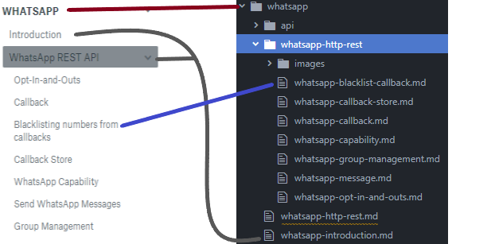
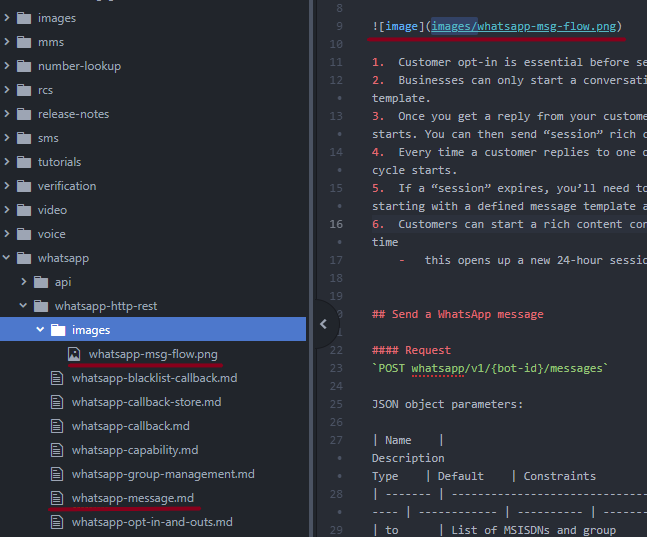

# Publication and deployment

We have chosen to go with an solution provided by [ReadMe](https://www.readme.com) to host our documentation.

There's not many steps needed to get your content live on the [Sinch Developer Documentation](https://developers.sinch.com) site.

Anyone can fork and submit pull requests to this Git repository!

## 1. Clone this repository

```ssh
$ git clone git@github.com:sinch/docs.git
```

## 2. Write

If you're new to Markdown or need to update your knowledge check out this [cheatsheet](https://github.com/adam-p/markdown-here/wiki/Markdown-Cheatsheet).

Tips on how to write useful and easy to read [documentation](CONTRIBUTING.md)

### Callouts

To use callouts and to benefit from having them styled with CSS they should be written as follows:

Emoji Themes
Default themes are specified using one of the following emojis. (If you don't like the one we've chosen, you can always switch to the alternate!)

| Emoji |     Class      | Alternate |
| :---- | :------------: | --------: |
| 📘    | .callout_info  |        ℹ️ |
| 👍    | .callout_okay  |        ✅ |
| 🚧    | .callout_warn  |        ⚠️ |
| ❗️   | .callout_error |        🛑 |

```markdown
> 🎅 Old Saint Nick
>
> 'Twas the night before Christmas, when all through the house not a creature was stirring, not even a mouse. The stockings were hung by the chimney with care, in hopes that St. Nicholas soon would be there. The children were nestled all snug in their beds, while visions of sugar plums danced in their heads.
```

### Directory structure and file names

The directory structure is important and so are the filenames.

Underneath the `docs` folder in this repository, each sub-directory represents a top-level category on the documentation site.

Each `.md` file under these directories represents a content page. The filename will be the page slug in the URL. For example, a file named `whatsapp-http-rest.md` will have the URL: https://developers.sinch.com/docs/whatsapp-http-rest.



A folder directly underneath the `docs/...` folder will be the _category name_. In the example above, `docs/whatsapp`, where _Whatsapp_ will be the category name on the hosted site.

Page slugs must be unique across the site since the navigation structure isn't represented in the URL published by ReadMe. Thus, it's good practice to prefix each page slug with the category slug to prevent name clashes. See the above screenshot for the `whatsapp-` prefixed file names.

#### Add a New Category

Adding a new Category to the documentation site is not supported on a "self-serve" basis. It requires access to the [ReadMe dashboard](https://dash.readme.io), which only the core project team has.

In order to get a new category added to the site, please [create a GitHub issue](https://github.com/sinch/docs/issues/new/choose) to ask the project team to create the desired category and add it to the repository.

#### Children pages

A content page directly at the category level can optionally have one level of children pages. Children pages will be displayed in the site navigation tree as leafs under their parent pages. Pages with children can have content of their own.

If you wish for a page to have children, create a folder with the same name as the parent file (without the `.md` extension) in the same folder as the parent page and create `.md` files in that folder.

**Example of a page with children pages**

    + docs
      + whatsapp
        + whatsapp-http-rest
           whatsapp-callback.md
           whatsapp-message.md
        whatsapp-http-rest.md

In the above example, the `whatsapp-http-rest.md` page will have two children pages, `whatsapp-callback.md` and `whatsapp-message.md` because they sit in a folder named the same as their parent page (`whatsapp-http-rest`).

### Cross-referencing

You can link to pages or to specific sections within a page on the site. This is called cross-referencing.

#### To a page

Use the following Markdown syntax to link to any page within the site (notice the `doc:` prefix before the link URL):

```markdown
[readable text](doc:PAGE-SLUG)
```

Where PAGE-SLUG is the page slug (it's file name) you want to link to.

For example, to link to the _WhatsApp Introduction_ page, use this:

```markdown
[WhatsApp Intro](doc:whatsapp-introduction)
```

#### To a section within a page

ReadMe creates HTML elements with specific IDs for all headings within pages. They can be used as anchors in URLs to link to specific sections within a content page.
The IDs are derived from each heading's content, slugified and prefixed with `section-`.

To create a link to a specific section on a page, you can use the following Markdown syntax:

```markdown
[readable text](doc:PAGE-SLUG#SLUGGIFIED-SECTION-NAME)
```

For example, a heading like this in a page `whatsapp-introduction.md`:

```markdown
## How's it going
```

Is going to have an anchor named `section-hows-it-going` which can then be linked to using standard URIs with anchors by adding `#section-hows-it-going` at the end of the URIs:

```markdown
[WhatsApp Intro](doc:whatsapp-introduction#section-hows-it-going)
```

If you're unsure of the ID for a specific section on an already published page, you can use the small anchor icon that appear when you hover your cursor over any heading:


### External URLs

When you want to create a link to an external site such as `[sinch](https://wwww.sinch.com)` make sure to use the full URL, with `https://`. Otherwise the URL will not work.

### Images

Images are referenced relative to the document where the image is present.



As a best practices and to ensure consistency across the site, images should always be located in a folder named `images` right beside the content page where the image is present.

For images that are shared between pages, they can be put in a folder higher in the folder hierarchy but no higher than inside each category folders.

## 3. Deploy

To deploy you just have to push to master - it will be live within minutes.

If you're an external contributor, submit a pull request and once the pull request is merged by the core team, your content will be deployed automatically.
