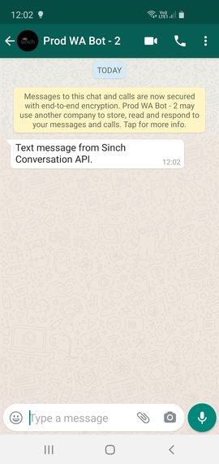
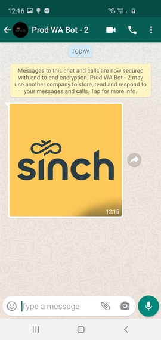
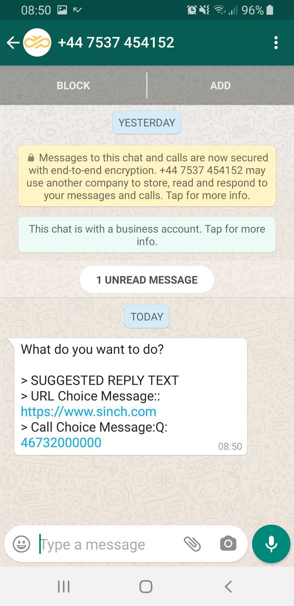
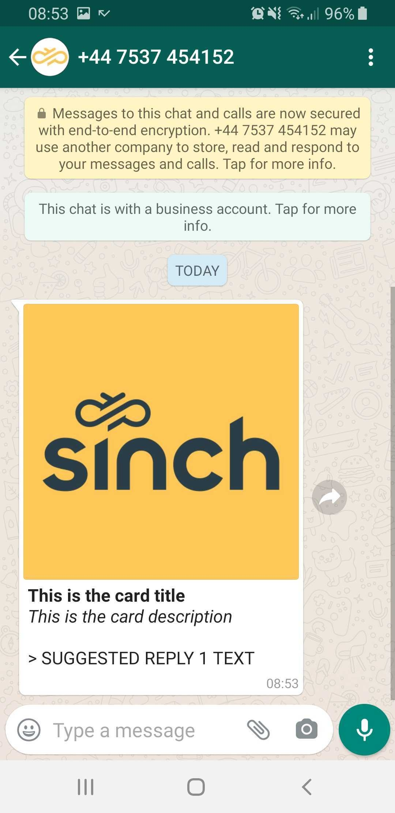
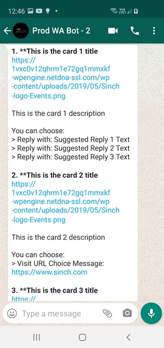
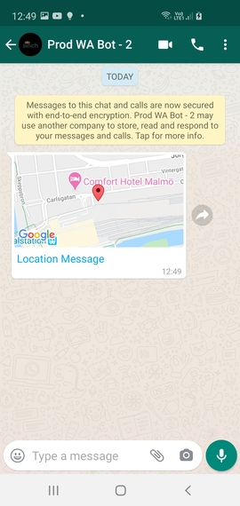
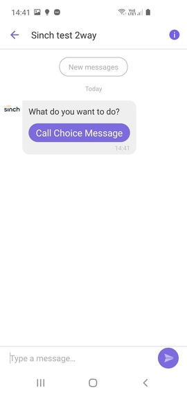
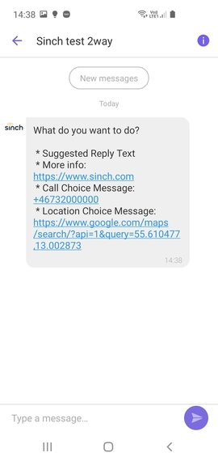
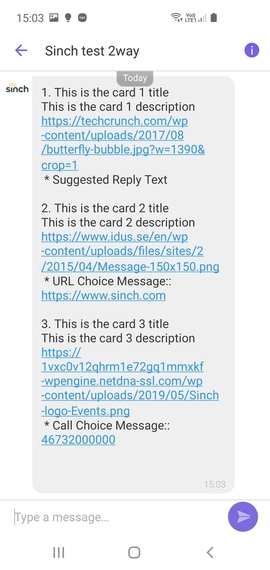

## Conversation API Channel Support

This document gives detailed description of Conversation API channel support.

### Facebook Messenger

Conversation API supports Facebook Messenger and allows sending messages from Facebook Pages.
Page cannot initiate the conversation, it must be started by a contact. To create and configure
Facebook Page and connect it to Conversation Api App follow the instructions below

- Go to https://developers.facebook.com/ and login with your personal/developer account
- Click on **My Apps** on the top right corner and select **Create App**
- Fill in the display name for your app and contact email, then click **Create App ID** button
- Once the app is created, you will see a dashboard with various products that you may add to your app.
  Click **Set Up** button inside a box with **Messenger** title
- Scroll down to **Access Tokens** section, and click **Create New Page** button
- Provide page name and category, then click **Create Page** button
- Go back to the **Messenger Set Up** page. Now click **Add or Remove pages** in the **Access Tokens** section.
  Select previously created page and link it to your app (just **Next**, **Done**, **Ok**)
- You should now see a table row in a table in the **Access Tokens** modal. Click on **Generate Token** for that row.
  Copy this token (from now on referred as **FACEBOOK_PAGE_TOKEN**) and save it somewhere safe.
  This is the access token that you need to specify when setting up a Conversation API App
- Now you need to create an Conversation Api App with `channel_credentials` for Facebook Messenger,
  example snippet below

```json
{
  "channel_priority_order": ["MESSENGER"],
  "channel_credentials": [
    {
      "channel": "MESSENGER",
      "static_token": {
        "token": "{{FACEBOOK_PAGE_TOKEN}}"
      }
    }
  ],
  "display_name": "App name"
}
```

- Once you have created Conversation Api App, go back to Facebook **Messenger Set Up** page, find
  **Webhooks** section (just below **Access Tokens**), click **Add Callback URL** button and fill in with
  the following data (**remember to put your Conversation App ID in the callback url**):  
  Callback URL: `https://messenger-adapter.conversation-api.prod.sinch.com/adapter/v1/{{CONVERSATION_APP_ID}}/callback`  
  Verify Token: `5651d9fd-5c33-4d7a-aa37-5e3e151c2a92`
- After clicking **Verify and Save**, if no errors occurred, a table in **Webhooks** section will appear,
  with your **Facebook Page** listed within. Click **Add Subscriptions** button, check all boxes and click **save**
- Now you need to enable **pages_messaging** for your App. Scroll down to the **App review for Messenger**
  section and click **Add to submission** on the **pages_messaging** row
- Scroll down further and you should see a **Current Submissions** section. You will most likely see
  a little **Additional Information Required** alert notifying you that you need to complete some details before submitting
- Follow the instructions and go to the settings to add the required pieces, which should be:
  - App Icon
  - Privacy Policy URL (for test and development purposes you may use a generator for it)
  - Category
  - Business Use
- This is enough for test and development purposes, you don't have to fill **Details** section nor
  submit it for review. Now you are able to send messages anyone that has been granted either the Administrator,
  Developer or Tester role for your app
- Add webhook to your Conversation App using Conversation Api, example snippet below

```json
{
  "app_id": "{{APP}}",
  "target": "{{WEBHOOK_URL}}",
  "target_type": "HTTP",
  "triggers": [
    "MESSAGE_DELIVERY",
    "EVENT_DELIVERY",
    "MESSAGE_INBOUND",
    "EVENT_INBOUND",
    "CONVERSATION_START",
    "CONVERSATION_STOP",
    "UNSUPPORTED"
  ]
}
```

- And finally, visit your Facebook Page as user with proper role granted (preferably the one who created page)
  and try sending a message to it - remember that user has to start the conversation. If everything works
  fine, you should receive two callbacks, one with `conversation_start_notification`

```json
{
  "app_id": "01E9DQJFPWGZ2T05XTVZAD0BYB",
  "conversation_start_notification": {
    "conversation": {
      "id": "01E9DV2N8C6CK41XFPGQPN0NWE",
      "app_id": "01E9DQJFPWGZ2T05XTVZAD0BYB",
      "contact_id": "01E9DV2N7TYPJ50V0FYC08110D",
      "last_received": "2020-05-28T14:30:48Z",
      "active_channel": "CHANNEL_UNSPECIFIED",
      "active": true,
      "metadata": "",
      "active_channel_senders": []
    }
  }
}
```

- and one with message you've just sent

```json
{
  "app_id": "01E9DQJFPWGZ2T05XTVZAD0BYB",
  "accepted_time": "2020-05-28T14:30:47.850538Z",
  "message": {
    "id": "01E9DV2N92BMDD034JZ0AQ0VKB",
    "direction": "TO_APP",
    "contact_message": {
      "text_message": {
        "text": "Hello World"
      }
    },
    "channel": "MESSENGER",
    "conversation_id": "01E9DV2N8C6CK41XFPGQPN0NWE",
    "contact_id": "01E9DV2N7TYPJ50V0FYC08110D",
    "metadata": "",
    "accept_time": "2020-05-28T14:30:47.841429Z"
  }
}
```

- Now, with conversation created automatically, you can use received **contact_id** to send a response
  for this user:

```json
{
  "app_id": "{{APP_ID}}",
  "recipient": {
    "contact_id": "{{CONTACT_ID}}"
  },
  "message": {
    "text_message": {
      "text": "Text message from Sinch Conversation API."
    }
  },
  "channel_priority_order": ["MESSENGER"]
}
```

- You should receive callbacks with information that message has been delivered and read. Channel is now configured

#### Rich Message Support

This section provides detailed information about which rich messages are
natively supported by Facebook Messenger channel and what transcoding is applied in
other cases.

#### Sending Messages

Here we give a mapping between Conversation API generic message format
and the Messenger rendering on mobile devices.
Please note that for the sake of brevity the JSON snippets do not include
the **recipient** and **app_id** which are both required when sending a message.

##### Text Messages

---

Conversation API POST `messages:send`

```json
{
  "message": {
    "text_message": {
      "text": "Text message from Sinch Conversation API."
    }
  }
}
```

The rendered message:


##### Media Messages

---

Conversation API POST `messages:send`

```json
{
  "message": {
    "media_message": {
      "url": "https://1vxc0v12qhrm1e72gq1mmxkf-wpengine.netdna-ssl.com/wp-content/uploads/2018/12/favicon.png"
    }
  }
}
```

The rendered message:


##### Choice Messages

---

Conversation API POST `messages:send`

```json
{
  "message": {
    "choice_message": {
      "text_message": {
        "text": "What do you want to do?"
      },
      "choices": [
        {
          "text_message": {
            "text": "Suggested Reply Text"
          }
        },
        {
          "url_message": {
            "title": "URL Choice Message:",
            "url": "https://www.sinch.com"
          }
        },
        {
          "call_message": {
            "title": "Call Choice Message:Q",
            "phone_number": "46732000000"
          }
        },
        {
          "location_message": {
            "title": "Location Choice Message",
            "label": "Enriching Engagement",
            "coordinates": {
              "latitude": 55.610479,
              "longitude": 13.002873
            }
          }
        }
      ]
    }
  }
}
```

The rendered message:


##### Card Messages

---

Conversation API POST `messages:send`

```json
{
  "message": {
    "card_message": {
      "title": "This is the card title",
      "description": "This is the card description",
      "media_message": {
        "url": "https://1vxc0v12qhrm1e72gq1mmxkf-wpengine.netdna-ssl.com/wp-content/uploads/2019/05/Sinch-logo-Events.png"
      },
      "choices": [
        {
          "text_message": {
            "text": "Suggested Reply Text"
          }
        },
        {
          "url_message": {
            "title": "URL Choice Message:",
            "url": "https://www.sinch.com"
          }
        },
        {
          "call_message": {
            "title": "Call Choice Message:Q",
            "phone_number": "46732000000"
          }
        },
        {
          "location_message": {
            "title": "Location Choice Message",
            "label": "Enriching Engagement",
            "coordinates": {
              "latitude": 55.610479,
              "longitude": 13.002873
            }
          }
        }
      ]
    }
  }
}
```

The rendered message:


##### Carousel Messages

---

Conversation API POST `messages:send`

```json
{
  "message": {
    "carousel_message": {
      "cards": [
        {
          "title": "This is the card 1 title",
          "description": "This is the card 1 description",
          "media_message": {
            "url": "https://1vxc0v12qhrm1e72gq1mmxkf-wpengine.netdna-ssl.com/wp-content/uploads/2019/05/Sinch-logo-Events.png"
          },
          "choices": [
            {
              "text_message": {
                "text": "Suggested Reply 1 Text"
              }
            },
            {
              "text_message": {
                "text": "Suggested Reply 2 Text"
              }
            },
            {
              "text_message": {
                "text": "Suggested Reply 3 Text"
              }
            }
          ]
        },
        {
          "title": "This is the card 2 title",
          "description": "This is the card 2 description",
          "media_message": {
            "url": "https://1vxc0v12qhrm1e72gq1mmxkf-wpengine.netdna-ssl.com/wp-content/uploads/2019/05/Sinch-logo-Events.png"
          },
          "choices": [
            {
              "url_message": {
                "title": "URL Choice Message:",
                "url": "https://www.sinch.com"
              }
            }
          ]
        },
        {
          "title": "This is the card 3 title",
          "description": "This is the card 3 description",
          "media_message": {
            "url": "https://1vxc0v12qhrm1e72gq1mmxkf-wpengine.netdna-ssl.com/wp-content/uploads/2019/05/Sinch-logo-Events.png"
          },
          "choices": [
            {
              "call_message": {
                "title": "Call Choice Message:Q",
                "phone_number": "46732000000"
              }
            }
          ]
        },
        {
          "title": "This is the card 4 title",
          "description": "This is the card 4 description",
          "media_message": {
            "url": "https://1vxc0v12qhrm1e72gq1mmxkf-wpengine.netdna-ssl.com/wp-content/uploads/2019/05/Sinch-logo-Events.png"
          },
          "choices": [
            {
              "location_message": {
                "title": "Location Choice Message",
                "label": "Enriching Engagement",
                "coordinates": {
                  "latitude": 55.610479,
                  "longitude": 13.002873
                }
              }
            }
          ]
        }
      ]
    }
  }
}
```

The rendered message:


##### Location Messages

---

Conversation API POST `messages:send`

```json
{
  "message": {
    "location_message": {
      "title": "Location Message",
      "label": "Enriching Engagement",
      "coordinates": {
        "latitude": 55.610479,
        "longitude": 13.002873
      }
    }
  }
}
```

The rendered message:


### WhatsApp

Conversation API provides support for WhatsApp channel through Sinch WhatsApp Business Messaging API.
To start using WhatsApp through Conversation API you need to first have a Sinch WhatsApp bot -
[read more](https://developers.sinch.com/docs/whatsapp-introduction).

#### Channel Configuration

##### Sending Config

Sending a WhatsApp message requires a Conversation API **app** with
`channel_credentials` for WHATSAPP channel. Example, **app** is given in the
following snippet:

```json
{
    "channel_credentials": [
        {
            "channel": "WHATSAPP",
            "static_bearer": {
                "claimed_identity": "{{WHATSAPP_BOT_ID}}",
                "token": "{{WHATSAPP_BEARER_TOKEN}}"
            }
        }
    ]
}
```

You need to replace `{{WHATSAPP_BOT_ID}}` with your Sinch WhatsApp bot ID and
`{{WHATSAPP_BEARER_TOKEN}}` with the bot's access token.

##### Receiving Config

Receiving contact messages (replies) and delivery receipts
from WhatsApp requires setting the Callback URL of the WhatsApp bot to
point to your Conversation API **app**. The URL is the following:

```
https://whatsapp-adapter.conversation-api.int.prod.sinch.com/adapter/v1/{{CONV_API_APP_ID}}/callback
```

where {{CONV_API_APP_ID}} is your **app** id.
You also need to configure at least one Conversation API webhook which
will trigger POST callbacks to the given URL.
The triggers which are relevant for WhatsApp channel are:

* MESSAGE_DELIVERY - delivery receipts for business messages
* MESSAGE_INBOUND - inbound messages e.g., contact replies

#### Rich Message Support

Conversation API supports all capabilities of WhatsApp API: rich template messages,
media and location messages.

##### Sending Messages

This section provides examples of various messaging capabilities of WhatsApp channel,
and how to utilize them using Conversation API generic message format.
Please note that for the sake of brevity the JSON snippets do not include
the **recipient** and **app_id** which are both required when sending a message.

###### Template messages

Sending a message outside of the customer care session requires an approved template
([read more](https://developers.sinch.com/docs/whatsapp-introduction)).
You need to specify the template name, language code, and the set of parameters
defined in the template. Conversation API provides capability to send
channel-specific templates that use a key-value dictionary to
specify the template parameters. Each key in the dictionary corresponds to
a property of a template parameter as they are defined in WhatsApp public
documentation for [media](https://developers.facebook.com/docs/whatsapp/api/messages/message-templates/media-message-templates)
and [interactive](https://developers.facebook.com/docs/whatsapp/api/messages/message-templates/interactive-message-templates)
templates.

The format of the keys in the parameter dictionary is of the following form:
```
<component_type>[<component_index>]<component_sub_type>[<parameter_index>]<parameter_field>
```

where:

- *component_type* is one of header, body or button.
- *component_index* is a 0-based index of the button in the template. There are at most 3 buttons. *component_index* is present and required only for button component.
- *component_sub_type* is present and required only for button component. It is one of quick_reply or url.
- *parameter_index* is a 1-based index of the parameter for the given component.
- *parameter_field* is a property of the parameter. It can be one of text, payload, document.*, image.* or video.*

---

**Text Template**

Below is an example of sending a text-only template with three body parameters i.e., no header.
The template name is *text_template* and it is available for *en* language code.

Conversation API POST `messages:send`

```json
{
    "message": {
        "template_message": {
            "channel_template": {
                "WHATSAPP": {
                    "template_id": "text_template",
                    "language_code": "en",
                    "parameters": {
                        "body[1]text": "Value of first parameter",
                        "body[2]text": "Value of second parameter",
                        "body[3]text": "Value of third parameter"
                    }
                }
            }
        }
    }
}
```

Sending the same template for *fr* language code which also include a text header parameter will be:

```json
{
    "message": {
        "template_message": {
            "channel_template": {
                "WHATSAPP": {
                    "template_id": "text_template",
                    "language_code": "fr",
                    "parameters": {
                        "header[1]text": "Value of header parameter",
                        "body[1]text": "Value of first parameter",
                        "body[2]text": "Value of second parameter",
                        "body[3]text": "Value of third parameter"
                    }
                }
            }
        }
    }
}
```

---

**Media Template**

WhatsApp allows sending media (document, video, image) in the template header.

**Document**

The parameter fields are:

| Parameter field key             | Description                               | Required? |
| ------------------------------- | ----------------------------------------- | --------- |
| header[1]document.link          | The URL of the document                   | Yes       |
| header[1]document.provider.name | Provider to use when downloading the file | No        |
| header[1]document.filename      | The filename of the document              | No        |

Below is an example of sending a template with a document header and a single body parameter.
The template name is *document_template* available for *en* language code.

Conversation API POST `messages:send`

```json
{
    "message": {
        "template_message": {
            "channel_template": {
                "WHATSAPP": {
                    "template_id": "document_template",
                    "language_code": "en",
                    "parameters": {
                        "header[1]document.link": "https://example.com",
                        "header[1]document.filename": "document.pdf",
                        "body[1]text": "Value of first parameter"
                    }
                }
            }
        }
    }
}
```

**Video**

The parameter fields are:

| Parameter field key             | Description                               | Required? |
| ------------------------------- | ----------------------------------------- | --------- |
| header[1]video.link             | The URL of the video                      | Yes       |
| header[1]video.provider.name    | Provider to use when downloading the file | No        |

Below is an example of sending a template with a video header and a single body parameter.
The template name is *video_template* available for *en* language code.

Conversation API POST `messages:send`

```json
{
    "message": {
        "template_message": {
            "channel_template": {
                "WHATSAPP": {
                    "template_id": "video_template",
                    "language_code": "en",
                    "parameters": {
                        "header[1]video.link": "https://example.com",
                        "body[1]text": "Value of first parameter"
                    }
                }
            }
        }
    }
}
```

**Image**

The parameter fields are:

| Parameter field key             | Description                               | Required? |
| ------------------------------- | ----------------------------------------- | --------- |
| header[1]image.link             | The URL of the image                      | Yes       |
| header[1]image.provider.name    | Provider to use when downloading the file | No        |

Below is an example of sending a template with an image header and a single body parameter.
The template name is *image_template* available for *en* language code.

Conversation API POST `messages:send`

```json
{
    "message": {
        "template_message": {
            "channel_template": {
                "WHATSAPP": {
                    "template_id": "image_template",
                    "language_code": "en",
                    "parameters": {
                        "header[1]image.link": "https://example.com",
                        "body[1]text": "Value of first parameter"
                    }
                }
            }
        }
    }
}
```

---

**Interactive Template**

WhatsApp allows sending interactive templates with up to three buttons.

The parameter fields used to configure the buttons in the template are:

| Parameter field key             | Description                               | Required?                                         |
| ------------------------------- | ----------------------------------------- | ------------------------------------------------- |
| button[n]url[1]text             | Dynamic URL suffix for the URL button     | Yes, if button at index *n* is URL button         |
| button[m]quick_reply[1]payload  | Postback payload to be returned           | Yes, if button at index *m* is quick_reply button |

where *n* and *m* are indices of the buttons in the template.
The quick_reply payload field must be set even when empty. For example for quick_reply button
at index 0 this can be done by adding the following entry in the parameter dictionary:

 ```
    "button[0]quick_reply[1]payload": ""
 ```

Below is an example of sending a template with a quick reply button at index 0 and two
URL buttons at index 1 and 2 respectively. The template have also one header and one body
parameters. The template name is *interactive_template* available for *en* language code.

Conversation API POST `messages:send`

```json
{
    "message": {
        "template_message": {
            "channel_template": {
                "WHATSAPP": {
                    "template_id": "interactive_template",
                    "language_code": "en",
                    "parameters": {
                        "header[1]text": "Value of header parameter",
                        "body[1]text": "Value of first parameter",
                        "button[0]quick_reply[1]payload": "Value of quick reply postback button 0",
                        "button[1]url[1]text": "Value for URL suffix button 1",
                        "button[2]url[1]text": "Value for URL suffix button 2"
                    }
                }
            }
        }
    }
}
```

###### Text Messages

Given a customer care session has started sending a text message with WhatsApp is done as follow:

---

Conversation API POST `messages:send`

```json
{
    "message": {
        "text_message": {
            "text": "Text message from Sinch Conversation API."
        }
    }
}
```

The rendered message:



###### Media Messages

Sending media messages is easy - simply specify the URL to the media and
Conversation API will automatically detect what type of WhatsApp message to use - image, video, document or audio:

---

Conversation API POST `messages:send`

```json
{
    "message": {
        "media_message": {
            "url": "https://1vxc0v12qhrm1e72gq1mmxkf-wpengine.netdna-ssl.com/wp-content/uploads/2019/05/Sinch-logo-Events.png"
        }
    }
}
```

The rendered message:



---

###### Choice Messages

WhatsApp channel does not provide native support for **Choice Messages** so they are
transcoded to text:

---

Conversation API POST `messages:send`

```json
{
    "message": {
        "choice_message": {
            "text_message": {
                "text": "What do you want to do?"
            },
            "choices": [
                {
                    "text_message": {
                        "text": "Suggested Reply Text"
                    }
                },
                {
                    "url_message": {
                        "title": "URL Choice Message:",
                        "url": "https://www.sinch.com"
                    }
                },
                {
                    "call_message": {
                        "title": "Call Choice Message:Q",
                        "phone_number": "46732000000"
                    }
                },
                {
                    "location_message": {
                        "title": "Location Choice Message",
                        "label": "Enriching Engagement",
                        "coordinates": {
                            "latitude": 55.610479,
                            "longitude": 13.002873
                        }
                    }
                }
            ]
        }
    }
}
```

The rendered message:



###### Card Messages

Card messages sent to WhatsApp are transcoded as media with text caption: 

---

Conversation API POST `messages:send`

```json
{
    "message": {
        "card_message": {
            "title": "This is the card title",
            "description": "This is the card description",
            "media_message": {
                "url": "https://1vxc0v12qhrm1e72gq1mmxkf-wpengine.netdna-ssl.com/wp-content/uploads/2019/05/Sinch-logo-Events.png"
            },
            "choices": [
                {
                    "text_message": {
                        "text": "Suggested Reply Text"
                    }
                },
                {
                    "url_message": {
                        "title": "URL Choice Message:",
                        "url": "https://www.sinch.com"
                    }
                },
                {
                    "call_message": {
                        "title": "Call Choice Message:Q",
                        "phone_number": "46732000000"
                    }
                },
                {
                    "location_message": {
                        "title": "Location Choice Message",
                        "label": "Enriching Engagement",
                        "coordinates": {
                            "latitude": 55.610479,
                            "longitude": 13.002873
                        }
                    }
                }
            ]
        }
    }
}
```

The rendered message:



###### Carousel Messages

WhatsApp does not support natively Carousel messages and this is why they are
transcoded and sent as text message by Conversation API.

---

Conversation API POST `messages:send`

```json
{
    "message": {
        "carousel_message": {
            "cards": [
                {
                    "title": "This is the card 1 title",
                    "description": "This is the card 1 description",
                    "media_message": {
                        "url": "https://1vxc0v12qhrm1e72gq1mmxkf-wpengine.netdna-ssl.com/wp-content/uploads/2019/05/Sinch-logo-Events.png"
                    },
                    "choices": [
                        {
                            "text_message": {
                                "text": "Suggested Reply 1 Text"
                            }
                        },
                        {
                            "text_message": {
                                "text": "Suggested Reply 2 Text"
                            }
                        },
                        {
                            "text_message": {
                                "text": "Suggested Reply 3 Text"
                            }
                        }
                    ]
                },
                {
                    "title": "This is the card 2 title",
                    "description": "This is the card 2 description",
                    "media_message": {
                        "url": "https://1vxc0v12qhrm1e72gq1mmxkf-wpengine.netdna-ssl.com/wp-content/uploads/2019/05/Sinch-logo-Events.png"
                    },
                    "choices": [
                        {
                            "url_message": {
                                "title": "URL Choice Message:",
                                "url": "https://www.sinch.com"
                            }
                        }
                    ]
                },
                {
                    "title": "This is the card 3 title",
                    "description": "This is the card 3 description",
                    "media_message": {
                        "url": "https://1vxc0v12qhrm1e72gq1mmxkf-wpengine.netdna-ssl.com/wp-content/uploads/2019/05/Sinch-logo-Events.png"
                    },
                    "choices": [
                        {
                            "call_message": {
                                "title": "Call Choice Message:Q",
                                "phone_number": "46732000000"
                            }
                        }
                    ]
                },
                {
                    "title": "This is the card 4 title",
                    "description": "This is the card 4 description",
                    "media_message": {
                        "url": "https://1vxc0v12qhrm1e72gq1mmxkf-wpengine.netdna-ssl.com/wp-content/uploads/2019/05/Sinch-logo-Events.png"
                    },
                    "choices": [
                        {
                            "location_message": {
                                "title": "Location Choice Message",
                                "label": "Enriching Engagement",
                                "coordinates": {
                                    "latitude": 55.610479,
                                    "longitude": 13.002873
                                }
                            }
                        }
                    ]
                }
            ]
        }
    }
}
```

The rendered message:



###### Location Messages

Location messages are supported by WhatsApp channel:

---

Conversation API POST `messages:send`

```json
{
    "message": {
        "location_message": {
            "title": "Location Message",
            "label": "Enriching Engagement",
            "coordinates": {
                "latitude": 55.610479,
                "longitude": 13.002873
            }
        }
    }
}
```

The rendered message:



##### Receiving Messages

WhatsApp channel supports various kinds of contact messages - text, media, location as well as quick replies.
All of these are delivered by Conversation API with POST to `MESSAGE_INBOUND` webhook:

---

Example text reply:

```json
{
  "app_id": "01E8RCZPK7HFV70FFDWFFK0EXK",
  "accepted_time": "2020-06-22T10:55:39.534687Z",
  "message": {
    "id": "01EBDTPPG3Q3EH14H7DY8X09MG",
    "direction": "TO_APP",
    "contact_message": {
      "text_message": {
        "text": "Hi from contact"
      }
    },
    "channel_identity": {
      "channel": "WHATSAPP",
      "identity": "46712312312",
      "app_id": ""
    },
    "conversation_id": "01EB199XQ2CBY50K6WZD9S1A22",
    "contact_id": "01EB197NDA4W7V15NPRCVV0S79",
    "metadata": "",
    "accept_time": "2020-06-22T10:55:39.521500Z"
  }
}
```

---

Example location contact message:

```json
{
  "app_id": "01E8RCZPK7HFV70FFDWFFK0EXK",
  "accepted_time": "2020-06-22T10:57:36.074692Z",
  "message": {
    "id": "01EBDTT89ZGTGM0P70W0RK0YR2",
    "direction": "TO_APP",
    "contact_message": {
      "location_message": {
        "title": "ICA Jägaren",
        "coordinates": {
          "latitude": 55.727802,
          "longitude": 13.175061
        },
        "label": ""
      }
    },
    "channel_identity": {
      "channel": "WHATSAPP",
      "identity": "46712312312",
      "app_id": ""
    },
    "conversation_id": "01EB199XQ2CBY50K6WZD9S1A22",
    "contact_id": "01EB197NDA4W7V15NPRCVV0S79",
    "metadata": "",
    "accept_time": "2020-06-22T10:57:36.060961Z"
  }
}
```

---

Example quick reply message:

```json
{
  "app_id": "01E8RCZPK7HFV70FFDWFFK0EXK",
  "accepted_time": "2020-06-22T11:00:32.866988Z",
  "message": {
    "id": "01EBDTZMYPHM0G1D0AJFEZ0A4P",
    "direction": "TO_APP",
    "contact_message": {
      "choice_response_message": {
        "message_id": "01EBDTZ9SN8HTW092K56PH1GDS",
        "postback_data": "email_postback"
      }
    },
    "channel_identity": {
      "channel": "WHATSAPP",
      "identity": "46712312312",
      "app_id": ""
    },
    "conversation_id": "01EB199XQ2CBY50K6WZD9S1A22",
    "contact_id": "01EB197NDA4W7V15NPRCVV0S79",
    "metadata": "",
    "accept_time": "2020-06-22T11:00:32.852315Z"
  }
}
```

##### Receiving Delivery Receipts

Messages sent on WhatsApp channel can have three statuses: DELIVERED, READ and FAILED.
If the status is FAILED the reason will include more information about the failure.
Note that not all messages which are successfully delivered have both DELIVERED and READ.
Only READ receipt is sent when the contact's WhatsApp app and conversation is active
when the message is received.
Below is an example for DELIVERED receipt - READ and FAILED differ by the
`status` and `reason` only.
Conversation API POST to `MESSAGE_DELIVERY` webhook:

```json
{
  "app_id": "01E8RCZPK7HFV70FFDWFFK0EXK",
  "accepted_time": "2020-06-22T11:05:53.910Z",
  "message_delivery_report": {
    "message_id": "01EBDV9EFP66ZA0GQJ9MCX1V9H",
    "conversation_id": "01EB199XQ2CBY50K6WZD9S1A22",
    "status": "READ",
    "channel_identity": {
      "channel": "WHATSAPP",
      "identity": "+46702471483",
      "app_id": ""
    },
    "contact_id": "01EB197NDA4W7V15NPRCVV0S79",
    "metadata": ""
  }
}
```

### Viber Business Messages

Viber Business Messages (VBM) supports 3 types of business account: 1way, 2way
and session:

- 1way is an account which can send one-way messages only - the contact cannot
  enter a reply from the device
- 2way accounts allow contacts to reply
- session accounts cannot initiate the conversation to the contact. Instead,
  the conversation must be started by the contact. Session accounts only support
  text and image messages.

For all types of accounts the phone number is the contact identifier of the
recipient of the business messages (i.e., channel recipient identity).

Conversation API supports 1way and 2way Viber BM accounts.

#### Channel Configuration

##### Sending Config

To start sending VBM messages you need a Conversation API **app** with
`channel_credentials` for VIBERBM channel. Example, **app** is given in the
following snippet:

```json
{
  "channel_credentials": [
    {
      "channel": "VIBERBM",
      "static_bearer": {
        "claimed_identity": "{{VBM_SERVICE_ID}}"
      }
    }
  ]
}
```

You need to replace `{{VBM_SERVICE_ID}}` with your VBM service ID.

##### Receiving Config

To start receiving contact messages (replies) and delivery receipts for sent
messages your VBM service plan needs to be configured with the callback
URL corresponding to your Conversation API **app**.
Please contact Conversation API support team for help with that.

You also need to configure at least one Conversation API webhook which
will trigger POST callbacks to the given URL.
The triggers which are relevant for VBM channel are:

- MESSAGE_DELIVERY - delivery receipts for business messages
- MESSAGE_INBOUND - inbound messages e.g., contact replies
- UNSUPPORTED - Conversation API delivers VBM user opt-in/out events as UNSUPPORTED channel notifications

#### Rich Message Support

This section provides detailed information about which rich messages are
natively supported by VBM channel and what transcoding is applied in
other cases.

##### Sending Messages

Here we give a mapping between Conversation API generic message format
and the VBM rendering on mobile devices.
Please note that for the sake of brevity the JSON snippets do not include
the **recipient** and **app_id** which are both required when sending a message.

###### Text Messages

Text messages are natively supported by VBM channel.

---

Conversation API POST `messages:send`

```json
{
  "message": {
    "text_message": {
      "text": "Text message from Sinch Conversation API."
    }
  }
}
```

The rendered message:


###### Media Messages

VBM support Image messages natively:

---

Conversation API POST `messages:send`

```json
{
  "message": {
    "media_message": {
      "url": "https://1vxc0v12qhrm1e72gq1mmxkf-wpengine.netdna-ssl.com/wp-content/uploads/2019/05/Sinch-logo-Events.png"
    }
  }
}
```

The rendered message:


---

Video and other types of media messages render as a link:


###### Choice Messages

VBM channel provides native support for single choice (URL, Call, or Location) **Choice Messages**:

---

**URL Choice**

Conversation API POST `messages:send`

```json
{
  "message": {
    "choice_message": {
      "text_message": {
        "text": "What do you want to do?"
      },
      "choices": [
        {
          "url_message": {
            "title": "More info",
            "url": "https://www.sinch.com"
          }
        }
      ]
    }
  }
}
```

The rendered message:


---

**Call Choice**

Call choice renders a button which opens Viber keypad with the phone
number in the request.

```json
{
  "message": {
    "choice_message": {
      "text_message": {
        "text": "What do you want to do?"
      },
      "choices": [
        {
          "call_message": {
            "title": "Call Choice Message",
            "phone_number": "+46732000000"
          }
        }
      ]
    }
  }
}
```

The rendered message:



---

**Location Choice**

Location choice renders a button which opens Google Maps with the coordinates
of the location.

```json
{
  "message": {
    "choice_message": {
      "text_message": {
        "text": "What do you want to do?"
      },
      "choices": [
        {
          "location_message": {
            "title": "Location Choice Message",
            "label": "Enriching Engagement",
            "coordinates": {
              "latitude": 55.610479,
              "longitude": 13.002873
            }
          }
        }
      ]
    }
  }
}
```

The rendered message:


---

**Text Choice or Multiple Choices**

There is no native support for suggested replies or multiple choices in VBM.

```json
{
  "message": {
    "choice_message": {
      "text_message": {
        "text": "What do you want to do?"
      },
      "choices": [
        {
          "text_message": {
            "text": "Suggested Reply Text"
          }
        },
        {
          "url_message": {
            "title": "More info",
            "url": "https://www.sinch.com"
          }
        },
        {
          "call_message": {
            "title": "Call Choice Message",
            "phone_number": "+46732000000"
          }
        },
        {
          "location_message": {
            "title": "Location Choice Message",
            "label": "Enriching Engagement",
            "coordinates": {
              "latitude": 55.610479,
              "longitude": 13.002873
            }
          }
        }
      ]
    }
  }
}
```

The rendered message:



###### Card Messages

VBM supports natively Card messages with one URL, Call, or Location choice.
The media message in the Card should point to an image.

---

Conversation API POST `messages:send`

```json
{
  "message": {
    "card_message": {
      "title": "This is the card title",
      "description": "This is the card description",
      "media_message": {
        "url": "https://1vxc0v12qhrm1e72gq1mmxkf-wpengine.netdna-ssl.com/wp-content/uploads/2019/05/Sinch-logo-Events.png"
      },
      "choices": [
        {
          "url_message": {
            "title": "More info",
            "url": "https://www.sinch.com"
          }
        }
      ]
    }
  }
}
```

The rendered message:


---

Card messages with non-image media, multiple choices or a single suggested reply choice render
as text:


###### Carousel Messages

VBM does not support natively Carousel messages and this is why they are
transcoded and sent as text message by Conversation API.

---

Conversation API POST `messages:send`

```json
{
  "message": {
    "carousel_message": {
      "cards": [
        {
          "title": "This is the card 1 title",
          "description": "This is the card 1 description",
          "media_message": {
            "url": "https://techcrunch.com/wp-content/uploads/2017/08/butterfly-bubble.jpg?w=1390&crop=1"
          },
          "choices": [
            {
              "text_message": {
                "text": "Suggested Reply Text"
              }
            }
          ]
        },
        {
          "title": "This is the card 2 title",
          "description": "This is the card 2 description",
          "media_message": {
            "url": "https://www.idus.se/en/wp-content/uploads/files/sites/2/2015/04/Message-150x150.png"
          },
          "choices": [
            {
              "url_message": {
                "title": "URL Choice Message:",
                "url": "https://www.sinch.com"
              }
            }
          ]
        },
        {
          "title": "This is the card 3 title",
          "description": "This is the card 3 description",
          "media_message": {
            "url": "https://1vxc0v12qhrm1e72gq1mmxkf-wpengine.netdna-ssl.com/wp-content/uploads/2019/05/Sinch-logo-Events.png"
          },
          "choices": [
            {
              "call_message": {
                "title": "Call Choice Message:",
                "phone_number": "46732000000"
              }
            }
          ]
        }
      ]
    }
  }
}
```

The rendered message:



###### Location Messages

VBM does not support natively Location messages and so they are
transcoded and sent as text message by Conversation API.

---

Conversation API POST `messages:send`

```json
{
  "message": {
    "location_message": {
      "title": "Location Message",
      "label": "Enriching Engagement",
      "coordinates": {
        "latitude": 55.610479,
        "longitude": 13.002873
      }
    }
  }
}
```

The rendered message:


##### Receiving Messages

VBM support only text replies or contact initiated messages.

Conversation API POST to `MESSAGE_INBOUND` webhook:

```json
{
  "app_id": "01E3S8B6YCMRNR0GGM94H80ACX",
  "accepted_time": "2020-04-24T08:02:50.184581Z",
  "message": {
    "id": "01E6NKBV63YG6K01ENEW7S1N80",
    "direction": "TO_APP",
    "contact_message": {
      "text_message": {
        "text": "Hi from contact"
      }
    },
    "channel": "VIBERBM",
    "conversation_id": "01E6K4A8PGZ6MV0GD3C7M901MZ",
    "contact_id": "01E6K4A8N3NANZ05VM0FS80EHD",
    "metadata": "",
    "accept_time": "2020-04-24T08:02:50.179021Z"
  }
}
```

##### Receiving Delivery Receipts

Messages sent on VBM channel have three statuses: DELIVERED, READ and FAILED.
Below is an example for DELIVERED receipt - READ and FAILED differ by the
`status` and `reason` only.
Conversation API POST to `MESSAGE_DELIVERY` webhook:

```json
{
  "app_id": "01E3S8B6YCMRNR0GGM94H80ACX",
  "accepted_time": "2020-04-23T09:55:04.766Z",
  "message_delivery_report": {
    "message_id": "01E6K7CMXY3KHH0AGCTY6D04F2",
    "conversation_id": "01E6JY5HMCADX31SANQ0YE0CH6",
    "status": "DELIVERED",
    "channel": "VIBERBM",
    "reason": "",
    "metadata": ""
  }
}
```

##### Receiving User Opt-In/Out

VBM can at any time opt-in/out of receiving messages by given VBM account.

###### Opt-In

Conversation API POST to `UNSUPPORTED` webhook:

```json
{
  "app_id": "01E3S8B6YCMRNR0GGM94H80ACX",
  "accepted_time": "2020-04-24T08:06:04.078344Z",
  "unsupported_callback": {
    "channel": "VIBERBM",
    "payload": "{\"message_token\":\"5434382642129923939\",\"message_status\":4,\"message_time\":1587715563958,\"phone_number\":\"46702470247\",\"service_id\":111}"
  }
}
```

###### Opt-Out

Conversation API POST to `UNSUPPORTED` webhook:

```json
{
  "app_id": "01E3S8B6YCMRNR0GGM94H80ACX",
  "accepted_time": "2020-04-24T08:06:57.176156Z",
  "unsupported_callback": {
    "channel": "VIBERBM",
    "payload": "{\"message_token\":\"5434382864469978544\",\"message_status\":5,\"message_time\":1587715616968,\"phone_number\":\"46702470247\",\"service_id\":111}"
  }
}
```
