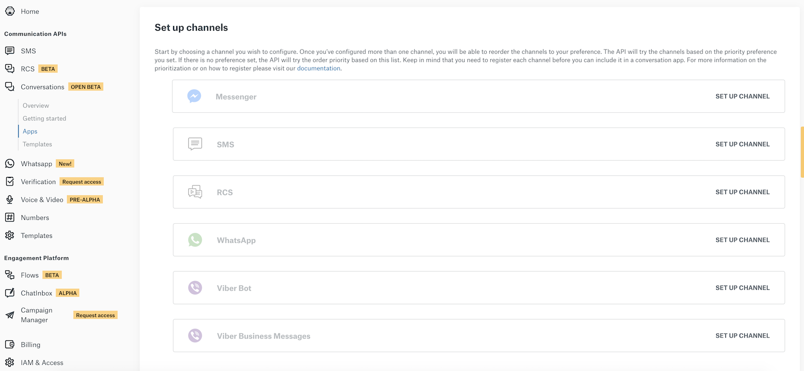
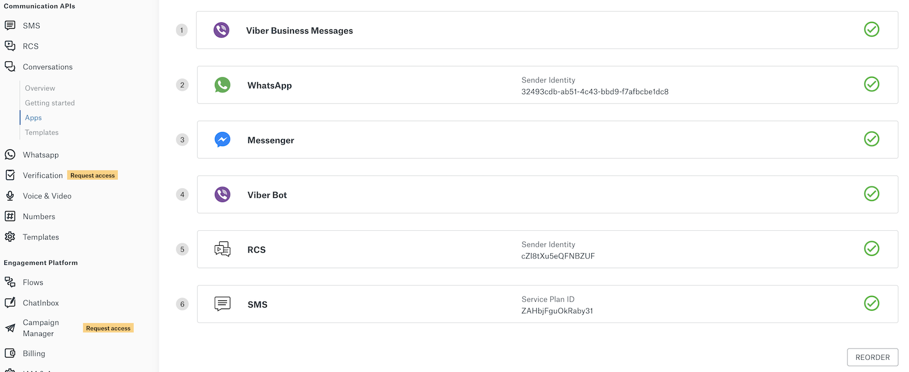
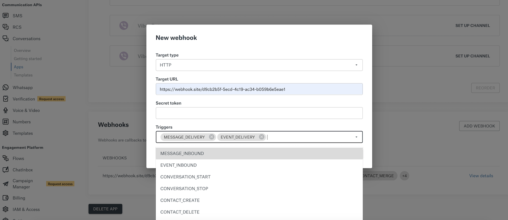
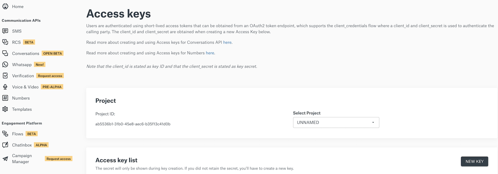
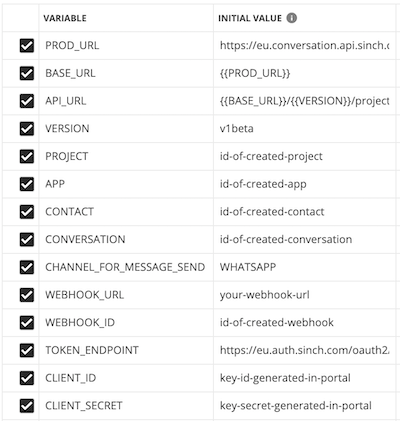

In this guide we’ll go through the necessary steps of creating your first App.

## 1. Creating and configuring a new App

Go to the [Apps page](https://dashboard.sinch.com/convapi/apps) to get started on creating your App.
 
Once you’ve started to create a new App you are prompted to specify an internal display name as well as in which **region**, Eu or US, the App should be stored. 

> 📘 Note
>
> Please note that once an App is created it cannot be migrated to another region.


Once a display name is created, and a region is selected, a unique App ID will be generated for you.

## 2. Selecting and adding channels

Once step 1 is completed, start setting up the [**channels**](https://developers.sinch.com/v1.3/docs/conversation-channel-support) you want to include in the conversation App.

Select the channel you wish to set up. Keep in mind that you need to register each channel before you can include it in a conversation App.



Depending on the channel, select your channel sender identity to configure your channel to work with your Conversation API App. Note that you must first set up a Service plan ID/Service ID/Sender Identity at corresponding channel portals.

The callback URL of the underlying channel should be updated to point to the channel adapter of the Conversation API. Note: the callback URL for most channels will be updated automatically which will overwrite the current callback URL.

> 📘 Note
>
> Some channels require an access token or more, like Messenger or Viber. Please visit the Messenger or Viber documentation on how to set up these channels and acquire the token.

## 3. Reordering and prioritizing channels

Conversation API will try to send messages on the channels based on the priority preference you set. If there is no preference set, the API will try the order priority based on the following criteria: 

1. If a conversation with the contact exists: the active channel of the conversation is tried first.

2. The existing channels for the contact, that are ordered by contact channel preferences (if given).

3. Lastly the existing channels for the contact are ordered by the App priority.

You can define the App channel priority by reordering the channels that you have set up.



## 4. Add and configure Webhooks

[**Webhooks**](doc:conversation-keyconcepts#webhook) are callbacks triggered by specific events. When adding a Webhook you are prompted to specify a Target URL and events that should trigger a call to the specified URL.

> 📘 Note
>
> The Secret Token can be used to sign the content of Conversation API callbacks. This way you can verify the integrity of the callbacks coming from Conversation API.



## 5. Project ID and Access keys

Your **Project ID** is used to group your Conversation API resources. You can find it on the Apps page under *"Project"*.

**Access keys** are required for authentication purposes when using the Conversation API.

You can generate an access key under Settings -> Access Keys page by clicking on *"New Key"*.



A **client_id** and **client_secret** will be provided when creating an Access Key in the portal. The secret is only shown after generation, copy and store it in a safe place. 

You can obtain an Access Token to Conversation API by using your client_id and client_secret in the appropriate region:

EU region:

```
curl https://eu.auth.sinch.com/oauth2/token -d grant_type=client_credentials --user <client_id>:<client_secret>
```

US region:

```
curl https://us.auth.sinch.com/oauth2/token -d grant_type=client_credentials --user <client_id>:<client_secret>
```

The access token can be used in conjunction with your project ID to interact with the Conversation API. Read more about possible authentication methods at [**Authentication**](doc:conversation#authentication).

## 6. Try our Postman collection

We have a [**Postman collection**](doc:conversation#postman-collection) available to download. There you can find examples to access our API endpoints.

In the collection there are variables that you need to fill with your own values and IDs to be able to send the requests:



The collection includes requests to manage your resources - it is possible to create the same Conversation App that we created on the portal via these requests!

Available Services: 

* `APP` Management

* `CONTACT` Management 

* `CONVERSATION` Management 

* `WEBHOOK` Management

You will also find requests to send **messages and events** to your contact:

* Send a `MESSAGE`:
    
    * `TEXT`
    
    * `MEDIA`
    
    * `CHOICE`
    
    * `CARD`
    
    * `CAROUSEL`
    
    * `LOCATION`

* Send an `EVENT`

## 7. Send Messages!

**Conversation API** integrates multiple channels that you can try. [**Channel Support**](doc:conversation-channel-support) contains detailed examples and screenshots about message types that you can try on supported channels!

