## Setup your FB App with Messenger Chat

In this quick start guide we will show you how to create and configure a basic FB Business Page with Messenger chat feature. Once you complete the steps below you will have an FB App, FB Business Page with Messenger Chat button, a Messenger Token, and a configured Messenger Webhook to use with the Sinch Conversations API.

### Set up a facebook Page

A Facebook Page is required to use the Facebook Messenger API, it is used as the identity of your Messenger experience. When people chat with your app, they will see the Page name and the Page profile picture. To create a new Page, visit https://www.facebook.com/pages/create. If you already have one, you can skip to (#create-your-facebook-app).

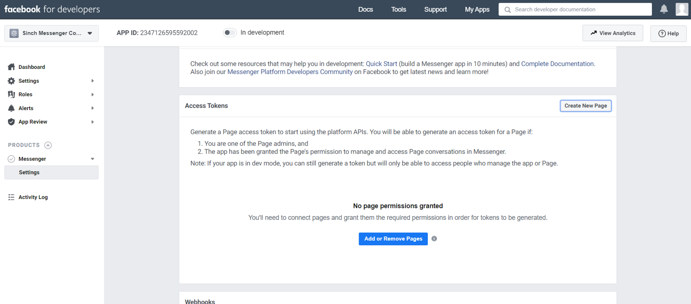

Next choose to create a **"Business or Brand"** and fill out the ensuing page name and contact form.

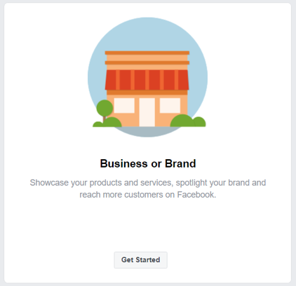

You can choose to **"Skip"** adding 'Profile' and 'Background' pictures as well as **"Not Now"** for the option to 'Add online booking'. You have now completed creating your Facebook Business Page. Remember while your FB App is 'In development' the FB Business Page is not visible to anyone except you and other developers you invite to your FB developer account.

Make sure to bookmark your FB Business Page you will head back there to send messages later.

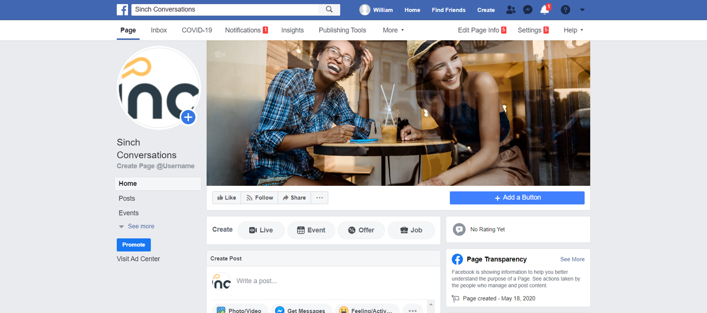

#### Add a Messenger Chat Button to your FB Business Page

Click on **"+ Add Button"**.

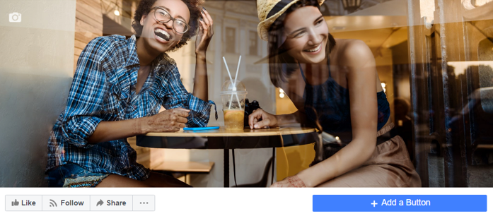

Choose **Send Message** and click **"Next"**.

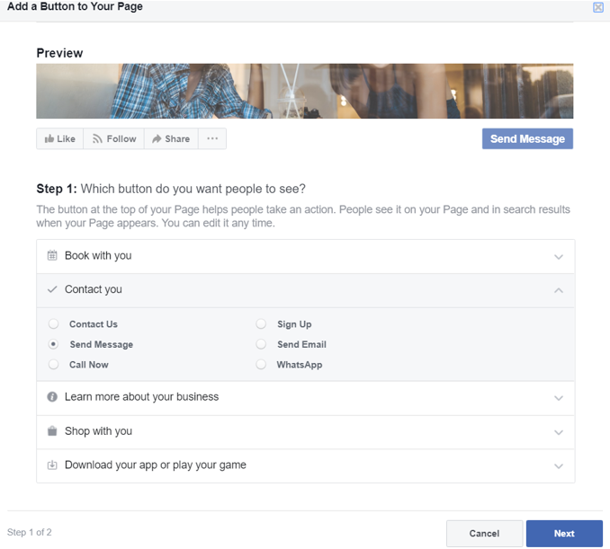

Click on **"Messenger"** and then click **"Finish"**.

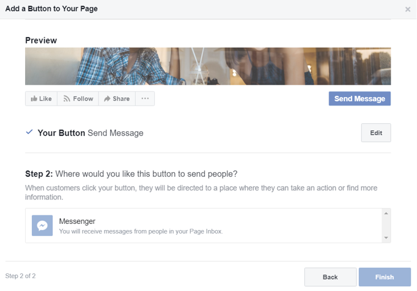

### Create your Facebook App

If you have an existing FB Developer Account and an FB App, you cant skip to [Add Messenger Product to your FB App](#add-messenger-to-your-app).
To register for an FB Developer account go to **[Facebook Developer Account](https://developers.facebook.com)** and click **"Get Started"** on the upper right menu.

[](images/channel-support/messenger/fb_for_developers.png)

Once you have created your Facebook developer account you can choose to **"Create First App"**

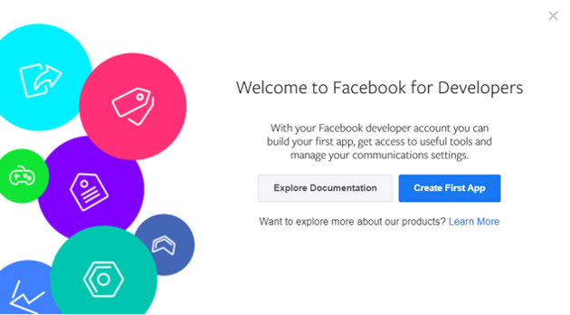

Your new _APP ID_ will be displayed at the top left of your FB App Dashboard.

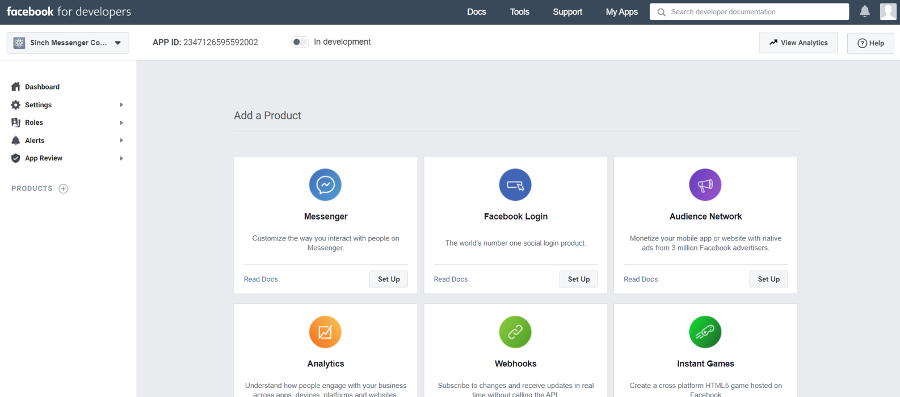

#### Add Messenger to your app

From your FB Developer Dashboard, under _Add Product_, click on Messenger **"Setup"** button.

#### Generate your Messenger API Token

To generate your Messenger API Token, add the FB Page you created earler. scroll down to **Access Tokens** and click **"Add or Remove Pages"**.

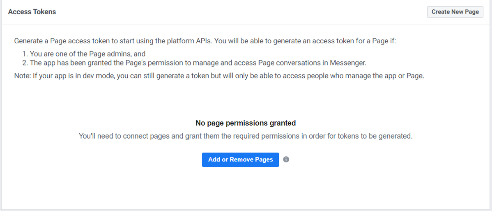

Now follow the prompts and choose the new FB Page you just created. Make sure that you leave default setting **Manage and access Page conversations in Messenger** set to YES.


You will should see your FB Page listed under **Access Tokens**, click on the **"Generate Token"** button.

Copy and store your Messenger Token somewhere safe, we will need it to add the Messenger Channel to your **Sinch Conversations App**.

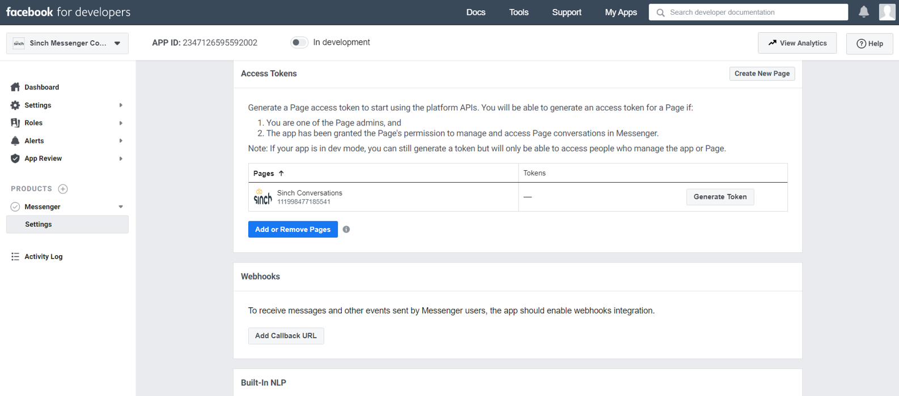

#### Configure your FB Messenger Channel on Sinch Conversations API

Create and send a POST to **Patch** your Sinch Conversations App with the newly created **Messenger Token**, this will allow Sinch Conversations App to respond to inbound messages posted by visitors of your FB Page.

```javascript Curl
curl --location --request POST 'https://api.conversation-api.prod.sinch.com/v1beta/accounts/{{YOUR_SINCH_ACCOUNT_ID}}/apps' \
--header 'Content-Type: application/json' \
--data-raw '{
    "channel_credentials": [
        {
            "channel": "MESSENGER",
            "static_token": {
                "claimed_identity": "{{YOUR_FB_APP_NAME}}",
                "token": "{{YOUR_FB_PAGE_MESSENGER_TOKEN}}"
            }
        }
    ],
    "display_name": "Messages"
}'
```

### Configure the Messenger Webhook

The Messenger Webhook Settings configuration forwards message events posted on your **FB Page** to your **Sinch Conversations App**. To set the configuration click on **"Add Callback URL"** in FB App Dashboard > Products > Messenger > Settings **Webhooks**.


Then add the following **Callback URL** and **Verify Token**:

```Curl  Callback URL:
https://messenger-adapter.conversation-api.staging.sinch.com/adapter/v1/{{YOUR_SINCH_CONVERSATION_APP_ID}}/callback

Verify Token: 5651d9fd-5c33-4d7a-aa37-5e3e151c2a92
```

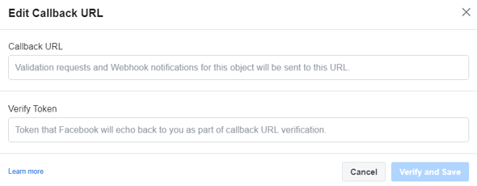

To complete your **Webhooks** configuration click on **"Add Subscriptions"**. Select **"messages"** and **"message_deliveries"** fields and click on **"Save"**.


Great! You are almost there. Just a couple of more steps.

### Start a conversation in Messenger and Respond with Sinch Conversations API

OK, you are ready for some action! Visit your FB Page, click on **"Send Message"** and choose **"Test Button"**.


Enter a message into the **Messenger** chat window and **Send**.

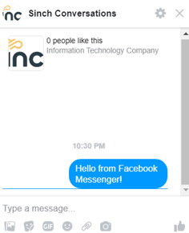

Use **Sinch Conversations API** to **List Contacts**, you should now see a new contact entry generated when the **Messenger Message** was posted from your FB Page.

```
{
    "contacts": [
        {
            "id": "J69H07BDS8G11RDF01E96CW660",
            "channel_identities": [
                {
                    "channel": "MESSENGER",
                    "channel_recipient_identity": "7746490198930851",
                    "app_id": "3FDS0PWWERGN1QX101E75WGS3Y"
                }
            ],
            "channel_priority": [
                "MESSENGER",
            ],
            "display_name": "",
            "email": "",
            "external_id": "",
            "metadata": ""
        }
    ],
    "next_page_token": ""

```

Use your newly created Sinch **Contact** to send a **Text Message** response using the **message:send** function.

```shell Curl
curl --location --request POST 'https://api.conversation-api.prod.sinch.com/v1beta/accounts/{{YOUR_SINCH_ACCOUNT_ID}}/messages:send' \
--header 'Content-Type: application/json' \
--data-raw '{
	"app_id": "{{YOUR_SINCH_APP_ID}}",
    "recipient": {
    	"contact_id": "{{YOUR_SINCH_CONTACT_ID}}"
    },
    "message": {
        "text_message": {
            "text": "Greetings from Sinch Conversation API!"
        }
    },
    "channel_priority_order": [
        "MESSENGER"
    ]
}'
```
```java Raw Java
RequestBody body =
    RequestBody.create(
        mediaType,
        "{\n"
            + "\t\n"
            + "\t\"app_id\": \"your_app_id\",\n"
            + "    \"recipient\": {\n"
            + "    \t\"contact_id\": \"your_contact_id\"\n"
            + "    },\n"
            + "    \"message\": {\n"
            + "        \"text_message\": {\n"
            + "            \"text\": \"Text message from Sinch Conversation API.\"\n"
            + "        }\n"
            + "    },\n"
            + "    \"channel_priority_order\": [\n"
            + "        \"SMS\"\n"
            + "    ]\n"
            + "}");
Request request =
    new Request.Builder()
        .url(
            "https://api.conversation-api.prod.sinch.com/v1beta/accounts/your_account_id/messages:send")
        .method("POST", body)
        .addHeader("Content-Type", "application/json")
        .addHeader(
            "Authorization",
            "Basic your_token")
        .build();
Response response = client.newCall(request).execute();
```


**ALRIGHT!! CONGRATULATIONS**, you have just sent your first Sinch Conversations Messenger Message!

1.  Learn how to receive messages
2.  Learn how to [send rich messages with Facebook messenger](doc:conversation-send-rich-messages-with-fb-messenger).
