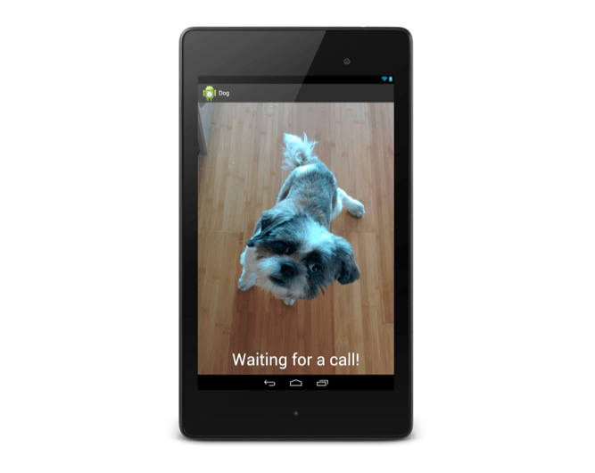
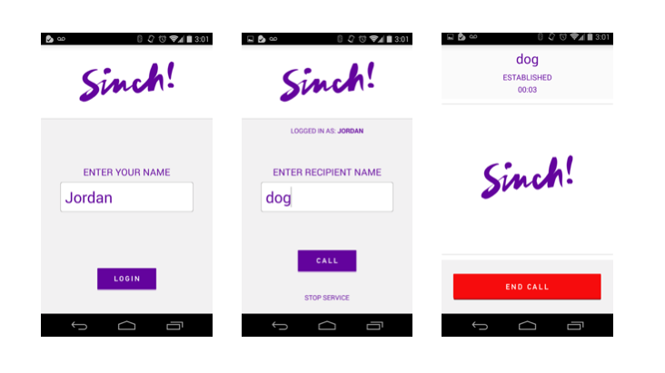

Want to check in on your pet while you’re at work, but not willing to shell out the big bucks for custom hardware devices such as [PetChatz](http://www.petchatz.com/) or [PetCube](https://www.petcube.com/) ? If you have an Android tablet and phone, you can build a voice communication system to chat with your pet in no time at all.

You can find the finished code for this tutorial [on our GitHub](https://github.com/sinch/pet-monitor/).

## Sinch setup

You will use the Sinch Android SDK for the voice stream in this app. First, download the SDK from [here](doc:downloads). Next, [sign up for a developer account](https://portal.sinch.com/#/signup), and create an app in the developer console. Take note of the generated app key and secret, as you will need them in a few minutes. Then, create a new Android project. (I’m using Android Studio, but Eclipse will work too.) Follow these steps to add Sinch as a library:

### Android Studio
    
> 1.  Copy the two jar files into your project’s libs folder
> 2.  Right-click the jar files and select “Add as library”
> 3.  Create a new folder under src/main, and name it jniLibs
> 4.  Move the armeabi and armeabi-v7a folders into the jniLibs folder you just created

### Eclipse
    
> 1.  Copy the entire libs folder into your project’s root directory.

## Build the pet’s app

For the pet’s app, you only need a blank screen that automatically accepts incoming phone calls. I jazzed mine up a bit:


In your main activity, start an instance of the Sinch client, listen for incoming calls and automatically answer incoming calls. First, start the client using the app key and secret you generated earlier:

```java
sinchClient = Sinch.getSinchClientBuilder()
    .context(this)
    .userId("dog")
    .applicationKey("key")
    .applicationSecret("secret")
    .environmentHost("clientapi.sinch.com")
    .build();

sinchClient.setSupportCalling(true);
sinchClient.startListeningOnActiveConnection();
sinchClient.start();
```

Next, define a custom call listener that will automatically answer incoming calls:

```java
private class SinchCallClientListener implements CallClientListener {
    @Override
    public void onIncomingCall(CallClient callClient, Call incomingCall) {
        incomingCall.answer();
    }
}
```

After starting the Sinch client, add an instance of `SinchCallClientListener`:

```java
sinchClient.getCallClient().addCallClientListener(new SinchCallClientListener());
```

In addition, stop listening for incoming calls and terminate the client when the app is killed:

```java
@Override
protected void onDestroy() {
    super.onDestroy();
    sinchClient.stopListeningOnActiveConnection();
    sinchClient.terminate();
}
```

Last but not least, you don’t want the tablet to fall asleep from inactivity during the day. Add the following line before starting the Sinch client to keep the screen awake for as long as the app is open. (Let’s hope your pet isn’t smart enough to close the app\!)

```java
getWindow().addFlags(WindowManager.LayoutParams.FLAG_KEEP_SCREEN_ON);
```

## The human app

Lucky you — you don’t need to build an app for yourself\! In the Sinch Android SDK, there is a sample calling app that you can use to call your pet. Open **sinch-rtc-sample-calling** and enter the same key and secret from above in **SinchClientService.java**.

Now, run this app on your phone, and run the pet app on your tablet. The human app will prompt you for your name; you can enter anything here. To place the call, enter “dog” as the recipient name and press “call.” You’ll notice on your phone screen that the status of the call goes from “initiating” to “established” in one to two seconds without doing anything on the tablet.


Tomorrow, before you leave for work, open this app on your tablet and turn up the volume. Call throughout the day to say hi, check if your dog is barking at the neighbors or talk to your parrot\!