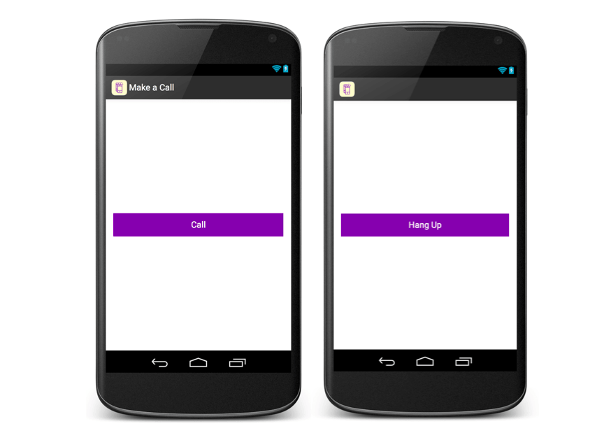
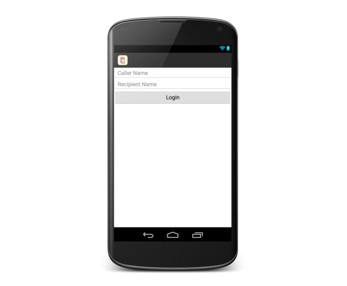

This tutorial will walk you through building a simple Android VoIP calling app. When you are finished, it will look something like this:


The completed source code for this tutorial is available at [github.com/sinch/app-app-calling-android](https://github.com/sinch/app-app-calling-android).

This covers building an Android app to app system. If you are looking for app to phone, check out our [other tutorial here](doc:call-a-phone-number-from-your-android-app-with-sinch).

## Setup

First, you will need to create a new project in Android Studio. (You can use Eclipse if you like, but this tutorial was built and tested in Android Studio.)

To generate an API key and secret, create an app in the Sinch Dashboard. Name the app anything you like, and press “create.” (You do not need a description or call control callback.)


Hold onto the key and secret from this app; you will use them in just a few minutes.

Next, download the Sinch Android SDK from [here](https://sinch.readme.io/page/downloads). To add the Sinch SDK to your project:

1.  Copy the entire libs folder to your project’s app folder

2.  Open build.gradle (Module) in allprojects \> repositories , add these lines

    ```text
    flatDir {
    dirs '/libs'
    }
    ```

3.  Finally, open build.gradle (Project) in dependencies and add this line: 

    ```
    compile(name:'sinch-android-rtc', version:'+', ext:'aar')
    ```
    
Sinch requires a few permissions. Head over to **AndroidManifest.xml** and add the following:

```xml
<uses-feature
    android:name="android.hardware.microphone"
    android:required="false"/>

<uses-permission android:name="android.permission.INTERNET"/>
<uses-permission android:name="android.permission.RECORD_AUDIO"/>
<uses-permission android:name="android.permission.MODIFY_AUDIO_SETTINGS"/>
<uses-permission android:name="android.permission.READ_PHONE_STATE"/>
<uses-permission android:name="android.permission.ACCESS_NETWORK_STATE"/>
```

## Make outgoing calls

First, create a new .xml file, and name it **call.xml**. Add a simple “Call” button:

```xml
<Button
        android:layout_width="fill_parent"
        android:layout_height="wrap_content"
        android:text="Call"
        android:id="@+id/button"
        android:layout_centerVertical="true"
        android:layout_centerHorizontal="true" />
```

Now, create a new activity, **CallActivity**, where your user can make a phone call with the click of the call button.

> **Note**
> 
> **In AndroidManifest.xml**, you should set
> 
> ```xml
> android:screenOrientation=“portrait”
> ```
> 
> for CallActivity. Since onCreate gets called when the screen is rotated, calls will hang up if the screen rotates. Setting the orientation to portrait prevents this from happening.

Back in onCreate, start by creating an OnClickListener:

```java
Button button = (Button) findViewById(R.id.button);
button.setOnClickListener(new View.OnClickListener() {
    @Override
    public void onClick(View view) {
       // make a call!
    }
});
```

To make a call, you first need to create an instance of SinchClient:

```java
SinchClient sinchClient = Sinch.getSinchClientBuilder()
        .context(this)
        .userId("current-user-id")
        .applicationKey("app-key")
        .applicationSecret("app-secret")
        .environmentHost("clientapi.sinch.com")
        .build();
```

Make sure to fill in app key and app secret with the key and secret you generated when creating an app in the dashboard. Then, tell the SinchClient that you want to have calling in your app, and finally, start the client:

```java
sinchClient.setSupportCalling(true); 
sinchClient.start();
```

Inside the OnClickListener, you will make the call:

```java
sinchClient.getCallClient().callUser("call-recipient-id");
```

To make a test call, you will use the calling sample app included in the SDK for your recipient. Open sinch-rtc-sample-calling in Android Studio, input the same keys you used above, and run the app. Once you log in as “call-recipient-id,” this app will be able to receive incoming calls from the app you are currently building. Give it a try\!

This app currently provides an awful user experience for the caller. Let’s change that. Here is a list of things you will now add:

> - Allow the caller to hang up
> - React accordingly when the call recipient hangs up
> - Let the caller control the volume of the call
> - Let the caller know when the call is ringing
> - Let the caller know when the call is connected

To toggle the main button between “Call” and “Hang Up,” start by storing the current call:

```java
private Call call;
```

Inside the onClickListener, you can make a call or hang up the current call depending on whether or not call is null:

```java
public void onClick(View view) {
    if (call == null) {
        call = sinchClient.getCallClient().callUser("call-recipient-id");
        button.setText("Hang Up");
    } else {
        call.hangup();
        call = null;
        button.setText("Call");
    }
}
```

Unfortunately, this only handles the user hanging up. You will also want your app to react accordingly if the recipient hangs up. To track these changes, you will set up a CallListener that can execute code depending on the state of phone call:

```java
private class SinchCallListener implements CallListener {
    @Override
    public void onCallEnded(Call endedCall) {
        //call ended by either party
    }

    @Override
    public void onCallEstablished(Call establishedCall) {
        //incoming call was picked up
    }

    @Override
    public void onCallProgressing(Call progressingCall) {
        //call is ringing
    }

    @Override
    public void onShouldSendPushNotification(Call call, List<PushPair> pushPairs) {
        //don't worry about this right now
    }
}
```

Then, add an instance of SinchCallListener to the current call in your OnClickListener:

```java
call.addCallListener(new SinchCallListener());
```

Note: If you’re curious about when each of these methods is called, this would be a good time to add some logging output or toast messages in SinchCallListener.

Since onCallEnded will get called if either party ends the phone call, you can move these two lines from your OnClickListener into onCallEnded:

```java
call = null;
button.setText("Call");
```

To make the volume buttons control the volume of the phone call while connected, use the AudioManager provided by Android:

```java
@Override
public void onCallEstablished(Call establishedCall) {
    setVolumeControlStream(AudioManager.STREAM_VOICE_CALL);
}
```

Then, to make the volume buttons go back to controlling the ringer volume when the phone call is disconnected:

```java
@Override
public void onCallEnded(Call endedCall) { 
    setVolumeControlStream(AudioManager.USE_DEFAULT_STREAM_TYPE);
}
```

To update the user on the state of the call (ringing, connected), create a textView that will appear above the button:

```java
<TextView
    android:layout_width="fill_parent"
    android:layout_height="wrap_content"        
    android:id="@+id/callState"
    android:layout_above="@+id/button"
    android:gravity="center_horizontal"
    android:layout_marginBottom="30dp"/>
```

In onCreate, define the textView:

```java
callState = (TextView) findViewById(R.id.callState);
```

Now, you can set the text to “ringing” in onCallRinging, and “connected” in onCallEstablished, and finally to " " in onCallEnded:

```java
//onCallProgressing
callState.setText("ringing");

//onCallEstablished
callState.setText("connected");

//onCallEnded
callState.setText("");
```

Now your app has a much better user experience. Try making a call to the SDK sample app that you set up earlier.

## Receive incoming calls

For the purposes of this tutorial, your app will automatically accept incoming calls. To start, you want your SinchClient to listen for incoming calls. Add this right before you start the SinchClient:

```java
sinchClient.startListeningOnActiveConnection();
```

Now that your app is listening for incoming calls, it should know how to respond appropriately. After you start the SinchClient, add a listener to the CallClient:

```java
sinchClient.getCallClient().addCallClientListener(new SinchCallClientListener());    

private class SinchCallClientListener implements CallClientListener {
    @Override
    public void onIncomingCall(CallClient callClient, Call incomingCall) {
        //Pick up the call!
    }
}
```

In onIncomingCall, you will need to do the following:

> - Set current call to incomingCall
> - Answer the call
> - Add a call listener to the current call
> - Set the button text to “hang up”

Easy enough, right?

```java
call = incomingCall;
call.answer();
call.addCallListener(new SinchCallListener());
button.setText("Hang Up");
```

To test the app:

 > - Set user ID to “a” and recipient ID to “b” (in your code)
 > - Run the app on device \#1
 > - Set user ID to “b” and recipient ID to “a” (in your code)
 > - Run the app on device \#2
 > - Chat away\!

## Add login

In this section, you are going to add a simple login screen so that users can call more than just one person. Your login screen will look like this:


To set this up, you will need to do the following:

- Create a new activity, **LoginActivity**
- Create layout for LoginActivity
- Pass callerId and recipientId to CallActivity as intent extras

Start by creating a new activity, **LoginActivity**. In the view for this activity, you will need two EditTexts and a login button:

```xml
<EditText
    android:layout_width="match_parent"
    android:layout_height="wrap_content"
    android:id="@+id/callerId"
    android:hint="Caller Name"/>

<EditText
    android:layout_width="match_parent"
    android:layout_height="wrap_content"
    android:id="@+id/recipientId"
    android:layout_below="@+id/callerId"
    android:hint="Recipient Name"/>

<Button
    android:layout_width="match_parent"
    android:layout_height="wrap_content"
    android:id="@+id/loginButton"
    android:text="Login"
    android:layout_below="@+id/recipientId"/>
```

That is all you’ll need in the login view. Head back to **LoginActivity.java** to add an OnClickListener for the login button:

```java
findViewById(R.id.loginButton).setOnClickListener(new View.OnClickListener() {
    @Override
    public void onClick(View view) {
        //start CallActivity
    }
});
```

When starting **CallActivity**, you’ll want to pass along callerId and recipientId as string extras:

```java
EditText callerEditText = (TextView) findViewById(R.id.callerId));
EditText recipientEditText = (TextView) findViewById(R.id.recipientId);
String callerId = callerEditText.getText().toString();
String recipientId = recipientEditText.getText().toString;

Intent intent = new Intent(getApplicationContext(), CallActivity.class);
intent.putExtra("callerId", callerId);
intent.putExtra("recipientId", recipientId);
startActivity(intent);
```

In **CallActivity.onCreate**, use Intent.getStringExtra to get callerId and recipientId from LoginActivity:

```java
Intent intent = getIntent();
callerId = intent.getStringExtra("callerId");
recipientId = intent.getStringExtra("recipientId");
```

Now you can use the callerId variable when starting the SinchClient, and recipientId when making a call.

And that’s it for this VoIP tutorial. If you have any questions, we’re always available on Twitter @SinchDev. You can also reach us via email at [dev@sinch.com](mailto:dev@sinch.com).

<a class="gitbutton pill" target="_blank" href="https://github.com/sinch/docs/blob/master/docs/tutorials/android/build-a-simple-android-voip-calling-app-with-sinch.md">
                        <span class="icon medium">
                            <svg xmlns="http://www.w3.org/2000/svg" role="img" viewBox="0 0 24 24"><title>GitHub icon</title><path d="M 12 0.297 c -6.63 0 -12 5.373 -12 12 c 0 5.303 3.438 9.8 8.205 11.385 c 0.6 0.113 0.82 -0.258 0.82 -0.577 c 0 -0.285 -0.01 -1.04 -0.015 -2.04 c -3.338 0.724 -4.042 -1.61 -4.042 -1.61 C 4.422 18.07 3.633 17.7 3.633 17.7 c -1.087 -0.744 0.084 -0.729 0.084 -0.729 c 1.205 0.084 1.838 1.236 1.838 1.236 c 1.07 1.835 2.809 1.305 3.495 0.998 c 0.108 -0.776 0.417 -1.305 0.76 -1.605 c -2.665 -0.3 -5.466 -1.332 -5.466 -5.93 c 0 -1.31 0.465 -2.38 1.235 -3.22 c -0.135 -0.303 -0.54 -1.523 0.105 -3.176 c 0 0 1.005 -0.322 3.3 1.23 c 0.96 -0.267 1.98 -0.399 3 -0.405 c 1.02 0.006 2.04 0.138 3 0.405 c 2.28 -1.552 3.285 -1.23 3.285 -1.23 c 0.645 1.653 0.24 2.873 0.12 3.176 c 0.765 0.84 1.23 1.91 1.23 3.22 c 0 4.61 -2.805 5.625 -5.475 5.92 c 0.42 0.36 0.81 1.096 0.81 2.22 c 0 1.606 -0.015 2.896 -0.015 3.286 c 0 0.315 0.21 0.69 0.825 0.57 C 20.565 22.092 24 17.592 24 12.297 c 0 -6.627 -5.373 -12 -12 -12" /></svg>
                        </span>
                        Edit on GitHub!</a>