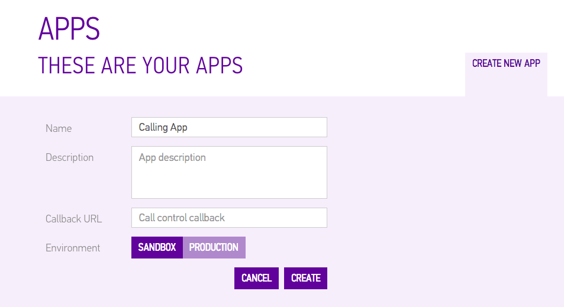
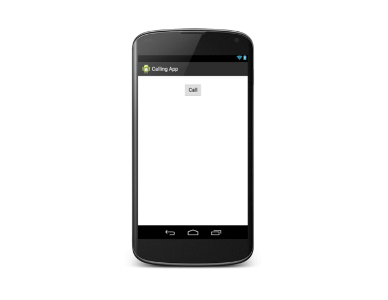

In this tutorial, you will build an Android app that uses Sinch to call phone numbers all over the world. It will take about 15 minutes.

You can find the finished code for this tutorial at [github.com/sinch/android-pstn-tutorial](https://github.com/sinch/android-pstn-tutorial).

## Setup

To get started, create a blank project in Android Studio or Eclipse. You only need one activity for this app; I’ll call mine **CallActivity**.

To use the Sinch SDK, you will need to create a developer account. If you don’t have one yet, sign up [here](https://portal.sinch.com/#/signup). Once inside the developer dashboard, you can create a new app by clicking **Apps**\>**Create new app**, and filling in an app name.


Once you’ve created your app, you will see your app key and secret in the dashboard. Write these down because you will need these in a few minutes.

To download a copy of the latest version of the Sinch Android SDK, click [here](https://sinch.readme.io/page/downloads). Once you’ve downloaded the SDK, follow these instructions to include it in your project:

**Android Studio**
    
1.  Copy the entire libs folder to your project’s app folder
2.  Open build.gradle (Module) in allprojects \> repositories , add these lines :
    ```text
    flatDir {
        dirs '/libs'
    }
    ```
3.  Finally, open build.gradle (Project) in dependencies and add this line:
    ```text
    compile(name:'sinch-android-rtc', version:'+', ext:'aar')
    ```

## Create the view

The view for this app is very simple. It will be a single button that functions as both the **call** and **hang-up** button. There will also be a TextView that shows the state of the call (ringing or connected, for example).



```xml
<Button
    android:layout_width="wrap_content"
    android:layout_height="wrap_content"
    android:text="Call"
    android:id="@+id/callButton"
    android:layout_alignParentTop="true"
    android:layout_centerHorizontal="true"/>

<TextView
    android:layout_width="wrap_content"
    android:layout_height="wrap_content"
    android:text=""
    android:id="@+id/callState"
    android:layout_below="@+id/callButton"
    android:layout_centerHorizontal="true"/>
```

By default, the button will act as a call button and the call state will be empty.

## Permissions to make a phone call

To make a phone call, you will need a few app permissions, as well access to the hardware microphone. Add this in **AndroidManifest.xml**:

```xml
<uses-feature
    android:name="android.hardware.microphone"
    android:required="false"/>

<uses-permission android:name="android.permission.INTERNET"/>
    <uses-permission android:name="android.permission.RECORD_AUDIO"/>
    <uses-permission android:name="android.permission.MODIFY_AUDIO_SETTINGS"/>
    <uses-permission android:name="android.permission.READ_PHONE_STATE"/>
    <uses-permission android:name="android.permission.ACCESS_NETWORK_STATE"/>
```

## Make the call

To make a call with Sinch (from **CallActivity**), the first thing you will need is an instance of the Sinch client, with the app key and secret you created earlier in this tutorial:

```java
//in onCreate
final SinchClient sinchClient = Sinch.getSinchClientBuilder()
    .context(this)
    .userId("current-user-id")
    .applicationKey("your-app-key")
    .applicationSecret("your-app-secret")
    .environmentHost("clientapi.sinch.com")
    .build();

    sinchClient.setSupportCalling(true);
    sinchClient.start();
```

> **Note**
> 
> In a production app, you wouldn’t want to hardcode a single user ID into this. Instead, you would use a string that uniquely identifies the current user in your app.

Next, define the callButton and callState from the view:

```java
callState = (TextView) findViewById(R.id.callState);
callButton = (Button) findViewById(R.id.callButton);
```

Then, listen for a click on the call button:

```java
callButton.setOnClickListener(new View.OnClickListener() {
    @Override
    public void onClick(View view) {
        //make a call!
    }
});
```

When the button is clicked, you will make a call to our test phone number. Calling the test phone number is an easy way to test your app. (You can also easily swap out the test phone number for any phone number and give it a call.)

```java
sinchClient.getCallClient().callPhoneNumber("+46000000000");
callButton.setText("Hang Up");
```

At this point, you can use your app to make a test call. Kill the app to hang up; you will add the functionality to hang up in the next section.

## Hang up the call

The first thing you need to do is keep track of the current call. Declare a variable, call and store the current call in this:

```java
Call call;

//when calling
call = sinchClient.getCallClient().callPhoneNumber("+46000000000");
```

This way, you can check to see if there is a current call in the OnClickListener and respond appropriately:

```java
callButton.setOnClickListener(new View.OnClickListener() {
    @Override
    public void onClick(View view) {
        if (call == null) {
            call = sinchClient.getCallClient().callPhoneNumber("+46000000000");
            callButton.setText("Hang Up");
        } else {
            call.hangup();
        }
    }
});
```

## Add a call listener

A call listener makes it easy to respond to events throughout the call, such as setting the callState text to “ringing” when the call is trying to connect or letting the user control the volume of the voice stream when the call is connected. See the inline comments below for more explanation:

```java
private class SinchCallListener implements CallListener {

    //the call is ended for any reason
    @Override
    public void onCallEnded(Call endedCall) {
        call = null; //no longer a current call
        callButton.setText("Call"); //change text on button
        callState.setText(""); //empty call state
        //hardware volume buttons should revert to their normal function
        setVolumeControlStream(AudioManager.USE_DEFAULT_STREAM_TYPE);
    }

    //call is connected
    @Override
    public void onCallEstablished(Call establishedCall) {
        //change the call state in the view
        callState.setText("connected");
        //the hardware volume buttons should control the voice stream volume
        setVolumeControlStream(AudioManager.STREAM_VOICE_CALL);
    }

    //call is trying to connect
    @Override
    public void onCallProgressing(Call progressingCall) {
        //set call state to "ringing" in the view
        callState.setText("ringing");
    }

    @Override
    public void onShouldSendPushNotification(Call call, List<PushPair> pushPairs) {
        //intentionally left empty
    }
}
```

Last but not least, add an instance of the SinchCallListener to the call right after it is created:

`call.addCallListener(new SinchCallListener());`

Congratulations on completing this tutorial\! You can now call any phone number from your Android app using Sinch.