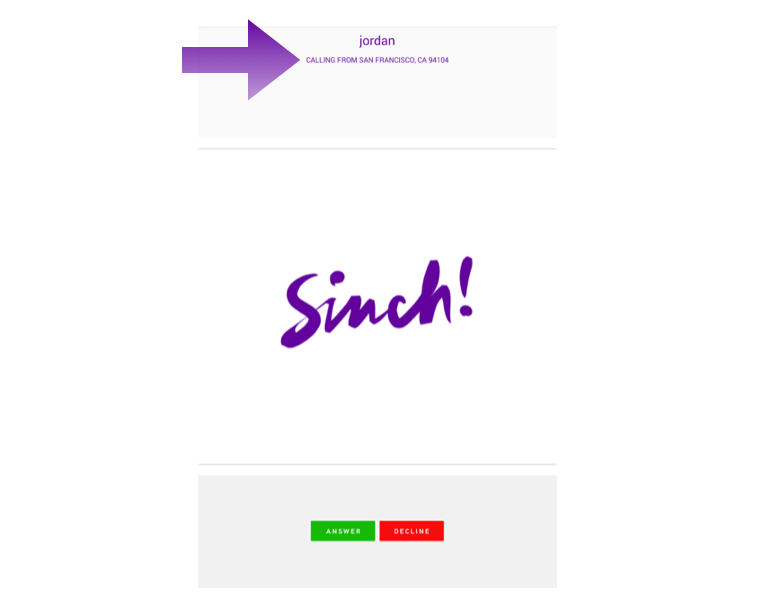

This tutorial demonstrates how to make a Sinch app-to-app call with a header. In this app, I’ll send the location of the person calling so the recipient can see where the other user is calling from.


The app is built on top of the **sinch-rtc-sample-calling** sample included in the Android SDK, and the finished code can be found on [our GitHub](https://www.github.com/sinch/android-app-app-calling-headers).

## Setup

1.  Create a free [Sinch developer account](https://portal.sinch.com/#/signup)
2.  Create an app in the [Developer Dashboard](https://portal.sinch.com/#/apps)
3.  Download the [Sinch Android SDK](https://sinch.readme.io/page/downloads)
4.  Add your app key and secret to the **sinch-rtc-sample-calling** app included in the SDK (in **SinchService.java**)

## Update SinchServiceInterface

Sinch allows you to make an app-to-app call and send along a `Map<String, String>` of headers. First, extend the `SinchServiceInterface` in **SinchService.java** to support this method:

```java
public Call callUser(String userId, Map<String, String> headers) {
    return mSinchClient.getCallClient().callUser(userId, headers);
}
```

## Get location and make the call

You’ll need the following permission to access the device’s location:

```java
<uses-permission android:name="android.permission.ACCESS_FINE_LOCATION"/>
```

Now, in `callButtonClicked` in **PlaceCallActivity.java**, you can get the latitude and longitude of the last known location:

```java
LocationManager locationManager = (LocationManager) getSystemService(Context.LOCATION_SERVICE);
Location lastLoc = locationManager.getLastKnownLocation(LocationManager.NETWORK_PROVIDER);
Double longitude = lastLoc.getLongitude();
Double latitude = lastLoc.getLatitude();
```

> **Note**
>
> This is definitely not a production-ready way of getting an accurate location. First of all, your app will crash if the user doesn’t have any “last location.” You could also use the ACCESS\_COARSE\_LOCATION permission, since you don’t need to know their *exact* location. Regardless, there are several location strategies and I suggest doing some research if you want to send a current location in your production app.

Use a Geocoder object to turn the latitude and and longitude into a human-readable address:

```java
Geocoder geocoder = new Geocoder(this, Locale.getDefault());
List<Address> addresses = null;
try {
    addresses = geocoder.getFromLocation(latitude, longitude, 1);
} catch (IOException e) {
    e.printStackTrace();
}
```

I chose to send the city/state/zipcode of the location as the header:

```java
Map<String, String> headers = new HashMap<String, String>();
headers.put("location", addresses.get(0).getAddressLine(0));
```

You can add as many items as you like to the headers like so:

```java
headers.put("key", "value");
```

Finally, change this line that makes the call:

```java
Call call = getSinchServiceInterface().callUser(userName);
```

to this:

```java
Call call = getSinchServiceInterface().callUser(userName, headers);
```

## Display header value on incoming call

In `SinchCallClientListener#onIncomingCall` in **SinchService.java**, get the location value from the headers, and pass it along in the intent:

```java
intent.putExtra("location", call.getHeaders().get("location"));
```

Then, in **IncomingCallScreenActivity.java**, you can get the location from the intent like so:

```java
String location = getIntent().getStringExtra(SinchService.LOCATION);
```

I chose to create a TextView with ID remoteUserLocation in **incoming.xml**, so I could set it to the location from the header in `onServiceConnected` (right where the remoteUserId TextView is set).

```java
TextView remoteUserLocation = (TextView) findViewById(R.id.remoteUserLocation);
remoteUserLocation.setText("Calling from " + mCallLocation);
```

That’s all\! Rinse and repeat for any data you want to send along with an app-to-app call.

<div class="magic-block-html"><a class="gitbutton pill" target="_blank" href="https://github.com/sinch/docs/blob/master/docs/tutorials/android/how-to-add-an-android-header-in-a-calling-app.md"><span class="icon medium"><svg xmlns="http://www.w3.org/2000/svg" role="img" viewBox="0 0 24 24"><title>GitHub icon</title><path d="M 12 0.297 c -6.63 0 -12 5.373 -12 12 c 0 5.303 3.438 9.8 8.205 11.385 c 0.6 0.113 0.82 -0.258 0.82 -0.577 c 0 -0.285 -0.01 -1.04 -0.015 -2.04 c -3.338 0.724 -4.042 -1.61 -4.042 -1.61 C 4.422 18.07 3.633 17.7 3.633 17.7 c -1.087 -0.744 0.084 -0.729 0.084 -0.729 c 1.205 0.084 1.838 1.236 1.838 1.236 c 1.07 1.835 2.809 1.305 3.495 0.998 c 0.108 -0.776 0.417 -1.305 0.76 -1.605 c -2.665 -0.3 -5.466 -1.332 -5.466 -5.93 c 0 -1.31 0.465 -2.38 1.235 -3.22 c -0.135 -0.303 -0.54 -1.523 0.105 -3.176 c 0 0 1.005 -0.322 3.3 1.23 c 0.96 -0.267 1.98 -0.399 3 -0.405 c 1.02 0.006 2.04 0.138 3 0.405 c 2.28 -1.552 3.285 -1.23 3.285 -1.23 c 0.645 1.653 0.24 2.873 0.12 3.176 c 0.765 0.84 1.23 1.91 1.23 3.22 c 0 4.61 -2.805 5.625 -5.475 5.92 c 0.42 0.36 0.81 1.096 0.81 2.22 c 0 1.606 -0.015 2.896 -0.015 3.286 c 0 0.315 0.21 0.69 0.825 0.57 C 20.565 22.092 24 17.592 24 12.297 c 0 -6.627 -5.373 -12 -12 -12" /></svg></span>Edit on GitHub!</a></div>