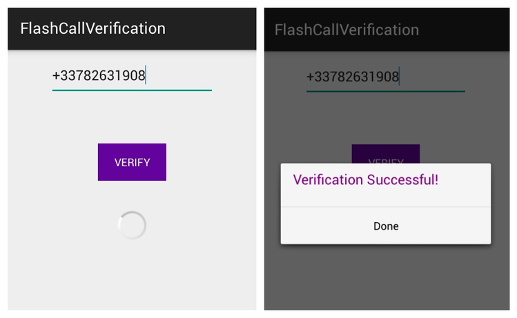
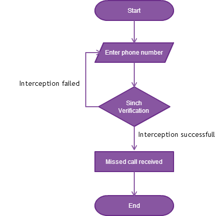
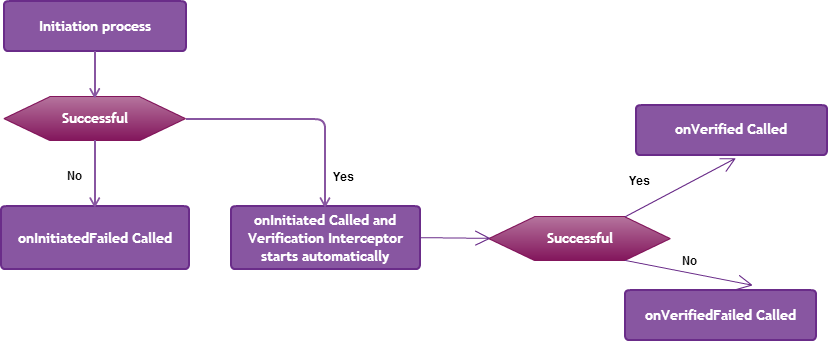

This tutorial will show you how to verify your users with no interaction required from the user in two minutes. This uses the Sinch Flash Call technology for Android, and lets you ensure that a user is in possession of a phone number by relying on the regular phone network.

By the end of this tutorial, your app will look similar to this:


The following workflow summarizes how the app is operating.


## Setup

If you haven’t done so yet, set up a developer account with Sinch. You will need to create an app in the developer portal. Be sure to enable Verification as follows:


Hold on to the app key generated by this service; you will need it in a few minutes.

> **Note:** 
>
> In order to use the verification SDK, you should have some credits in your account. But don’t worry, Sinch offers $2 in free credits when you verify your phone number.

Go to your Dashboard in the account tab and verify your phone number. You will receive a prompt SMS with your code verification.

## Flash Call Verification

Now, let’s start coding. Create a new project in your IDE and choose VerificationActivity as a name of your LauncherActivity.

Download the Sinch Verification SDK at [Verification SDK](https://www.sinch.com/android-verification-sdk) and add it to your project.

Sinch Flash Call Verification SDK requires a few permissions. Add the following to your **AndroidManifest** file:

```xml
<uses-permission android:name="android.permission.INTERNET" />
<uses-permission android:name="android.permission.READ_CALL_LOG" />
<uses-permission android:name="android.permission.READ_PHONE_STATE" />
<uses-permission android:name="android.permission.CALL_PHONE" />
```

In your **activity\_verification** layout file, add the following Views:

```xml
<EditText
   android:layout_width="wrap_content"
   android:layout_height="wrap_content"
   android:inputType="phone"
   android:ems="10"
   android:id="@+id/phoneNumber"
   android:layout_alignParentTop="true"
   android:layout_centerHorizontal="true" />

<Button
   android:layout_width="wrap_content"
   android:layout_height="wrap_content"
   android:text="Verify"
   android:id="@+id/verify"
   android:layout_marginTop="63dp"
   android:textColor="#ffffffff"
   android:layout_below="@+id/phoneNumber"
   android:layout_centerHorizontal="true" />

<ProgressBar
   android:layout_width="wrap_content"
   android:layout_height="wrap_content"
   android:id="@+id/progressBar"
   android:layout_centerVertical="true"
   android:layout_centerHorizontal="true"
   android:visibility="invisible" />
```

In **onCreate** method, we need to start the Flash Call Verification process when the user enters his or her phone number and clicks on the verify button.

```java
super.onCreate(savedInstanceState);
setContentView(R.layout.activity_main);

numberPhone = (EditText) findViewById(R.id.phoneNumber);
verify = (Button) findViewById(R.id.verify);
progressBar = (ProgressBar) findViewById(R.id.progressBar);

verify.setOnClickListener(new View.OnClickListener() {
    public void onClick(View v) {
        String number = numberPhone.getText().toString();
        if(number.isEmpty()) {
            Toast.makeText(getApplicationContext(), "Phone number cannot be empty!",Toast.LENGTH_LONG).show();
       }
        else {
            showProgressDialog();
            startVerification(number);
        }
    }
});
```

Now, add the **startVerification** method:

```java
private void startVerification(String phoneNumber) {
    Config config = SinchVerification.config().applicationKey("your_app_key").context(getApplicationContext()).build();
    VerificationListener listener = new MyVerificationListener();
    verification = SinchVerification.createFlashCallVerification(config, phoneNumber, listener);
    verification.initiate();
}
```

Create **MyVerificationListener** class, which implements **VerificationListener** interface. The VerificationListener provides callbacks during the verification process.

The following workflow describes the verification process:


```java
private class MyVerificationListener implements VerificationListener {
        @Override
        public void onInitiated() {}
    
        @Override
        public void onInitiationFailed(Exception e) {
            hideProgressDialog();
            if (e instanceof InvalidInputException) {
                Toast.makeText(MainActivity.this,"Incorrect number provided",Toast.LENGTH_LONG).show();
            } else if (e instanceof ServiceErrorException) {
                Toast.makeText(MainActivity.this,"Sinch service error",Toast.LENGTH_LONG).show();
            } else {
                Toast.makeText(MainActivity.this,"Other system error, check your network state", Toast.LENGTH_LONG).show();
            }
        }
    
        @Override
        public void onVerified() {
            hideProgressDialog();
            new AlertDialog.Builder(VerificationActivity.this)
                           .setMessage("Verification Successful!")
                           .setPositiveButton("Done", new DialogInterface.OnClickListener() {
                                public void onClick(DialogInterface dialog, int whichButton) {
                                    dialog.cancel();
                                }
                            })
                            .show();
        }
    
        @Override
        public void onVerificationFailed(Exception e) {
            hideProgressDialog();
            if (e instanceof CodeInterceptionException) {
                Toast.makeText(VerificationActivity.this,"Intercepting the verification call automatically failed",Toast.LENGTH_LONG).show();
            } else if (e instanceof ServiceErrorException) {
                Toast.makeText(VerificationActivity.this, "Sinch service error",Toast.LENGTH_LONG).show();
            } else {
                Toast.makeText(VerificationActivity.this,"Other system error, check your network state", Toast.LENGTH_LONG).show();
            }
        }
    }
}
```


Finally, add methods to show and hide the progressBar:

```java
private void showProgressDialog() {
    progressBar.setVisibility(ProgressBar.VISIBLE);
}

private void hideProgressDialog() {
    progressBar.setVisibility(ProgressBar.INVISIBLE);
}
```

Sinch Flash Call Verification has proven itself to be the fastest method to verify user phone number. Happy Verification\!

<div class="magic-block-html"><a class="gitbutton pill" target="_blank" href="https://github.com/sinch/docs/blob/master/docs/tutorials/android/verify-phone-numbers-flash-call-verification.md"><span class="icon medium"><svg xmlns="http://www.w3.org/2000/svg" role="img" viewBox="0 0 24 24"><title>GitHub icon</title><path d="M 12 0.297 c -6.63 0 -12 5.373 -12 12 c 0 5.303 3.438 9.8 8.205 11.385 c 0.6 0.113 0.82 -0.258 0.82 -0.577 c 0 -0.285 -0.01 -1.04 -0.015 -2.04 c -3.338 0.724 -4.042 -1.61 -4.042 -1.61 C 4.422 18.07 3.633 17.7 3.633 17.7 c -1.087 -0.744 0.084 -0.729 0.084 -0.729 c 1.205 0.084 1.838 1.236 1.838 1.236 c 1.07 1.835 2.809 1.305 3.495 0.998 c 0.108 -0.776 0.417 -1.305 0.76 -1.605 c -2.665 -0.3 -5.466 -1.332 -5.466 -5.93 c 0 -1.31 0.465 -2.38 1.235 -3.22 c -0.135 -0.303 -0.54 -1.523 0.105 -3.176 c 0 0 1.005 -0.322 3.3 1.23 c 0.96 -0.267 1.98 -0.399 3 -0.405 c 1.02 0.006 2.04 0.138 3 0.405 c 2.28 -1.552 3.285 -1.23 3.285 -1.23 c 0.645 1.653 0.24 2.873 0.12 3.176 c 0.765 0.84 1.23 1.91 1.23 3.22 c 0 4.61 -2.805 5.625 -5.475 5.92 c 0.42 0.36 0.81 1.096 0.81 2.22 c 0 1.606 -0.015 2.896 -0.015 3.286 c 0 0.315 0.21 0.69 0.825 0.57 C 20.565 22.092 24 17.592 24 12.297 c 0 -6.627 -5.373 -12 -12 -12" /></svg></span>Edit on GitHub!</a></div>