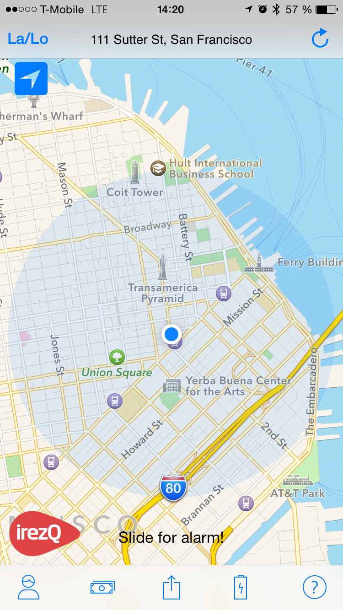
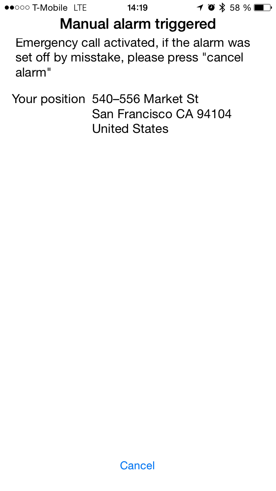

If you’re like me, when you start testing a new SDK or service, you just want to start building and prototyping straight away. While our SDK is simple to use, you still have to add your own UI to make a calling app that users will understand.

Full disclosure: I have a minor investment in a company called [iRezQ](http://irezq.com), an app that warns you about nearby traffic accidents, which it detects using your device’s accelerometer and an algorithm developed in collaboration with some insurance companies.

I wanted to test if VoIP calling could help iRezQ save some money and add an extra feature on top of the existing functionality using our [Voice API](doc:voice-introduction).

## Setup

I downloaded the framework [here](https://www.dropbox.com/s/462krss0k4ov8x3/SinchCallingUIKit.tar.gz?dl=0). You can also check out the [GitHub repo](https://github.com/sinch/SinchCallingUIKit).

First, I dropped the framework into my Xcode project as an embedded binary. (Don’t forget to check the **‘copy if needed’** box.)


Second, I added the **other linker flags** `-ObjC -Xlinker -lc++` in my targets build settings.

Lastly, in the setup, I added the required frameworks by Sinch; **AudioToolbox**, **AVFoundation** and **Security.framework**.

(P.S., if you like this kit, I can make it available as a pod so you don’t even have to follow the above steps. Tweet me at [@cjsinch](https://twitter.com/cjsinch) if you’re interested.

## Initializing Sinch

Next, initialize the **SinchCallingUIKit**. In my project, I needed to do that in two places: on app launch, if it’s not the first launch, and right after account creation or login. In this app, that’s in the **AppDelegate** and a **VerifyCode** controller.

```objectivec
- (BOOL)application:(UIApplication *)application didFinishLaunchingWithOptions:(NSDictionary *)launchOptions {
    // removed a lot of code for clarity ;)
    [[CallingManager sharedManager]
     startClientWithKey:@"mykey"
     secret:@"mysecret"
     userName:[User currentUser] clientapi:YES
     launchOptions:launchOptions];
    return YES;
}
```

The **\[User currentUser\]** is an internal object to iRezQ, where I keep the currently logged in user info.

I added the same line of code to my controller where I verify the user.

## Adding a call

In iRezQ, there is a premium feature that allows you to call and ask for help. Right now, the app is sending an alert to the operator to call the user.

I removed that code and added the import to my controller and the following line of code:

```objectivec
[[CallingManager sharedManager] callNumber:@"irezQAlarmnumber"];
```

Now I’m ready to show this to the product owner. And it’s good to submit to the App Store. We probably won’t do that because we want to have VoIP calling so we can send some extra headers with more meta information about the call. But in just a few minutes, we can try out the user flow and potential UI without having to plan a whole sprint.






We’re really interested to know how you feel about these kinds of libraries. Tweet me at [@cjsinch](https://twitter.com/cjsinch) or email me at `christian@sinch.com` to let me know.

If there is interest, we could make this a supported product feature. For now, enjoy the open-source framework that lets you add calling in two minutes.

<div class="magic-block-html"><a class="gitbutton pill" target="_blank" href="https://github.com/sinch/docs/blob/master/docs/tutorials/ios/add-calling-to-your-existing-app-in-2-minutes.md"><span class="icon medium"><svg xmlns="http://www.w3.org/2000/svg" role="img" viewBox="0 0 24 24"><title>GitHub icon</title><path d="M 12 0.297 c -6.63 0 -12 5.373 -12 12 c 0 5.303 3.438 9.8 8.205 11.385 c 0.6 0.113 0.82 -0.258 0.82 -0.577 c 0 -0.285 -0.01 -1.04 -0.015 -2.04 c -3.338 0.724 -4.042 -1.61 -4.042 -1.61 C 4.422 18.07 3.633 17.7 3.633 17.7 c -1.087 -0.744 0.084 -0.729 0.084 -0.729 c 1.205 0.084 1.838 1.236 1.838 1.236 c 1.07 1.835 2.809 1.305 3.495 0.998 c 0.108 -0.776 0.417 -1.305 0.76 -1.605 c -2.665 -0.3 -5.466 -1.332 -5.466 -5.93 c 0 -1.31 0.465 -2.38 1.235 -3.22 c -0.135 -0.303 -0.54 -1.523 0.105 -3.176 c 0 0 1.005 -0.322 3.3 1.23 c 0.96 -0.267 1.98 -0.399 3 -0.405 c 1.02 0.006 2.04 0.138 3 0.405 c 2.28 -1.552 3.285 -1.23 3.285 -1.23 c 0.645 1.653 0.24 2.873 0.12 3.176 c 0.765 0.84 1.23 1.91 1.23 3.22 c 0 4.61 -2.805 5.625 -5.475 5.92 c 0.42 0.36 0.81 1.096 0.81 2.22 c 0 1.606 -0.015 2.896 -0.015 3.286 c 0 0.315 0.21 0.69 0.825 0.57 C 20.565 22.092 24 17.592 24 12.297 c 0 -6.627 -5.373 -12 -12 -12" /></svg></span>Edit on GitHub!</a></div>