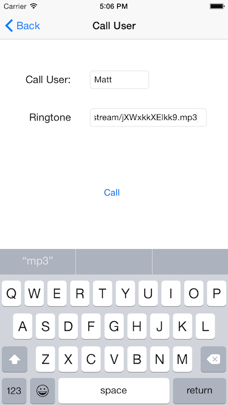
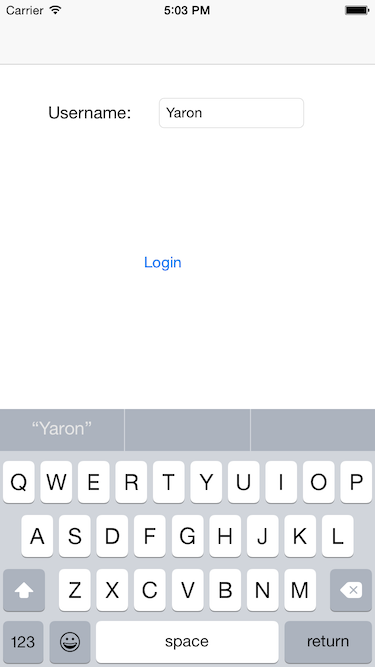

In this tutorial, we will be creating an app that lets you call a person using a custom ringtone using [app-to-app calls](https://www.sinch.com/products/voice/data-calling/). Outgoing calls will specify a person to call, as well as a URL for the ringtone that will play when the person receives his or her incoming call. To get the most out of this tutorial, you will need a basic understanding of the following areas:

>   - XCode
>   - Objective-C
>   - CocoaPods



A starter project has been provided with the appropriate app layout. You can download it from [Github](https://github.com/sinch/ios-custom-ringtone-calling). The Storyboard should look something like this:


## 1. Setup

First, go to your [Sinch Dashboard](https://portal.sinch.com/#/login) and create a new app. Take note of the application key and secret.

Now, use Terminal to navigate to your project directory, containing the appropriate **Podfile**, and run `pod install`. You will need to work out of the XCode workspace that has now been created.

## 2. Using SinchService

Head over to **AppDelegate.h** and add the following import statements:

```objectivec
#import <Sinch/Sinch.h>
#import <SinchService/SinchService.h>
#import "CallViewController.h"
```

Then, add the following property:

```objectivec
@property (strong, nonatomic) id<SINService> sinch;
```

Now go to **AppDelegate.m**. Allow for delegate assignment by adding to the interface:

```objectivec
@interface AppDelegate () <SINServiceDelegate, SINCallClientDelegate>
```

Now we can handle SinchService functionality in **AppDelegate**.

Find the method `application:didFinishLaunchingWithOptions:` and add the following code:

```objectivec
id config = [SinchService configWithApplicationKey:@"your-application-key"
                                      applicationSecret:@"your-application-secret"
                                        environmentHost:@"clientapi.sinch.com"];

id<SINService> sinch = [SinchService serviceWithConfig:config];
sinch.delegate = self;
sinch.callClient.delegate = self;

void (^onUserDidLogin)(NSString *) = ^(NSString *userId) {
    [sinch logInUserWithId:userId];
};

self.sinch = sinch;

[[NSNotificationCenter defaultCenter]
    addObserverForName:@"UserDidLoginNotification"
    object:nil
    queue:nil
    usingBlock:^(NSNotification *note) { onUserDidLogin(note.userInfo[@"userId"]); }];
```

Be sure to fill in you application key and secret.

Since **AppDelegate** is a SinchService delegate, we can call the `client:didReceiveIncomingCall:` method to handle incomming calls. When we get a call, we want to display the call screen. We can do so by implementing `client:didReceiveIncomingCall:` as follows:

```objectivec
- (void)client:(id<SINCallClient>)client didReceiveIncomingCall:(id<SINCall>)call {
    UIViewController *top = self.window.rootViewController;
    CallViewController *controller = [top.storyboard instantiateViewControllerWithIdentifier:@"callScreen"];
    // 1
    [self.window.rootViewController presentViewController:controller animated:YES completion:nil];
}
```

Now let’s go to **ViewController.m** to log a user in once they click the login button. Implement the `LoginAction` method as follows:

```objectivec
- (IBAction)LoginAction:(id)sender {
    if (![self.UsernameTextField.text isEqualToString:@""]) {
        [[NSNotificationCenter defaultCenter] postNotificationName:@"UserDidLoginNotification"
                                                            object:nil
                                                          userInfo:@{@"userId" : self.UsernameTextField.text}];

        [self performSegueWithIdentifier:@"showUserRingtone" sender:nil];
    }
}
```

Next, add these imports to **UserRingtoneViewController.h**:

```objectivec
#import "AppDelegate.h"
#import "CallViewController.h"
```

In **UserRingtoneViewController.m**, add implement the following method:

```objectivec
- (id<SINCallClient>)callClient {
    return [[(AppDelegate *)[[UIApplication sharedApplication] delegate] sinch] callClient];
}
```

and add to the method `CallAction:` to make it look like this:

```objectivec
- (IBAction)CallAction:(id)sender {
    if (![self.UsernameTextField.text isEqualToString:@""]) {
        CallViewController *controller = [self.storyboard instantiateViewControllerWithIdentifier:@"callScreen"];

        NSDictionary *dict = [[NSDictionary alloc] initWithObjectsAndKeys:self.RingtoneTextField.text, @"url", nil];
        id<SINCall> call = [self.callClient callUserWithId:self.UsernameTextField.text headers:dict];
        // 2

        [self presentViewController:controller animated:YES completion:nil];
    }
}
```

Here, we use the `callUserWithId:headers:` method. With this method, we are able to send information through a Sinch call. Since this method takes an NSDictionary as a parameter, we can send useful data such as contact info. We’ll be using this field to send a caller’s ringtone using a URL string.

Now, go to **CallViewController.h** and add these import statements:

```objectivec
#import <Sinch/Sinch.h>
#import <AVFoundation/AVFoundation.h>
```

and add to the interface line so that it reads as follows:

```objectivec
@interface CallViewController : UIViewController <SINCallClientDelegate, SINCallDelegate>
```

Finally, add the following properties:

```objectivec
@property (nonatomic, readwrite, strong) id<SINCall> call;
@property (strong, nonatomic) NSString *contact;
@property (strong, nonatomic) NSString *urlString;
```

## 3\. Making Calls with Ringtones

We’ll want a way to play a sound file from a URL. Add the following property to **CallViewController.h** to add an AVPlayer object that can play URL sound files:

```objectivec
@property (strong, nonatomic) AVPlayer *player;
```

Next, head over to **CallViewController.m**. Add the following code to `viewDidLoad`:

```objectivec
if ([self.call direction] == SINCallDirectionIncoming) {
    self.AnswerButton.hidden = NO;
    self.ContactLabel.text = [NSString stringWithFormat:@"Call from %@", self.contact];
    NSString *urlString = [[_call headers] objectForKey:@"url"];
    NSURL *url = [NSURL URLWithString:urlString];
    self.player = [[AVPlayer alloc]initWithURL:url];
    [self.player play];

} else {
    self.AnswerButton.hidden = YES;
    NSString *contactName = [self.call remoteUserId];
    self.ContactLabel.text = [NSString stringWithFormat:@"Calling %@...", contactName];
}
```

Here, we use the `direction` property to dispay the appropriate call screen. If the user is receiving a call, we play the custom ringtone.

To set the call property, implement the call setter as follows:

```objectivec
- (void)setCall:(id<SINCall>)call {
    _call = call;
    _call.delegate = self;
}
```

In order to give the call screen buttons functionality, implement the methods `AnswerAction` and `HangupAction` as follows:

```objectivec
- (IBAction)AnswerAction:(id)sender {
    [self.call answer];
    self.AnswerButton.hidden = YES;
}

- (IBAction)HangupAction:(id)sender {
    [self.call hangup];
}
```

With SinchService, you are able to tell when a call has started and ended. You can also execute code at these stages. Let’s take advantage of this feature by adding the following:

```objectivec
- (void)callDidEstablish:(id<SINCall>)call {
    self.ContactLabel.text = [call remoteUserId];
    [self.player pause];
}

- (void)callDidEnd:(id<SINCall>)call {
    [self dismissViewControllerAnimated:YES completion:nil];
}
```

Now that we’ve set up the call screen, let’s set all of it’s properties whenever it is displayed.

First, go to **AppDelegate.m**. In the method `client:didReceiveIncomingCall:`, replace the `// 1` comment with:

```objectivec
[controller setCall:call];
[controller setContact:[call remoteUserId]];
```

Finally, go to **UserRingtoneViewController.m**. In the method `CallAction`, replace the `// 2` comment with:

```objectivec
[controller setCall:call];
[controller setContact:self.UsernameTextField.text];
[controller setUrlString:self.RingtoneTextField.text];
```

That’s it\! You should be able to test the app out. There’s also a completed version of this app on [Github](https://github.com/sinch/ios-custom-ringtone-calling).



Custom ringtones is just one example of how you can send useful information over Sinch calls. By passing headers to a Sinch call, you can add to your app’s functionality.

For more tutorials, head over to the [Sinch Tutorial Site](doc:tutorials) or the [Sinch Github](https://github.com/sinch).