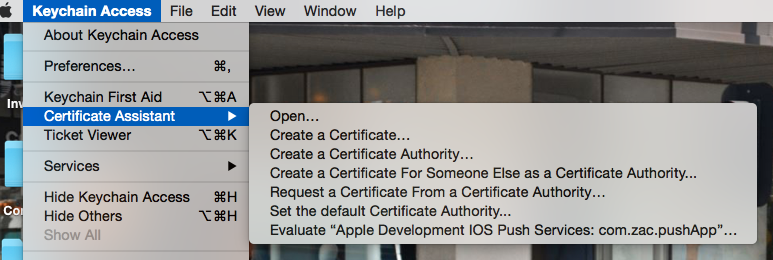
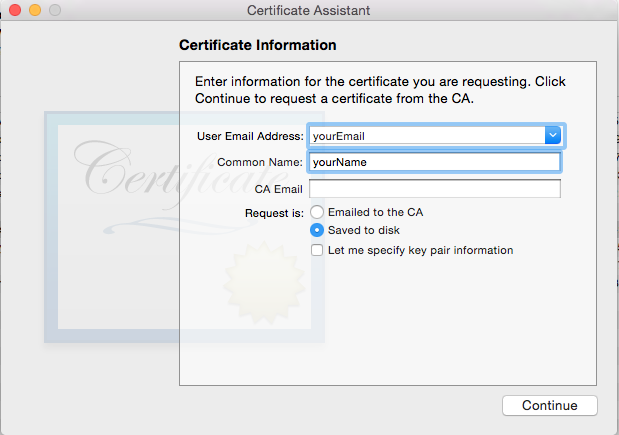
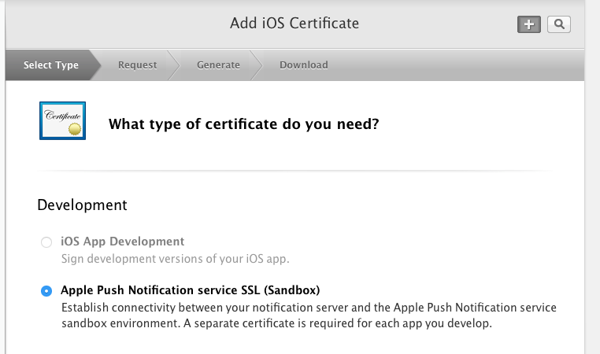

Since iOS 3, Apple has given developers the ability to send push notifications to users, and by doing so, applications have become a far bigger part of our lives.

Traditionally, one needed a third-party service or a custom app server to manage communications with Apple Push Notifications Service (APNS). This made it difficult to implement what should be an easy feature.

A few weeks ago, the team at Sinch brought us a game-changing feature. Not only does Sinch offer a full service voice, messaging, and PSTN service, but now it offers managed push built in. This means that we developers no longer have to worry about doing it ourselves.

Now you can provide real-time notifications for the real-time features of your app in a rather short amount of time.

Today, we’re going to be building the Sinch push notification app that’s provided as an example when you download the Sinch SDK. You can [download the starter project](https://github.com/sinch/ios-managed-push-tutorial), which includes all the features except for managed push. If you’d like to learn about any of the other features, or simply how to get started, you can check out the other tutorials on this site or browse through their docs, which include a comprehensive beginner’s guide for iOS.

Before writing code we’re going to have to set up our development environment. You will see that in the starter project we’ve got a PodFile, which includes our Sinch SDK. Using your terminal, go ahead and `pod install` in this directory. This will generate our new development environment. From here on you should begin using the xcworkspace project instead of xcodeproj. Make sure you close any open xcodeproj versions of the project and open the newly generated xcworkspace file.

## Setup

Now, let’s begin. Open up the starter project and navigate over to **AppDelegate.m**. If you look for the initSinchClientWithUserId method, you will see the following code:

```objectivec
[_client setSupportActiveConnectionInBackground:YES];
```

This is the code currently powering our push notifications. As of iOS 7, Apple has allowed us to keep sockets open for a short amount of time once a user has exited an app, although this only applies to VoIP push notifications. Go ahead and try out the app as it is; you will find that you can receive a push notification for an incoming call, though if you were to leave your device idle for a short amount of time, this would no longer be the case.

You can remove that line of code, as we’re now going to be implementing managed push notifications, which will give us the ability to receive push notifications at all times. Replace this code with a call to enable managed push:

```objectivec
[_client enableManagedPushNotifications];
```

## Certificates

Before we get into coding, there’s some background work we need to take care of. On your Mac, find the application Keychain Access and then find Certificate Assistant \> Request a Certificate from a Certificate Authority.



Now, follow the steps and make sure to save your certificate to somewhere accessible on your Mac.


We’re all done with Keychain Access for the moment. Now, open up a web browser and visit [Apple’s developer portal](https://developer.apple.com/). Once you’ve logged in, find Certificates, Identifiers & Profiles; from here, you’re going to need to select ‘App IDs’ under the section ‘Identifiers’.

Create a new app and under the ‘App services’ section, be sure to check the push notifications box. Once this has been done, you will see that besides push notifications, we’re given the “Configurable” status, which is exactly what we want.

Hit done and you will be presented with a list of your App IDs. Select the one you just created and press edit. From here, find the push notifications section.


Today, we will only be working in the development environment, so go ahead and create a certificate under Development SSL certificate.

Follow the steps and, when prompted, upload the certificate we made at the start of the tutorial. Once the certificate has been generated, download, double-click, and then head back over to Keychain Access, where we’re going to export a .p12 file for use with the Sinch dashboard. While we’re here, it’s probably a good idea to generate a Provisioning Profile for our new app; make sure that it’s a development one and it’s tied to the App ID we created earlier.

Find your certificate under the login section, right-click, and select export. You’re now prompted to save the certificate. Name it whatever you like, and save it. (Make sure it is in fact in the .p12 format.) You can make a password for it, however, as this is a development environment, it’s up to you. Now, enter your login password and you’re ready to head over to the Sinch dashboard to start configuring.

## Adding the certificate to Sinch

If you haven’t already, make an account. Next, create a new app, select it, and, on the third tab, find the push settings.


You can drag and drop your .p12 file that we just created into Sinch.

It’s that easy\! Now we can get back to the good stuff: coding.

Once back in XCode, there are a few things we need to do before we can start writing code. First, under build settings, set the provisioning profile to the one you created earlier. Then set the bundle identifier to the one that you specified when creating your App ID.

Now it’s really time to code\!

If you’d like, check out the code already in place and give the app a try. It’s fully functional.

We’re currently managing the Sinch client from our AppDelegate, so we’re going to get started in **AppDelegate.m**. Make a property of type SINManagedPush and name it Push.

```objectivec
@property (nonatomic, readwrite, strong) id<SINManagedPush> push;
```

We’ve now got a property that’s accessible globally within our class—exactly what we want. If you check out our docs, you will see that it’s best to init the push client as early as possible in the app’s lifecycle. Because of this, we’ll go ahead and add this code to the top of the method didFinishLaunchingWithOptions.

```objectivec
self.push = [Sinch managedPushWithAPSEnvironment:SINAPSEnvironmentAutomatic];
  self.push.delegate = self;
  [self.push setDesiredPushTypeAutomatically];
```

Here you can see we’re setting the APS Environment to automatic, our delegate, and then the desired push type to automatic. When automatic is available, use it\!

## Run the code

If you run the code now, you’ll see an issue with what we just implemented because our app delegate doesn’t conform to the SINManagedPush delegate. Go ahead and change that.

```objectivec
@interface AppDelegate () <SINClientDelegate, SINCallClientDelegate, SINManagedPushDelegate>
```

Once again, we’ve got more errors. Not to worry, though, as they’re just letting us know we’ve got to implement didReceiveIncomingPushWithPayload.

```objectivec
- (void)managedPush:(id<SINManagedPush>)unused
    didReceiveIncomingPushWithPayload:(NSDictionary *)payload
                              forType:(NSString *)pushType {

}
```

Here’s our go-to place if we’re to receive a push notification. As you can see, there isn’t any functionality here. Instead of implementing it all here, we’re going to create a separate method with some other logic to handle the push notification.

```objectivec
- (void)handleRemoteNotification:(NSDictionary *)userInfo {
  if (!_client) {
    NSString *userId = [[NSUserDefaults standardUserDefaults] objectForKey:@"userId"];
    if (userId) {
      [self initSinchClientWithUserId:userId];
    }
  }
  [self.client relayRemotePushNotification:userInfo];
}
```

Here we pass in a dictionary, userInfo from Sinch, which will give us the data we need. We then check if the client is active; it more than likely won’t be if a push notification has been sent. In the login process, we store our userId in NSUserDefaults, then if the client isn’t active, we’re able to init our client here.

We then call another method, relayRemotePushNotification, once we know the client is active. Go back and call this method from didReceiveIncomingPushWithPayload. The didReceiveIncomingPushWithPayload method is built into the Sinch SDK and provides a link between the Sinch SDK and iOS push notifications. Go ahead and implement the didReceiveRemoteNotification
method.

```objectivec
- (void)application:(UIApplication *)application didReceiveRemoteNotification:(NSDictionary *)userInfo {
    NSLog(@"Remote notification");
  [self.push application:application didReceiveRemoteNotification:userInfo];
}
```

This method calls our push property and, from that, passes in our userInfo dictionary. There’s one method already in place that you should take note of, as it’s used to set up push notifications. Before it was handling incoming push notifications from our active background connecting, however now it will be receiving them as Apple push notifications.

```objectivec
- (SINLocalNotification *)client:(id<SINClient>)client localNotificationForIncomingCall:(id<SINCall>)call {
  SINLocalNotification *notification = [[SINLocalNotification alloc] init];
  notification.alertAction = @"Answer";
  notification.alertBody = [NSString stringWithFormat:@"Incoming call from %@", [call remoteUserId]];
  return notification;
}
```

This method creates a SINLocalNotification, sets some basic properties, and then returns the notification so it can be displayed.

There are two types of push notifications: VoIP and traditional. VoIP notifications are available as of iOS 8 and is managed by adding the framework PushKit, which has already been done for us in the starter project. If we were to receive traditional push notifications, which might be the case if we add instant messaging to our application, you’d need to add these two additional methods.

```objectivec
- (void)application:(UIApplication *)application
    didRegisterForRemoteNotificationsWithDeviceToken:(NSData *)deviceToken {
        [self.push application:application didRegisterForRemoteNotificationsWithDeviceToken:deviceToken];
}
- (void)application:(UIApplication *)application
    didReceiveRemoteNotification:(NSDictionary *)userInfo {
        [self.push application:application didReceiveRemoteNotification:userInfo];
}
```

It’s good to have these methods implemented, as in versions prior to iOS 8, we aren’t able to use VoIP push notifications.

<a class="gitbutton pill" target="_blank" href="https://github.com/sinch/docs/blob/master/docs/tutorials/ios/ios-managed-push-tutorial.md">
                        <span class="icon medium">
                            <svg xmlns="http://www.w3.org/2000/svg" role="img" viewBox="0 0 24 24"><title>GitHub icon</title><path d="M 12 0.297 c -6.63 0 -12 5.373 -12 12 c 0 5.303 3.438 9.8 8.205 11.385 c 0.6 0.113 0.82 -0.258 0.82 -0.577 c 0 -0.285 -0.01 -1.04 -0.015 -2.04 c -3.338 0.724 -4.042 -1.61 -4.042 -1.61 C 4.422 18.07 3.633 17.7 3.633 17.7 c -1.087 -0.744 0.084 -0.729 0.084 -0.729 c 1.205 0.084 1.838 1.236 1.838 1.236 c 1.07 1.835 2.809 1.305 3.495 0.998 c 0.108 -0.776 0.417 -1.305 0.76 -1.605 c -2.665 -0.3 -5.466 -1.332 -5.466 -5.93 c 0 -1.31 0.465 -2.38 1.235 -3.22 c -0.135 -0.303 -0.54 -1.523 0.105 -3.176 c 0 0 1.005 -0.322 3.3 1.23 c 0.96 -0.267 1.98 -0.399 3 -0.405 c 1.02 0.006 2.04 0.138 3 0.405 c 2.28 -1.552 3.285 -1.23 3.285 -1.23 c 0.645 1.653 0.24 2.873 0.12 3.176 c 0.765 0.84 1.23 1.91 1.23 3.22 c 0 4.61 -2.805 5.625 -5.475 5.92 c 0.42 0.36 0.81 1.096 0.81 2.22 c 0 1.606 -0.015 2.896 -0.015 3.286 c 0 0.315 0.21 0.69 0.825 0.57 C 20.565 22.092 24 17.592 24 12.297 c 0 -6.627 -5.373 -12 -12 -12" /></svg>
                        </span>
                        Edit on GitHub!</a>