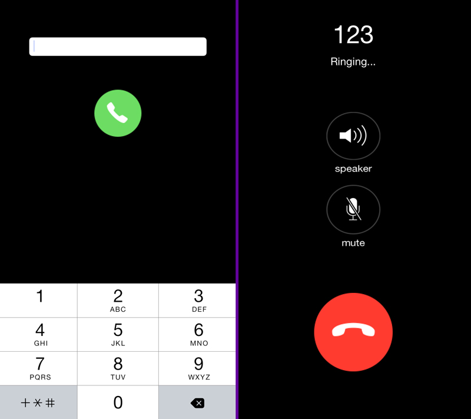
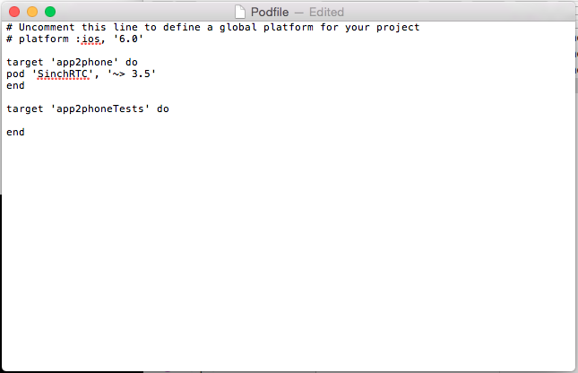

In this tutorial, we will build an ordinary iOS app-to-phone calling app. However, we will be investigating some of the cool features Sinch has added to make muting calls and using the iOS device’s speaker really easy. Today’s app also has a nice UI.


## Getting started

We’ve prepared a starter file, which can be downloaded [on our GitHub](https://github.com/sinch/ios-speaker-mute-functions). Download the project, open it, and have a look around the app to get an idea of what we will be building. The app is comprised of two screens: one that lets us enter a phone number and another that displays the current call. To save time, we’ve set up all the actions and outlets for the views.

To get started, log into your Sinch dashboard, create a new app, and get your app keys. If you don’t have an account, [head to the Sinch website](https://portal.sinch.com/#/signup) to sign up for free. If you verify your mobile phone number now, you can get $2 worth of free calls, which is pretty helpful if you want to try out this tutorial.

Once you’ve got your app keys, head over to terminal on your Mac. Today we’re going to use CocoaPods to install the Sinch framework. This is the easiest way, although you’ve also got the option to add the framework manually. Start by using the $ cd command to navigate to your project’s main directory and call $ pod init. This will create a file in your project main directory, open up the text file, and add the Sinch pod.


Save the podfile and head back over to the terminal and call $ pod install. This could take a little while, but you’ll notice a message in the terminal telling you to use the xcworkspace file instead of the traditional xcodeproj file from now on when working on the project.

## Adding Sinch

Once you’ve got the frameworks set up, it’s time to start coding. In the ViewController.h, we need to add this line of code below `"#import <UIKit/UIKit.h>"`

```objectivec
#import <Sinch/Sinch.h>
```

And that’s how easy it is to start using Sinch. In the ViewController.m file, we then need to make the ViewController class conform to the delegate methods for Sinch. Make the class conform to both the SINCallClientDelegate and SINCallDelegate. Your ViewController.h file should look something like this:

```objectivec
#import <UIKit/UIKit.h>
#import <Sinch/Sinch.h>
@interface ViewController : UIViewController <SINCallClientDelegate,    SINCallDelegate>
```

> @end

Now head over to the .m counterpart and add some instance variables that Sinch will need to operate.

```objectivec
@implementation ViewController{
id<SINCall>_call;
id<SINClient>_client;
}
```

As you can see, we now have a global reference to both a call and client object.

Next, we will set up the Sinch client and add this method to the class. Make sure to add your app key and application secret that you got from Sinch earlier to this method, and also set whether the environment is clientapi or Production.

```objectivec
- (void)startSinchClient {
_client = [Sinch clientWithApplicationKey:@"YOUR-APP-KEY" applicationSecret:@"YOUR-APP-SECRET" environmentHost:@"ENVIRONMENT" userId:@"USER1"];
[_client setSupportCalling:YES];
[_client start];
```

> }

This method starts our SINClient, which we declared as an instance variable. Usually we would also add this line of code `[_client startListeningOnActiveConnection];`, however we will only be making outbound calls so there’s no need to listen for calls.

We now need a place to call this method from. It’s best to do so from the viewDidLoad method, and add a call to the startSinchClient.

```objectivec
- (void)viewDidLoad {
[super viewDidLoad];
[self startSinchClient];
```

> }

## Calling functionality and UI

Now that we have established the Sinch client, it’s time to start calling. We’ve already got a method called callButton, which is linked to the UI. Let’s go ahead and put some code in there.

```objectivec
- (IBAction)callButton:(id)sender {
_call = [[_client callClient] callPhoneNumber:_numberLabel.text];
}
```

Here we’re assigning our \_call instance variable to a new call. The phone number is sourced from the text field in the initial view controller, which we’ve already connected for you.

Although the call is being made, a segue isn’t occurring and the UI isn’t changing. We should change the code to present the next view programmatically, so we can set some variables on the screen.

Let’s import the callScreenViewController into our ViewController class. It’s best to import the file into our viewController.h file so it can be used in both the .h and .m files.

```objectivec
#import "callScreenViewController.h"
```

Now create a separate method that presents the callScreenViewController and takes an input of one NSString in the form of a phone number.

```objectivec
- (void)presentCallScreen:(NSString *)phoneNumber {
UIStoryboard *storyboard = [UIStoryboard storyboardWithName:@"Main" bundle:nil];
_callScreen = (callScreenViewController *)[storyboard instantiateViewControllerWithIdentifier:@"callScreen"];
[self presentViewController:_callScreen animated:YES completion:nil];
_callScreen.numberLabel.text = phoneNumber;
```

> }

This method accesses the view we want to present by associating the callScreen class with the storyboardId. We’ve already set the storyboardId for you. The last line is pretty self-explanatory. We’ve created a `_callScreen` property so that the variable has a global scope. Add this to your properties in viewController.m.

```objectivec
@property (nonatomic, strong) callScreenViewController *callScreen;
```

Now we need to call this method from the callButton action.

```objectivec
[self presentCallScreen:_numberLabel.text];
```

We’re also going to need to use some delegates to interact with the callScreen view controller.

If you have a look at the callScreen view in the storyboard, you will see we’ve got three buttons that need to have actions attached to them: a mute button, a speakerphone button, and a hangup button.

Let’s visit callScreenViewController.h and make a protocol to manage all of this.

```objectivec
@protocol callScreenDelegate <NSObject>

-(void)mute;
-(void)unMute;
-(void)speaker;
-(void)speakerOff;
-(void)hangup;

@end
```

This is all the functionality we need to add. Now make a property for the delegate.

```objectivec
@property (nonatomic, weak) id<callScreenDelegate> delegate;
```

Head back over to viewController.h and make the class conform to the protocol.

```objectivec
@interface ViewController : UIViewController <SINCallClientDelegate, SINCallDelegate, callScreenDelegate>
```

We must implement the delegate methods, which is the easiest part of this whole tutorial. Here’s the code you will want to put in viewController.m; I’ll explain after.

```objectivec
- (void)mute {
    id<SINAudioController> audio = [_client audioController];
    [audio mute];
}
- (void)unMute {
    id<SINAudioController> audio = [_client audioController];
    [audio unmute];
}
- (void)speaker {
    id<SINAudioController> audio = [_client audioController];
    [audio enableSpeaker];
}
- (void)speakerOff {
    id<SINAudioController> audio = [_client audioController];
    [audio disableSpeaker];
}
- (void)hangup {
    [_call hangup];
    [_callScreen dismissViewControllerAnimated:YES completion:nil];
}
```

In each of the sound-related methods, we get a reference to the audio controller and then send a message to the audio controller depending on what we want to do. Sinch has added some really great functionality here for us, making it super simple to use the mute function or speakerphone. If the Sinch SDK didn’t do the heavy lifting for us, we would have to do some serious reading into the Apple docs to make our own methods to reroute audio. Lucky for us, Sinch has us covered\!

In the hangup method, we call hangUp and call dismissViewController on the instance of callScreenViewController that we made earlier.

## Testing

Try out this code. You will notice that none of the buttons in our callScreenViewController work and there’s a simple reason for it: We haven’t set our view controller as the delegate for callScreenViewController. Before the call to present the callScreenViewController in the presentCallScreen method, set the delegate.

```objectivec
_callScreen.delegate = self;
```

There are now three delegate methods that allow us to configure the UI at different stage. There’s callDidProgress, callDidEnd and callDidEstablish. There’s also another method that’s used for incoming calls, which we won’t be needing today.

Today, we’re only going to implement callDidEnd and callDidEstablish. When a call ends, we want to dismiss the view controller if it hasn’t already been dismissed. This would occur when the user on the other end of the call hangs up. The callDidEstablish method will be used to update the user interface to let us know the call has connected.

Here’s the code for both of those methods.

```objectivec
- (void)callDidEstablish:(id<SINCall>)call {
    _callScreen.statusLabel.text = @"Connected!";
}
- (void)callDidEnd:(id<SINCall>)call {
    [_callScreen dismissViewControllerAnimated:YES completion:nil];
}
```

These methods won’t get called at any point in the current code, though. When we make a call, we need to set the delegate of that call object so we can listen for events. In the callButton method, edit the code to make it look like this:

```objectivec
- (IBAction)callButton:(id)sender {
_call = [[_client callClient] callPhoneNumber:_numberLabel.text];
_call.delegate = self;
_audioController = [_client audioController];
[self presentCallScreen:_numberLabel.text];
```

> }

As you can see, we’ve set the delegate property on \_call equal to self.

Now we need to provide the missing link between the callScreenViewController and the main class. In the callScreenViewController, when buttons are pressed, we need to call the delegate methods. Update the action methods in callScreenViewController.m to match these.

```objectivec
- (IBAction)speakerButton:(id)sender {
    if (_speaker == NO) {
        _speaker = YES;
        [self.delegate speaker];
        [_speakerButton setImage:[self loadImageWithName:@"speaker_selected"] forState:UIControlStateNormal];
    } else {
        _speaker = NO;
        [self.delegate speakerOff];
        [_speakerButton setImage:[self loadImageWithName:@"speaker"] forState:UIControlStateNormal];
    }
}

- (IBAction)muteButton:(id)sender {
    if (_muted) {
        _muted = NO;
        [self.delegate unMute];
        [_muteButton setImage:[self loadImageWithName:@"mute"] forState:UIControlStateNormal];
    } else {
        _muted = YES;
        [self.delegate mute];
        [_muteButton setImage:[self loadImageWithName:@"mute_selected"] forState:UIControlStateNormal];
    }
}
- (IBAction)hangUpButton:(id)sender {
    [self.delegate hangup];
}
-(UIImage*)loadImageWithName:(NSString*)imageName
{
    NSBundle* bundle = [NSBundle bundleWithIdentifier:@"com.zac.app2phone"];
    NSString *imagePath = [bundle pathForResource:imageName ofType:@"png"];
    UIImage* image = [UIImage imageWithContentsOfFile:imagePath];
    return image;
}
```

## Finishing up

In each of the methods, we’ve just called `[self.delegate (delegateMethod)]`. That’s all for now\! You can contact me on [Twitter](http://www.twitter.com/brownzac1) with any questions or just to say hi\!

You can also download the finished project from the [GitHub repo](https://github.com/sinch/ios-speaker-mute-functions).

<div class="magic-block-html"><a class="gitbutton pill" target="_blank" href="https://github.com/sinch/docs/blob/master/docs/tutorials/ios/muting-calls-and-using-the-devices-speaker-in-ios.md"><span class="icon medium"><svg xmlns="http://www.w3.org/2000/svg" role="img" viewBox="0 0 24 24"><title>GitHub icon</title><path d="M 12 0.297 c -6.63 0 -12 5.373 -12 12 c 0 5.303 3.438 9.8 8.205 11.385 c 0.6 0.113 0.82 -0.258 0.82 -0.577 c 0 -0.285 -0.01 -1.04 -0.015 -2.04 c -3.338 0.724 -4.042 -1.61 -4.042 -1.61 C 4.422 18.07 3.633 17.7 3.633 17.7 c -1.087 -0.744 0.084 -0.729 0.084 -0.729 c 1.205 0.084 1.838 1.236 1.838 1.236 c 1.07 1.835 2.809 1.305 3.495 0.998 c 0.108 -0.776 0.417 -1.305 0.76 -1.605 c -2.665 -0.3 -5.466 -1.332 -5.466 -5.93 c 0 -1.31 0.465 -2.38 1.235 -3.22 c -0.135 -0.303 -0.54 -1.523 0.105 -3.176 c 0 0 1.005 -0.322 3.3 1.23 c 0.96 -0.267 1.98 -0.399 3 -0.405 c 1.02 0.006 2.04 0.138 3 0.405 c 2.28 -1.552 3.285 -1.23 3.285 -1.23 c 0.645 1.653 0.24 2.873 0.12 3.176 c 0.765 0.84 1.23 1.91 1.23 3.22 c 0 4.61 -2.805 5.625 -5.475 5.92 c 0.42 0.36 0.81 1.096 0.81 2.22 c 0 1.606 -0.015 2.896 -0.015 3.286 c 0 0.315 0.21 0.69 0.825 0.57 C 20.565 22.092 24 17.592 24 12.297 c 0 -6.627 -5.373 -12 -12 -12" /></svg></span>Edit on GitHub!</a></div>