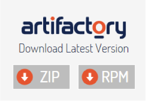
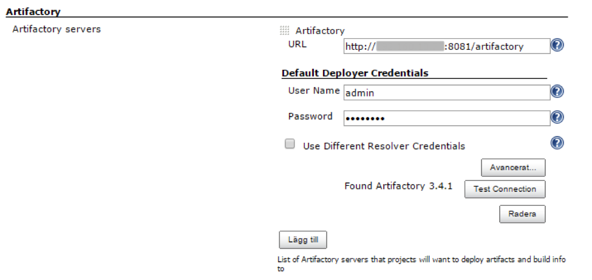

Working at [Sinch](https://www.sinch.com/), I was recently set with the task of separating our application code from our sister company, as well as the test framework we use, so they can run separately. This is great, but for a tech company that has been running for eight years, this is quite an undertaking!

In this quick tutorial, I will show you how to get started using Artifactory, Maven, and Jenkins in sync.

Before this, we had the luxury of needing only one dependency, which was not a big overhead to keep, and exported JAR right in the project folder. This new separation made it obvious that we needed any remote server acting as an artifacts storage to get better transparency in code changes and version control.

This should take about 30 minutes to complete and you will need some familiarity with Maven to get started.

## Setting up Artifactory


First, download and install Artifactory from its [official site](http://www.jfrog.com/open-source/).

We are using a Windows server virtual machine as a base for the Artifactory service to run. To install Artifactory, all you need to do is open the downloaded archive, go to `%ARTIFACTORY_HOME%\bin` and execute the file `artifactory.bat`.

This script searches for the Java executable and runs Artifactory’s main class. After installing Artifactory, start the service either via Windows Services menu or using Command Prompt `(sc start|stop Artifactory)`.


After that, Artifactory should be available at `http://SERVER_DOMAIN:8081/artifactory`. The dashboard looks something like this:


Next, we need to get it integrated into the CI server, which, in this case, is Jenkins. There is a pretty simple and user-friendly plugin for this called [Artifactory plugin](https://wiki.jenkins-ci.org/display/JENKINS/Artifactory+Plugin). After installing it, you should find a new ‘Artifactory’ section in your Jenkins settings, where you need to specify a Artifactory URL and user credentials.


Now we have a pipeline that can publish artifacts to the remote Artifactory server.

The next step is configuring a job that will build our target project and push the compiled JAR to Artifactory.

Create a new job and, in the settings page, find the Build section and a specify path to the POM file. You will also need to add Maven goals to get your project files built. In this case, we would also like to synchronize the Jenkins build version with the deployed artifact’s version. This is made via passing Jenkins `BUILD_NUMBER` variable to Maven.


In the post-build actions section, add deploy artifacts to the Artifactory step, specify that you would like to add your artifacts, and check the ‘Deploy Maven Artifacts’ checkbox.


You will also need to specify a project name and path to your repository.


As a final step, modify the target project’s POM file. Make sure you have `Maven-compiler-plugin` and `Maven-jar-plugin` in the plugins section.

```html
<plugins>
     <plugin>
        <artifactId>Maven-compiler-plugin</artifactId>
        <version>3.1</version>
        <configuration>
          <source>1.6</source>
          <target>1.6</target>
        </configuration>
     </plugin>
     <plugin>
        <groupId>org.apache.Maven.plugins</groupId>
        <artifactId>Maven-jar-plugin</artifactId>
        <version>2.5</version>
        <configuration>
          <archive>
             <index>true</index>
             <manifest>
                <addClasspath>true</addClasspath>
             </manifest>
             <manifestEntries>
                <Implementation-Version>${build.number}</Implementation-Version>
             </manifestEntries>
          </archive>
        </configuration>
     </plugin>
</plugins>
```

It is also important to add groupId, artifactId, version, and packaging to the top-level element of the POM. Please note that we are using the `${build.number}` property, which we are getting from Jenkins as a parameter when the project is built.

```html
<groupId>CommonKeywords</groupId>
<artifactId>CommonKeywords</artifactId>
<version>0.0.1-SNAPSHOT-${build.number}</version>
<packaging>jar</packaging>
```

Bingo! Everything is set up to publish a compiled JAR file to a remote server. All you need to do is save all your changes, push it to your remote repository, and press the ‘Start building’ button in your Jenkins job that is connected to Artifactory.

After the job has finalized all of its steps in the ‘Build history’ section, you should see a link to Artifactory where all the produced artifacts are stored.


From now on, it is possible to use published artifacts in other projects as a Maven dependency.

To set this up, add a dependency with the groupId and artifactId you specified in the previous steps. The version of the added dependency you can specify based on the version number that is deployed to Artifactory, e.g.:

```html
<dependency>
        <groupId>CommonKeywords</groupId>
        <artifactId>CommonKeywords</artifactId>
        <version>0.0.1-SNAPSHOT-54</version>
</dependency>
```

Basically, Maven searches all its dependencies in the central Maven repository. But we have not pushed our project there and that’s why we have to point Maven to our private Artifactory server. You can go to Artifactory and under ‘Artifacts’ in ‘Tree browser,’ it’s easy to find releases or snapshots repository. (We specified it in one of previous steps in job settings.)

On this page, there is a ‘Distribution management’ section, which is exactly where you need to add your POM to get a proper connection to Artifactory. Also, if you want to enable snapshots in addition to release versions, you will need to add the appropriate property to your ‘repository’ section in the POM. The other option is to separately define a snapshot and release repository.

```html
<repositories>
  <repository>
     <id>CLAESTOR</id>
     <name>CLAESTOR-snapshots</name>
     <snapshots>
                <enabled>true</enabled>
     </snapshots>
     <url>http://your_ip_address:8081/artifactory/snapshots</url>
  </repository>
</repositories>
```

And that’s it!

The following scheme shows how the combination of Maven, Jenkins, and Artifactory works in a split team environment to maintain a shared test automation framework.


A common workflow working with Artifactory is as follows:

> 1.  Changes in target project are pushed to Git repository.
> 2.  Jenkins gets latest code from Git and triggers a job.
> 3.  Jenkins job uses Maven goals to package a Jar (clean install) and to assign a proper version to the Jar `(-Dbuild.number=${BUILD_NUMBER})`.
> 4.  Jar file gets pushed to Artifactory by Jenkins job (as post-build action). Now the artifact is ready to be downloaded and used as a Maven dependency.
> 5.  Maven dependency (POM file) in projects that use target project are updated to the latest version available from Artifactory.
> 6.  Maven downloads dependency from Artifactory and stores it on a local machine `(../.m/repositories)`.

If you have any questions, please leave a comment and I will help you out.

Thanks,

Maryia Tuleika, Test Automation Developer at [Sinch](https://www.sinch.com/)

<a class="gitbutton pill" target="_blank" href="https://github.com/sinch/docs/blob/master/docs/tutorials/java/maven-jenkins-artifactory-integration.md">
                        <span class="icon medium">
                            <svg xmlns="http://www.w3.org/2000/svg" role="img" viewBox="0 0 24 24"><title>GitHub icon</title><path d="M 12 0.297 c -6.63 0 -12 5.373 -12 12 c 0 5.303 3.438 9.8 8.205 11.385 c 0.6 0.113 0.82 -0.258 0.82 -0.577 c 0 -0.285 -0.01 -1.04 -0.015 -2.04 c -3.338 0.724 -4.042 -1.61 -4.042 -1.61 C 4.422 18.07 3.633 17.7 3.633 17.7 c -1.087 -0.744 0.084 -0.729 0.084 -0.729 c 1.205 0.084 1.838 1.236 1.838 1.236 c 1.07 1.835 2.809 1.305 3.495 0.998 c 0.108 -0.776 0.417 -1.305 0.76 -1.605 c -2.665 -0.3 -5.466 -1.332 -5.466 -5.93 c 0 -1.31 0.465 -2.38 1.235 -3.22 c -0.135 -0.303 -0.54 -1.523 0.105 -3.176 c 0 0 1.005 -0.322 3.3 1.23 c 0.96 -0.267 1.98 -0.399 3 -0.405 c 1.02 0.006 2.04 0.138 3 0.405 c 2.28 -1.552 3.285 -1.23 3.285 -1.23 c 0.645 1.653 0.24 2.873 0.12 3.176 c 0.765 0.84 1.23 1.91 1.23 3.22 c 0 4.61 -2.805 5.625 -5.475 5.92 c 0.42 0.36 0.81 1.096 0.81 2.22 c 0 1.606 -0.015 2.896 -0.015 3.286 c 0 0.315 0.21 0.69 0.825 0.57 C 20.565 22.092 24 17.592 24 12.297 c 0 -6.627 -5.373 -12 -12 -12" /></svg>
                        </span>
                        Edit on GitHub!</a>