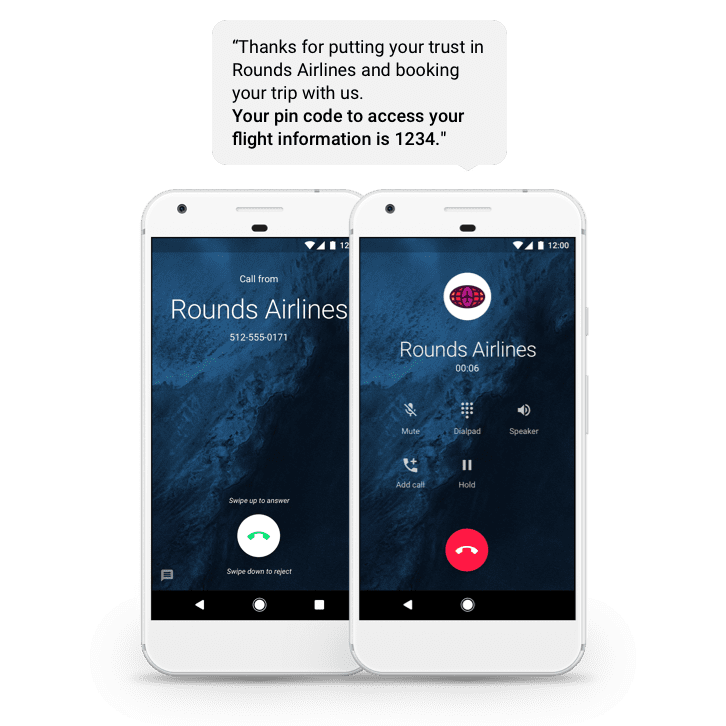

In this tutorial I will show you how to use node.js to build a [text to speech](https://en.wikipedia.org/wiki/Speech_synthesis) call that reads out pin-codes. To read more about the Sinch callout API please see the [documentation](doc:voice-rest-api-calling-api#section-text-to-speech).

## Other use cases

Common use cases for this type of call are weather- and fraud alerts, when you suspect that an SMS is not delivered.

## What you need to get started

 - Node development environment
 - Application - key and secret. Get one here if you don’t have one already - [Sign up](https://portal.sinch.com/#/signup).
 - Some credits on your account. Set up your phone on the dashboard and my boss will give you $2 to get you started\!

## Code

For this code snippet I will use the [sinch-request](https://www.npmjs.com/package/sinch-request) npm package to sign the requests. This package is not required but it makes life a lot easier. Below code makes a call to +15551234567 and play “Your pin code is 1234” in US English when user is answering the call.

```javascript
var sinchRequest = require('sinch-request');
var https = require('https');

var creds = { key: 'your key',
  secret: 'your secret'
};

var bodyData = JSON.stringify({ method: 'ttsCallout',
  ttsCallout:
   { destination: { type: 'number', endpoint: '+15551234567' },
     domain: 'pstn',
     custom: 'customData',
     locale: 'en-US',
     prompts : "#tts[Your pin code is 1234]", } });

var options = {
  method: 'POST',
  host: 'callingapi.sinch.com',
  port: 443,
  path: '/v1/callouts',
  data: bodyData
};

sinchRequest.applicationSigned(options, creds);
var req = https.request(options, function(response) {
  var data = '';
  response.on('data', function (chunk) {
    data += chunk;
  });
  response.on('end', function () {
    console.log('Response body: ' + data);
    //here you can i.e save your callid,
  });
});
req.end(options.data);
```

## Next steps

In the next tutorial I will show you how to make IVR menus that enable you to collect input from the user.


<div class="magic-block-html"><a class="gitbutton pill" target="_blank" href="https://github.com/sinch/docs/blob/master/docs/tutorials/javascript/send-otp-codes-with-text-to-speech-calls-using-sinch-and-nodejs.md"><span class="icon medium"><svg xmlns="http://www.w3.org/2000/svg" role="img" viewBox="0 0 24 24"><title>GitHub icon</title><path d="M 12 0.297 c -6.63 0 -12 5.373 -12 12 c 0 5.303 3.438 9.8 8.205 11.385 c 0.6 0.113 0.82 -0.258 0.82 -0.577 c 0 -0.285 -0.01 -1.04 -0.015 -2.04 c -3.338 0.724 -4.042 -1.61 -4.042 -1.61 C 4.422 18.07 3.633 17.7 3.633 17.7 c -1.087 -0.744 0.084 -0.729 0.084 -0.729 c 1.205 0.084 1.838 1.236 1.838 1.236 c 1.07 1.835 2.809 1.305 3.495 0.998 c 0.108 -0.776 0.417 -1.305 0.76 -1.605 c -2.665 -0.3 -5.466 -1.332 -5.466 -5.93 c 0 -1.31 0.465 -2.38 1.235 -3.22 c -0.135 -0.303 -0.54 -1.523 0.105 -3.176 c 0 0 1.005 -0.322 3.3 1.23 c 0.96 -0.267 1.98 -0.399 3 -0.405 c 1.02 0.006 2.04 0.138 3 0.405 c 2.28 -1.552 3.285 -1.23 3.285 -1.23 c 0.645 1.653 0.24 2.873 0.12 3.176 c 0.765 0.84 1.23 1.91 1.23 3.22 c 0 4.61 -2.805 5.625 -5.475 5.92 c 0.42 0.36 0.81 1.096 0.81 2.22 c 0 1.606 -0.015 2.896 -0.015 3.286 c 0 0.315 0.21 0.69 0.825 0.57 C 20.565 22.092 24 17.592 24 12.297 c 0 -6.627 -5.373 -12 -12 -12" /></svg></span>Edit on GitHub!</a></div>