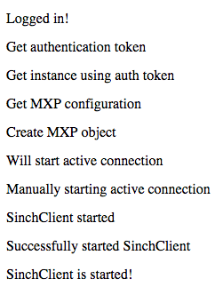

## Sinch setup

 1.  [Sign up](https://portal.sinch.com/#/signup) for a Sinch account
 1.  In the [developer dashboard](https://portal.sinch.com/), create a new app and take note of the app key and secret
 1.  [Download](https://sinch.readme.io/page/downloads) the Sinch JavaScript SDK

## Create the user ticket

Create a new servlet project with one servlet for authentication that has a doPost method:

```java
public class AuthServlet extends HttpServlet {
    private static final long serialVersionUID = 1L;

    public AuthServlet() {
        super();
    }
}

protected void doPost(HttpServletRequest request, HttpServletResponse response) throws ServletException, IOException {
    // If you want to authenticate user,
    // generate a ticket to pass to the Sinch Client
}
```

Next, create the login/signup form view that will send a post request to the `doPost` method above. (Ideally, you would have more of a distinction between logging in and signing up, but I’ll leave that to you to best implement with your existing user database.)

Create a file called **index.jsp** (or index.html) in the WebContent directory. This will be a simple username and password form:

```html
<form action="authenticate" method="post">
    Username: <input type="text" name="username" /><br>
    Password: <input type="password" name="password" /><br>
    <input type="submit" value="Login/Signup"/>
</form>
```

Now, let’s generate the ticket in `doPost`. First, define several variables that you will use to create the ticket. (Be sure to sub in your app key and secret.):

```javascript
int expiresIn = 3600; //seconds
String applicationKey = "YOUR_APP_KEY"; //change me!
String applicationSecret = "YOU_APP_SECRET"; //change me!

//date in iso8601 format
Date date= new java.util.Date();
DateFormat dateFormat = new SimpleDateFormat("yyyy-MM-dd'T'HH:mm:ss'Z'");
dateFormat.setTimeZone(TimeZone.getTimeZone("UTC"));
String timestamp = dateFormat.format(date);

//user-submitted username and password
String username = request.getParameter("username");
String password = request.getParameter("password");
```

Next, create the ticket and store it in the session object, which you can access from the view:

```javascript
String userTicket = "{\"identity\":{\"type\":\"username\""
            + ",\"endpoint\":\"" + username + "\"},\"expiresIn\":"
            + expiresIn + ",\"applicationKey\":\"" + applicationKey
            + "\",\"created\":\"" + timestamp + "\"}";

String userTicketBase64 = Base64.encodeBase64String(userTicket.getBytes());

String signature = "";
try {
    Mac sha256HMAC = Mac.getInstance("HmacSHA256");
    SecretKeySpec secretKey = new SecretKeySpec(Base64.decodeBase64(applicationSecret.getBytes()), "HmacSHA256");
       sha256HMAC.init(secretKey);
       signature = Base64.encodeBase64String(sha256HMAC.doFinal(userTicket.getBytes()));
} catch (Exception e) {
    e.printStackTrace();
}

HttpSession session = request.getSession();
session.setAttribute("ticket", userTicketBase64 + ":" + signature);
response.sendRedirect("success.jsp"); //still need to create this file
```

**Note:** This will authenticate any username/password combination. Before generating the ticket, you need to check the username/password combo against your database of users.

## Add the Sinch SDK

First, create a **success.jsp** file, where `doPost` redirects to.

To add the Sinch SDK, just move **sinch.min.js** to your WebContent folder. Then simply include the JavaScript file in the head of **success.jsp**:

```javascript
//while you're at it, add jquery too!
<script src="https://ajax.googleapis.com/ajax/libs/jquery/1.11.1/jquery.min.js"></script>
<script src="sinch.min.js"></script>
```

To keep things simple, I put the script to start the Sinch client inside my **success.jsp** file. Here, you will get the token from the session:

```html
<script>
  $('document').ready(function() {

    //define the sinch client
    sinchClient = new SinchClient({
      applicationKey: "YOUR_APP_KEY", //change me!
      capabilities: {calling:true, messaging: true}, //only use what you need here
      startActiveConnection: true,
      onLogMessage: function(message) {
        //messages appended to the body when
        //the state of the client changes
        $("body").append("<p>" + message.message + "</p>");
      },
    });

    //here's that user ticket!
    sinchClient.start({"userTicket":"<%= session.getAttribute("ticket").toString() %>"})
      .then(function() {
        //now, you can start using the client to make calls & send messages
        $("body").append("<p>SinchClient is started!</p>");
      }); //handle error if no ticket, or ticket is no longer valid
    });
</script>
```

When running this in your browser, after logging in, you will see the changes in client state as HTML like so:


Congratulations, you did it\! You can now use the Sinch client to add calling or messaging to your web app.

<div class="magic-block-html"><a class="gitbutton pill" target="_blank" href="https://github.com/sinch/docs/blob/master/docs/tutorials/javascript/use-the-sinch-javascript-sdk-in-your-servlet-project.md"><span class="icon medium"><svg xmlns="http://www.w3.org/2000/svg" role="img" viewBox="0 0 24 24"><title>GitHub icon</title><path d="M 12 0.297 c -6.63 0 -12 5.373 -12 12 c 0 5.303 3.438 9.8 8.205 11.385 c 0.6 0.113 0.82 -0.258 0.82 -0.577 c 0 -0.285 -0.01 -1.04 -0.015 -2.04 c -3.338 0.724 -4.042 -1.61 -4.042 -1.61 C 4.422 18.07 3.633 17.7 3.633 17.7 c -1.087 -0.744 0.084 -0.729 0.084 -0.729 c 1.205 0.084 1.838 1.236 1.838 1.236 c 1.07 1.835 2.809 1.305 3.495 0.998 c 0.108 -0.776 0.417 -1.305 0.76 -1.605 c -2.665 -0.3 -5.466 -1.332 -5.466 -5.93 c 0 -1.31 0.465 -2.38 1.235 -3.22 c -0.135 -0.303 -0.54 -1.523 0.105 -3.176 c 0 0 1.005 -0.322 3.3 1.23 c 0.96 -0.267 1.98 -0.399 3 -0.405 c 1.02 0.006 2.04 0.138 3 0.405 c 2.28 -1.552 3.285 -1.23 3.285 -1.23 c 0.645 1.653 0.24 2.873 0.12 3.176 c 0.765 0.84 1.23 1.91 1.23 3.22 c 0 4.61 -2.805 5.625 -5.475 5.92 c 0.42 0.36 0.81 1.096 0.81 2.22 c 0 1.606 -0.015 2.896 -0.015 3.286 c 0 0.315 0.21 0.69 0.825 0.57 C 20.565 22.092 24 17.592 24 12.297 c 0 -6.627 -5.373 -12 -12 -12" /></svg></span>Edit on GitHub!</a></div>