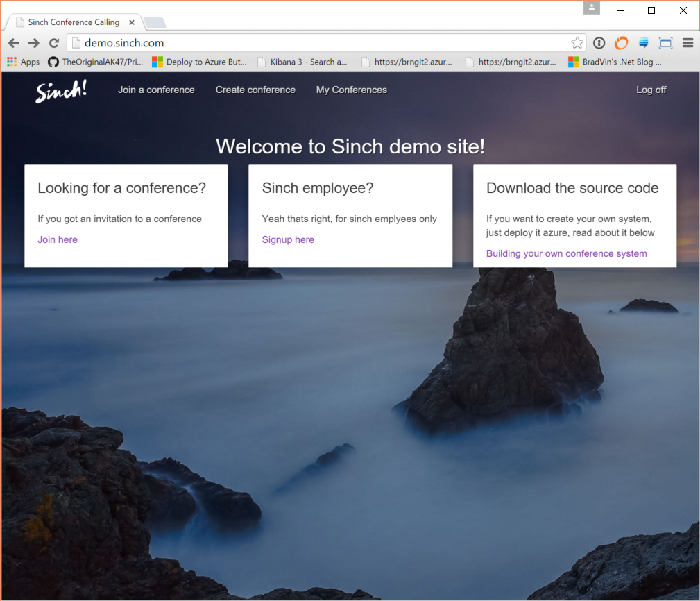
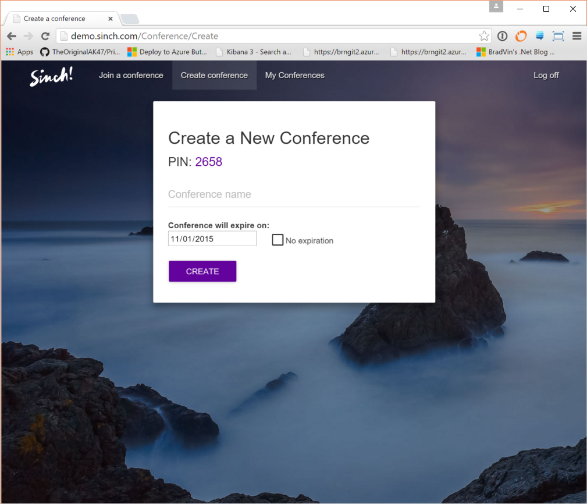
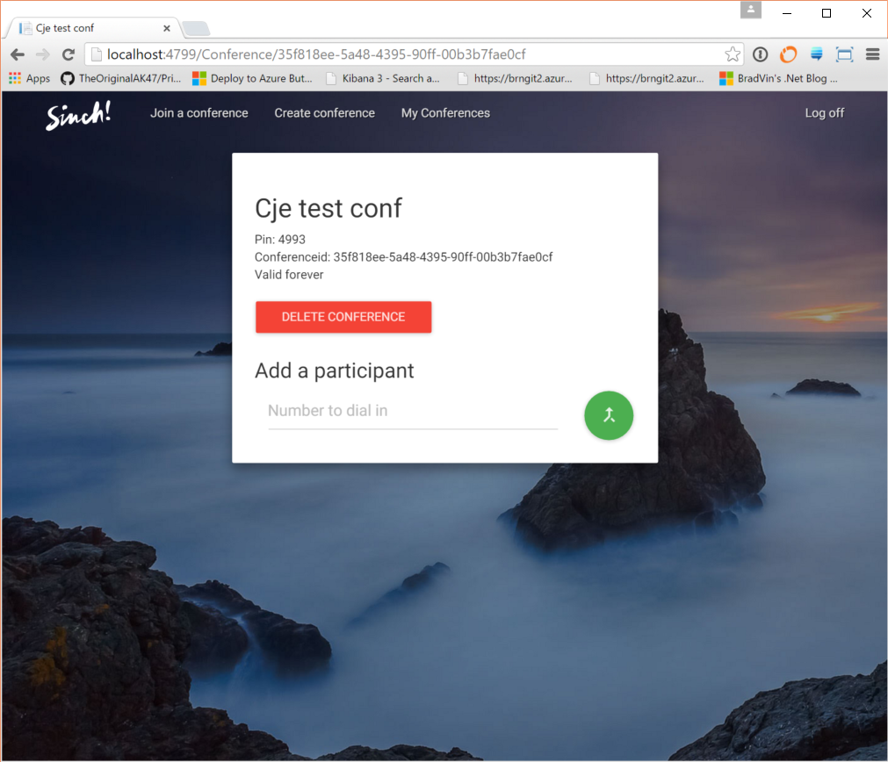

In today’s post, I am going to look at the conferencing system that we built to use with our customers.

This is part 1 of a new 2-part series, and when we are finished, we will have the following functionality in our application:

> 1.  Register users and only allowing a custom domain as registration email (in this case sinch.com)
> 2.  Create conferences if you are a registered user (this article)
> 3.  Join a conference via phone (this article)
> 4.  join Conference via browser (next article)
> 5.  Add participants by calling their phone
> 6.  See the participants of a conference (next article)

Sinch supports both regular phone calling and WebRTC calling for conferencing, as well as one-on-one conversations. When I built this system I started out from the [.NET Conference Calling template](https://github.com/sinch/net-ConferenceCalling) and went from there. The complete solution can be downloaded from GitHub [here](https://github.com/sinch/net-demo.sinch.com).


## Using The System

You can just deploy it to Azure using the deploy button below, and Azure will set up a database and configure Sinch app keys and secrets for you. Or you can just fork it and deploy the code wherever you want.


Now that this is out of the way, what we want to do is to enable both regular phones and web browsers to join a conference. The [ICE callback](doc:voice-rest-api-callback-api) information can help us in customizing the functionality for each use case.

> 1.  Calling in from a phone - We want to play a prompt to the user to enter the conference PIN in order to be connected
> 2.  When calling from a browser - We just want to present a PIN code window even before they attempt to call, and then connect the browser caller with no further interaction

We can use the following code to accomplish both steps:

**Controllers/CallbackController.cs**

```csharp
public async Task<SvamletModel> Post(CallbackEventModel model) {
var sinch = SinchFactory.CreateCallbackResponseFactory(Locale.EnUs);
var reader = sinch.CreateEventReader();
var evt = reader.ReadModel(model);
var builder = sinch.CreateIceSvamletBuilder();
switch (evt.Event) {
    case Event.IncomingCall:
        if (model.OriginationType == "MXP") { 
        //Its a browser calling in, just look up the PIN code
            await ConnectToConference(model.To.Endpoint, model.From, builder);
        } else { // A phone is calling in, play a promopt
            builder.AddNumberInputMenu("menu1", "Enter 4 digit pin", 4, "Enter 4 digit pin", 3,
                TimeSpan.FromSeconds(60));
            builder.RunMenu("menu1");
        }
        break;
    case Event.PromptInput: // Only regular phones will come here
        await ConnectToConference(model.MenuResult.Value, model.From, builder);
        break;
    case Event.AnsweredCall: 
        // Since we cant opt out from callbacks because of the prompts,
        // we need to respond to Answered call as well. 
        builder.Continue();
        break;
    case Event.DisconnectedCall: 
        // This would be a good place to notify 
        //other people in the conference that someone left
        break;
    default:
        break;
}
return builder.Build().Model;
}

private async Task ConnectToConference(string  pinCode, string cli, IIceSvamletBuilder builder) {
    using (var db = new ConferenceContext()) {
        // find the correct conference (current setup only allows for 10 000 unique 
        // conferences per day, because I wanted to limit the PIN code length to 4)
        var conference =
            await db.Conferences
            .FirstOrDefaultAsync(c => c.PinCode == pinCode 
            && (c.ConferenceEndDate >= DateTime.Today || c.ValidForever== true));

        if (conference != null) { 
            // connect the caller to the conrefence with the correct CLI
            builder.ConnectConference(conference.ConferenceId.ToString()).WithCli(cli);
            builder.Say(", Welcome to the conference");
        } else {
            builder.Say("Invalid code").Hangup(HangupCause.Normal);
        }
    }
}
```

That’s really all there is to it for the backend. I am sure you you are curious about the conference model, so let’s look at the conference creation.

I decided that for creating a conference, I wanted a protect login using ASP.NET identity, which is nothing fancy and you can read about how to use it [here](http://www.asp.net/identity).

## Creating A Conference

So to have a more “real” conference system I wanted set an expiry time for the conference and some basic info like who is the owner of the conference, etc. All of these fields will make more sense when we look at the creation of the conference page.

**ConferenceModels.cs**

```csharp
public class Conference {
    public int Id { get; set; }
    public string OwnerId { get; set; }
    public string ConferenceName { get; set; }
    [DataType(DataType.Date)]
    [DisplayFormat(DataFormatString = "{0:yyyy-MM-dd}", ApplyFormatInEditMode = true)]
    public DateTime ConferenceEndDate { get; set; }
    [MaxLength(4)]
    public string PinCode { get; set; }
    public Guid ConferenceId { get; set; }
    public bool ValidForever { get; set; }

}

// Invites to the conference
public class ConferenceAtendee {
    [DatabaseGenerated(DatabaseGeneratedOption.Identity)]
    public int Id { get; set; }
    public string  Name { get; set; }
    public string Email { get; set; }
    public string Phone { get; set; }
}
```

**ConferenceController.cs** This is a pretty big controller as it hosts both the functionality to join a conference and to create a conference. Let’s take a look at **Create**. There are two actions where you create a conference.


```csharp
[Authorize]
[Route("~/Conference/Create")]
[HttpGet]
public async Task<ActionResult> Create() {
    var model = new CreateConferenceModel();
    //Set up some standard values to make it look nice in the UI
    model.Conference = new Conference();
    model.Conference.ConferenceEndDate = DateTime.Today.AddDays(5);
    model.Conference.OwnerId = User.Identity.Name;

    string code = "";
    using (var db = new ConferenceContext()) {
    //Hacky - this has a potential for slowing down stuff considerably and produce errors.
        Random rng = new Random();
        int value = rng.Next(100, 9999); //1
        code = value.ToString("0000");
        while (db.Conferences
            .Any(m => m.PinCode == code 
            && (m.ConferenceEndDate <= DateTime.Today || m.ValidForever))) {
            value = rng.Next(100, 9999); //1
            code = value.ToString("0000");
        }

    }
    model.Conference.PinCode = code;
    return View(model);
}
```

##Authorization

Notice that in our implementation I don’t allow anonymous creation of conferences and so the **\[Authorize\]** statement is added. Next up is saving the conference with its attendees. If you want to allow that just remove **\[Authorize\]**.

```objectivec
[Authorize]
 [Route("~/Conference/Create")]
 [HttpPost]
 public async Task<ActionResult> Create(CreateConferenceModel model) {
     using (var db = new ConferenceContext()) {
         model.Conference.ConferenceId = Guid.NewGuid();
         var utcdate = model.Conference.ConferenceEndDate.ToUniversalTime();
         model.Conference.ConferenceEndDate = utcdate.Date;
         model.Conference.OwnerId = User.Identity.Name;
         db.Conferences.Add(model.Conference);
         await db.SaveChangesAsync();
     }
     return RedirectToAction("MyConferences");
 }
```

So now that we have a conference, I took the decision to not allow the user to set the PIN themselves because I felt it was a better user experience not to fail on duplicate codes.

The other Action of significance in **ConferenceContoller.cs** is Details, if you are the owner of the conference, you can see details and the current callers in the conference.

```csharp
[Authorize]
[Route("~/Conference/{id}")]
public async Task<ViewResult> Details(Guid id) {
    var model = new ConferenceDetailsViewModel();
    using (var db = new ConferenceContext())
    {
        var conference =
            db.Conferences
                .FirstOrDefault(m => m.OwnerId == User.Identity.Name 
                && m.ConferenceId == id);
        model.Conference = conference;
        try
        {
            var conf = await Getconference(conference.ConferenceId.ToString()).Get();
            // store the participants in the result model
            if (conf != null)
            {
                model.Participants = conf.Participants;
            }
            else
            {
                model.Participants = new IParticipant[0];
            }
        }
        catch (Exception)
        {}

        return View(model);
    }
}

private IConference Getconference(string conferenceId) {
    // 1. Create an API factory
    var sinch = SinchFactory.CreateApiFactory(appKey, appSecret);
    // 2. Get a ConferenceApi client
    var conferenceClient = sinch.CreateConferenceApi();
    //fetch the conference 
    try
    {
        return conferenceClient.Conference(conferenceId);
    }
    catch (Exception)
    {
        return null;
    }
}
```

##Call Out To A Phone Number

One other cool feature is that you can call out to a phone number to add them to the conference.


```csharp
[Route("~/Conference/Callout")]
public async Task<JsonResult> CallOut(string number, string conferenceId) {
    try
    {
        var factory = 
            new WebApiClientFactory().CreateClient<ICalloutApiEndpoints>(
                "https://api.sinch.com",
                new ApplicationSigningFilter(appKey, Convert.FromBase64String(appSecret)), 
                new RestReplyFilter());
        number = number.StartsWith("+") ? number.Trim() : "+" + number.Trim();
        await factory.AddParticipant(new CalloutRequest
        {
            method = "conferenceCallout",
            conferenceCallout = new ConferenceCallout
            {
                cli = "+17864088194",
                destination = new Destination {endpoint = number, type = "number"},
                domain = "pstn",
                conferenceId = conferenceId,
                enableDice = true
            }
        });
        return Json(null, JsonRequestBehavior.AllowGet);
    }
    catch (Exception e)
    {
        Debug.WriteLine(e.Message);
    }
    return Json(null, JsonRequestBehavior.AllowGet);
}
```

As you might notice, I’ve created a brand new API endpoint on the **SinchServerSDK**. The backend team rolls out features so quickly so sometimes it’s hard to keep up with the SDK parts of it. Fortunately, it’s super easy to use the **Sinch.WebAPI** client to handle request signing etc. You can read more about [callouts](doc:voice-rest-api-calling-api#section-text-to-speech) in our documentation. The above method is posted by pressing the green button with a JavaScript snippet in **views/conference/details.cshtml**

```javascript
$('#callout').bind('click', function(event) {
    event.preventDefault();
    $.getJSON('CallOut?number=' + $('#number').val() + 
    '&conferenceId=@Model.Conference.ConferenceId', 
    null, function(data) {
        //todo, add to list of participants
    });
});
```

## Finished

Now we actually have real life conference calling system with some security using PIN codes.

In the next tutorial, we will add a web client to call in to a conference.