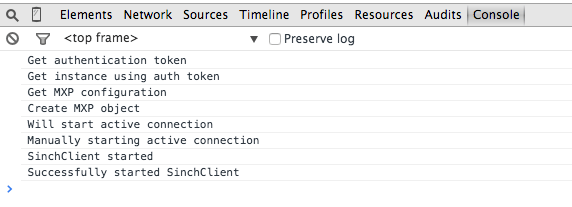

This tutorial will walk you through authenticating users to the [Sinch JavaScript SDK](https://www.sinch.com/web-sdk/) with a Rails backend. You will use the devise gem to securely authenticate and store your users’ info. Once users are authenticated with devise, you will generate a token and pass it to the Sinch JavaScript SDK. From there, you can follow our [calling or messaging tutorials](doc:tutorials-introduction) to build out the functionality of your app.

## Sinch setup

> 1.  Sign up for a [Sinch account](https://www.sinch.com/signup)
> 2.  In the developer dashboard, create a new app and take note of the app key and secret
> 3.  Download the [Sinch JavaScript SDK](https://sinch.readme.io/page/downloads)

## Project setup

First, create a new Rails app and move into the project directory:

```ruby
$ rails new NameOfYourApp
$ cd NameOfYourApp
```

Create the main controller. I’ll call mine `SinchController`:

```ruby
$ rails generate controller sinch --no-test-framework
```

To add the Sinch SDK to your project, add **sinch.min.js** to your JavaScript folder:


To set up devise, add the following to your Gemfile:

```ruby
gem 'devise'
```

Then bundle install and set up devise:

```ruby
$ bundle install
$ rails generate devise:install
$ rails generate devise User
$ rake db:migrate
```

## Authenticate 
You will want to generate the token for Sinch after a user has logged in or registered with devise. You can do this by overriding `after_sign_in_path_for(user)` and `after_sign_up_path_for(user)`. Add the following in **ApplicationController.rb** and be sure to fill in your app key and secret from the Sinch dashboard:

```ruby
def after_sign_in_path_for(user)
  after(user.email)
end

def after_sign_up_path_for(user)
  after(user.email)
end

#keep your code DRY!
def after(email)
  #temporarily store ticket in session
  session[:ticket] = get_auth_ticket(email)
  root_path
end

#generate ticket for Sinch authentication
def get_auth_ticket(username)
  user_ticket = {
    "identity" => {"type" => "username", "endpoint" => username},
    "expiresIn" => 3600, #seconds
    "applicationKey" => "your_app_key",
    "created" => Time.now.utc.iso8601
  }

  user_ticket_json = user_ticket.to_json.gsub(/\s+/, "")
    user_ticket_base64 = Base64.encode64(user_ticket_json).strip
    digest = OpenSSL::HMAC.digest(OpenSSL::Digest.new('sha256'), Base64.decode64("your_app_secret"), user_ticket_json).strip
    signature = Base64.encode64(digest).strip
    return (user_ticket_base64 + ':' + signature).gsub(/\s+/, "")
end
```

Then, in **SinchController.rb**, add the following to make the ticket accessible in the view:

```ruby
class SinchController < ApplicationController
  before_action :authenticate_user!

  def index
    @ticket = session[:ticket]
      session[:ticket] = nil

      redirect_to new_user_session_path if @ticket == nil
  end
end
```

In the above code, look for the ticket in the session storage. If there is no ticket, re-authenticate the user with devise. If there is a current valid devise session, users won’t see a login page, but rather, `after_sign_up_path_for(user)` will automatically get called, generating a new Sinch ticket. If there is a ticket, you will get access the @ticket variable in your view. `session[:ticket]` will be set to nil so that it can be reset next time a user logs in.

## Authenticate using the sinch\_auth gem

Alternatively, you can use the `sinch_auth` gem to take care of creating the token. First, add the `gem 'sinch_auth'` to your Gemfile and bundle install.

The gem generates the ticket that you have created by hand in `get_auth_ticket`. You can use it like so:

```ruby
sinchAuth = SinchAuth.new
ticket = sinchAuth.get_auth_ticket(username, expires_in, key, secret)
```

In the above example, pass in a string username, the number of seconds you want the token to expire in, your app key and your app secret.

##The view 

Next, you will make `sinch#index` the root path, and start the Sinch client in that view.

Add to routes.rb:

```ruby
root 'sinch#index'
```

Add sample HTML body and start the Sinch client in **sinch/index.html.erb**. Don’t forget to replace `your_app_key` with your app key from above:

```ruby
<div>
  <%= link_to "Sign Out", destroy_user_session_path, :method => :delete, :id => "signOut" %>
</div>

 <div id="clientStart" style="display:none;">
  Sinch client started!
</div>

<script>
  $('document').ready(function() {
    $("#signOut").click(function() {
      if (sinchClient) {
        sinchClient.terminate();
      }
    });

    sinchClient = new SinchClient({
      applicationKey: "your_app_key",
      capabilities: {messaging: true},
      startActiveConnection: true,
      onLogMessage: function(message) {
        console.log(message.message);
      },
    });

    sinchClient.start({"userTicket":"<%=@ticket%>"})
      .then(function() {
        $("#clientStart").css("display", "inline");
      });
    });
</script>
```

A few notes about the code above:

> 1.  Upon sign out, terminate the Sinch client
> 2.  Use the authentication ticket you generated, `@ticket`, to start the Sinch client
> 3.  Reveal the UI when the Sinch client is started. This will take one to two seconds

To test out your app, start a local rails server and navigate to <http://0.0.0.0:3000> :

```ruby
$ rails server
$ open http://0.0.0.0:3000
```

Open the developer console in your browser to see real-time updates of the Sinch client:


Congratulations, you did it\! You can now use the Sinch client to add calling or messaging to your web app. Check out the following tutorials to continue with your app:

>   - [Web-web calling tutorial](doc:turn-your-browser-into-a-phone-with-the-sinch-js-sdk)
>   - [Web-phone calling tutorial](doc:using-sinch-js-sdk-to-call-a-phone-number)

<a class="gitbutton pill" target="_blank" href="https://github.com/sinch/docs/blob/master/docs/tutorials/ruby/authenticate-to-sinch-from-rails-with-devise.md">
                        <span class="icon medium">
                            <svg xmlns="http://www.w3.org/2000/svg" role="img" viewBox="0 0 24 24"><title>GitHub icon</title><path d="M 12 0.297 c -6.63 0 -12 5.373 -12 12 c 0 5.303 3.438 9.8 8.205 11.385 c 0.6 0.113 0.82 -0.258 0.82 -0.577 c 0 -0.285 -0.01 -1.04 -0.015 -2.04 c -3.338 0.724 -4.042 -1.61 -4.042 -1.61 C 4.422 18.07 3.633 17.7 3.633 17.7 c -1.087 -0.744 0.084 -0.729 0.084 -0.729 c 1.205 0.084 1.838 1.236 1.838 1.236 c 1.07 1.835 2.809 1.305 3.495 0.998 c 0.108 -0.776 0.417 -1.305 0.76 -1.605 c -2.665 -0.3 -5.466 -1.332 -5.466 -5.93 c 0 -1.31 0.465 -2.38 1.235 -3.22 c -0.135 -0.303 -0.54 -1.523 0.105 -3.176 c 0 0 1.005 -0.322 3.3 1.23 c 0.96 -0.267 1.98 -0.399 3 -0.405 c 1.02 0.006 2.04 0.138 3 0.405 c 2.28 -1.552 3.285 -1.23 3.285 -1.23 c 0.645 1.653 0.24 2.873 0.12 3.176 c 0.765 0.84 1.23 1.91 1.23 3.22 c 0 4.61 -2.805 5.625 -5.475 5.92 c 0.42 0.36 0.81 1.096 0.81 2.22 c 0 1.606 -0.015 2.896 -0.015 3.286 c 0 0.315 0.21 0.69 0.825 0.57 C 20.565 22.092 24 17.592 24 12.297 c 0 -6.627 -5.373 -12 -12 -12" /></svg>
                        </span>
                        Edit on GitHub!</a>