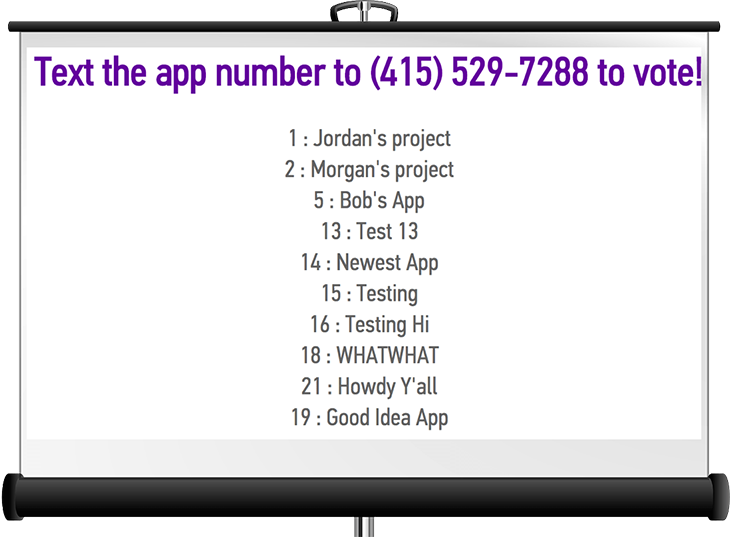
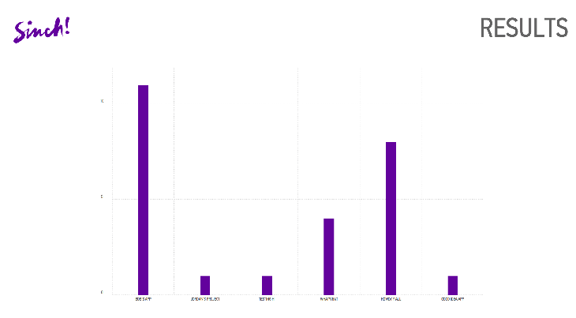
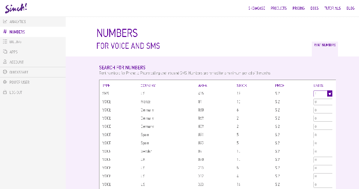

or an app pitch night we were hosting, I wanted an easy way for attendees to vote on their favorite app. I settled on building an SMS voting system that displays a list of submissions with a corresponding “app number” which attendees can then text to a phone number to place their vote.

Because attendees only had a few minutes to vote and everyone was physically present, using SMS prevented people from submitting multiple votes without forcing anyone to sign up for an account. As the presentations happened, I entered each app’s name into the system via a simple form. When it was time to vote, I put the list of submissions on the giant projector:


Once the voting period ended, I navigated to the results page, which shows how many votes each app received.


In the next two sections, I’ll dive into the details of handling the incoming SMS as a vote and displaying the results as a graph. The rest of the app is a basic Rails app. You can find the finished source code for my app on our GitHub at [github.com/sinch/rails-sms-voting](https://github.com/sinch/rails-sms-voting).

## Handle incoming SMS

> 1.  [Sign up for a Sinch developer account](https://portal.sinch.com/#/signup).
> 2.  When prompted, verify your mobile phone number to get $2 for free.
> 3.  Use the $2 to rent an SMS phone number.


> 4.  [Create a new app in the developer portal](https://portal.sinch.com/#/login).
> 5.  Edit the SMS callback URL for that app. (It can’t be a local server.) This URL should accept post requests.


> 6.  Add the phone number that you just rented as “inbound number.” At the time of writing this, you can’t copy and paste the number. Instead, start typing the area code of the number and click the number on the drop-down list. If it turned into a purple button like you see above, you did it right.
> 7.  Click the save button **twice\!**

Now, you’ll want to set up `http://www.where-is-your-app-hosted.com/vote` to do something with the incoming SMS. The post data will look something like this:

```json
{
    "event": "incomingSms",
    "to": {
        "type": "number",
        "endpoint": "+46700000000"
    },
    "from": {
        "type": "number",
        "endpoint": "+46700000001"
    },
    "message": "Hello world",
    "timestamp": "2014-12-01T12:00:00Z",
    "version": 1
}
```

In my app, I used this data to create a vote object that consisted of the message and the from number:

```ruby
pick = params["message"]
from = params["from"]["endpoint"]

#make sure their vote correlates to a submission number
submission_exists = Submission.where(identifier: pick).length > 0

if submission_exists
    v = Vote.new
    v.pick = pick
    v.from = from
    v.save
end

#you can do something fancier here
render nothing: true
```

I’ll also mention that Rails automatically denies post requests from other domains, so you have to add the following in your controller to allow cross-domain requests to accept the post request from Sinch:

```ruby
skip_before_action :verify_authenticity_token, only: [:vote]
```

## Display results as a graph

I chose to use the [Chartist.js](http://gionkunz.github.io/chartist-js/) library to display the results as a bar graph. If you think that’s boring, it also has nice pie and donut graphs with more interesting colors. To start using, include the **chartist.js**, **chartist.scss**, and \**settings/\_chartist-settings.scss*\* files in your project. This is all it takes to make a basic chart:

```ruby
<!-- apparently "golden-section" is a popular aspect ratio name! -->
<div class="ct-chart ct-golden-section"></div>

<script>
$(function() {
    data = {labels: ["Orange", "Banana", "Apple"], series: [[2, 4, 6]]}
    new Chartist.Bar('.ct-chart', data, {});
}
</script>
```

And here’s what mine looks like to get data from my backend, only display the y-axis displays if they are integers, and make the bars 30px wide and purple:

```ruby
$(function() {
    $.get('/votes', function(data) {
        options = {
            axisY: {
                labelInterpolationFnc: function (value) {
                    return value === Math.floor(value) ? value : null;
                }
            }
        };
        new Chartist.Bar('.ct-chart', data, options).on('draw', function(drawData) {
            if(drawData.type === 'bar') {
                drawData.element.attr({
                    style: 'stroke-width: 30px; stroke: RGB(99,2,157);'
                });
            };
        });
    });
});
```

So there you go. How to build your own SMS voting system using Rails and Chartist. For more customization options, check out [Chartist.js docs](http://gionkunz.github.io/chartist-js/api-documentation.html).

<a class="gitbutton pill" target="_blank" href="https://github.com/sinch/docs/blob/master/docs/tutorials/ruby/build-an-sms-voting-system-with-chartist-and-rails.md">
                        <span class="icon medium">
                            <svg xmlns="http://www.w3.org/2000/svg" role="img" viewBox="0 0 24 24"><title>GitHub icon</title><path d="M 12 0.297 c -6.63 0 -12 5.373 -12 12 c 0 5.303 3.438 9.8 8.205 11.385 c 0.6 0.113 0.82 -0.258 0.82 -0.577 c 0 -0.285 -0.01 -1.04 -0.015 -2.04 c -3.338 0.724 -4.042 -1.61 -4.042 -1.61 C 4.422 18.07 3.633 17.7 3.633 17.7 c -1.087 -0.744 0.084 -0.729 0.084 -0.729 c 1.205 0.084 1.838 1.236 1.838 1.236 c 1.07 1.835 2.809 1.305 3.495 0.998 c 0.108 -0.776 0.417 -1.305 0.76 -1.605 c -2.665 -0.3 -5.466 -1.332 -5.466 -5.93 c 0 -1.31 0.465 -2.38 1.235 -3.22 c -0.135 -0.303 -0.54 -1.523 0.105 -3.176 c 0 0 1.005 -0.322 3.3 1.23 c 0.96 -0.267 1.98 -0.399 3 -0.405 c 1.02 0.006 2.04 0.138 3 0.405 c 2.28 -1.552 3.285 -1.23 3.285 -1.23 c 0.645 1.653 0.24 2.873 0.12 3.176 c 0.765 0.84 1.23 1.91 1.23 3.22 c 0 4.61 -2.805 5.625 -5.475 5.92 c 0.42 0.36 0.81 1.096 0.81 2.22 c 0 1.606 -0.015 2.896 -0.015 3.286 c 0 0.315 0.21 0.69 0.825 0.57 C 20.565 22.092 24 17.592 24 12.297 c 0 -6.627 -5.373 -12 -12 -12" /></svg>
                        </span>
                        Edit on GitHub!</a>