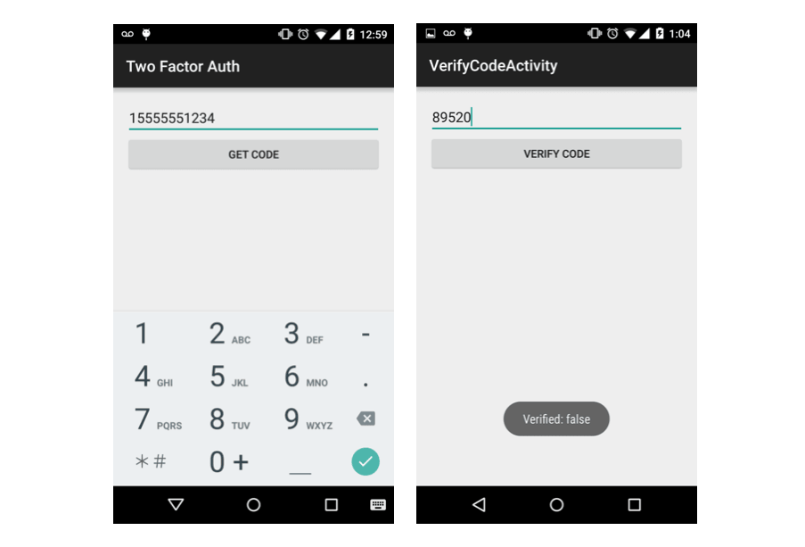

> **Update**
>
> To verify numbers even easier, check out our [Verification SDK](https://www.sinch.com/products/verification/sms/)

In this part of the tutorial, you will build an Android client app that uses the verification API you built in [part 1](doc:ruby-on-rails-two-factor-authentication-for-user-phone-numbers-part-1).

Your finished app will look like this:


Start by creating a new project in Android Studio. I’ll call the first activity **GetCodeActivity**. In this activity, the user will input his or her phone number and then you will make a request to your-website.com/generate (from part 1 of this tutorial) to generate a one-time code.

Start by adding permission to use the internet:

```xml
<uses-permission android:name="android.permission.INTERNET"/>
```

The view is a simple input box and a button to make the request.

```xml
<EditText
    android:layout_width="match_parent"
    android:layout_height="wrap_content"
    android:inputType="phone"
    android:id="@+id/phoneNumber"
    android:hint="your phone number"/>

<Button
    android:layout_width="match_parent"
    android:layout_height="wrap_content"
    android:text="Get Code"
    android:id="@+id/getCodeButton"
    android:layout_below="@+id/phoneNumber"
    android:onClick="getCodeButtonClick"/>
```

When the button is clicked, get the phone number that was typed in and use a background task to make the post request:

```java
public void getCodeButtonClick(View v) {
    String phoneNumber = ((EditText) findViewById(R.id.phoneNumber)).getText().toString();
    (new GetCode()).execute(phoneNumber);
}

class GetCode extends AsyncTask<String, Void, Void> {

    private String phoneNumber;

    @Override
    protected Void doInBackground(String... params) {
        HttpClient httpClient = new DefaultHttpClient();

        phoneNumber = params[0];

        try {
            HttpPost request = new HttpPost("http://your-url.com/generate");
            StringEntity se = new StringEntity("{\"phone_number\":\"" + phoneNumber + "\"}");
            request.addHeader("Content-Type", "application/json");
            request.setEntity(se);
            httpClient.execute(request);
        } catch (Exception e) {
            Log.d("GetCode", "Request exception:" + e.getMessage());
        } finally {
            httpClient.getConnectionManager().shutdown();
        }

        return null;
    }

    @Override
    protected void onPostExecute(Void v) {
        Intent intent = new Intent(getApplicationContext(), VerifyCodeActivity.class);
        intent.putExtra("phoneNumber", phoneNumber);
        startActivity(intent);
    }
}
```

You’ll notice in `onPostExecute`, you start the next activity. Go ahead on create that activity, **VerifyCodeActivity**. Once the user receives the text message with the one-time code, her or she will enter the code here. The view is very similar to **GetCodeActivity**:

```xml
<EditText
    android:layout_width="match_parent"
    android:layout_height="wrap_content"
    android:inputType="phone"
    android:id="@+id/code"
    android:layout_alignParentTop="true"/>

<Button
    android:layout_width="match_parent"
    android:layout_height="wrap_content"
    android:text="Verify Code"
    android:id="@+id/verifyCodeButton"
    android:layout_below="@+id/code"
    android:onClick="verifyCodeButtonClick"/>
```

When the user clicks the “Verify Code” button, your app will make a request to see if the phone number/code combo exists in your database. Then, it will display a toast message with the result:

```java
public void verifyCodeButtonClick(View v) {
        String code = ((EditText) findViewById(R.id.code)).getText().toString();
        (new VerifyCode()).execute(phoneNumber, code);
    }

    class VerifyCode extends AsyncTask<String, Void, Void> {
        @Override
        protected Void doInBackground(String... params) {
            HttpClient httpClient = new DefaultHttpClient();

            try {
                HttpPost request = new HttpPost("http://your-url.com/verify");
                StringEntity se = new StringEntity("{ \"phone_number\":\""+ params[0] +"\", \"code\":\"" + params[1] + "\"}");
                request.addHeader("Content-Type", "application/json");
                request.setEntity(se);
                HttpResponse response = httpClient.execute(request);
                ResponseHandler<String> handler = new BasicResponseHandler();
                String httpResponse = handler.handleResponse(response);
                JSONObject responseJSON = new JSONObject(httpResponse);
                if (responseJSON.getString("verified").toString().equals("true")) {
                    verified = true;
                } else {
                    verified = false;
                }
            } catch (Exception e) {
                Log.d("Exception", "Request exception:" + e.getMessage());
            } finally {
                httpClient.getConnectionManager().shutdown();
            }

            return null;
        }

        @Override
        protected void onPostExecute(Void v) {
            Toast.makeText(getApplicationContext(), "Verified: " + verified, Toast.LENGTH_LONG).show();
        }
    }
```

You’re ready to test your app\! Verify a correct code and then press the “Verify code” button a second time; you’ll notice that the code doesn’t work anymore since it’s a one-time use code.

<a class="gitbutton pill" target="_blank" href="https://github.com/sinch/docs/blob/master/docs/tutorials/ruby/number-verification-and-two-factor-authentication-in-an-android-app-part-2.md"><span class="fab fa-github"></span>Edit on GitHub!</a>