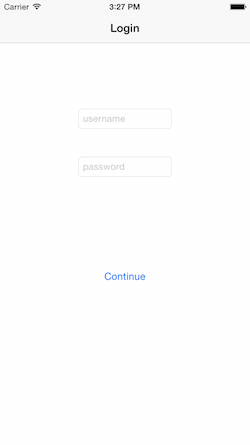
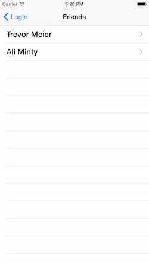
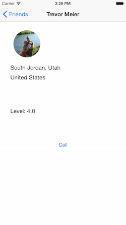
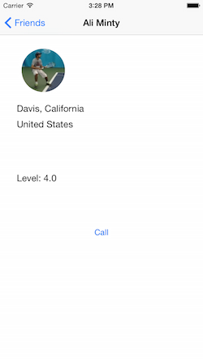

When I started studying at U.C. Davis, I often wanted to connect with tennis players at my skill level. I was used to playing for my high school team every day, so I needed to find a way to get my tennis fix. An app with this feature would have made things so much simpler for me—those awkward two-hour gaps between lectures could have been used to play tennis\!

In this tutorial, you will learn how to create an app that calls friends from your [Global Tennis Network](https://www.globaltennisnetwork.com) profile. While keeping your phone number private, this feature will allow you to call up other tennis players whom you know through Global Tennis Network and schedule a time and place to play. There’s no need for users to exchange phone numbers as we’ll be using Sinch [app-to-app calling](https://www.sinch.com/products/voice/data-calling/).

To get the most out of this tutorial, you will need to be familiar with the following topics:

>   - XCode
>   - Objective-C
>   - CocoaPods



## 1. Setup

First, you will want to create an app on your [Sinch Dashboard](https://portal.sinch.com/#/login). Take note of the application key and secret, as we will need them later.

Next, go to the [GTN Developer Site](https://www.globaltennisnetwork.com/home/developers) and opt to become a developer. You will be provided with a developer key. Save that for later.

We will be working with a starter project that you can download from [GitHub](https://github.com/sinch/ios-call-your-tennis-friends). Once you have the starter project downloaded, use the included **Podfile** to install the necessary CocoaPods through Terminal with the command `pod install`. Am XCode workspace should now be available for us to use.

## 2. Using the GTN API

Before we start, take a quick look at **TennisParser.h** and **TennisParser.m**. I went ahead and made this class for the purpose of this tutorial. It has methods for each of the three ways we’ll need to parse data that we get from the GTN API. Since the API returns data in XML, the class uses an NSXMLParser object. I won’t go into the details of how that’s done, but you can read up about NSXMLParser on [Apple’s Developer Website](https://developer.apple.com/documentation/foundation/nsxmlparser?language=objc).

To start, we will want to log in the user in when his or her credentials are entered. Go to **LoginViewController.m** and implement the method `LoginAction` as follows:

```objectivec
- (IBAction)LoginAction:(id)sender {
    NSString *userName = self.UsernameTextField.text;
    NSString *password = self.PasswordTextField.text;
    NSString *devKey = @"your-gtn-dev-key";
    TennisParser *parser = [[TennisParser alloc] initWithKey:devKey];
    self.username = [parser parseXMLForIDWithUsername:userName Password:password];

    if (self.username) {
        [[NSNotificationCenter defaultCenter] postNotificationName:@"UserDidLoginNotification"
                                                            object:nil
                                                          userInfo:@{@"userId" : self.username}];

        [self performSegueWithIdentifier:@"showMaster" sender:self.username];
    }
} 
```

Be sure to fill in your GTN developer key.

Here, we fetch user data from the GTN server using the user’s username and password. The method `parseXMLForIDWithUsername:Password:` returns the userID for a user that logs in.

We will use the userID later to identify who sends and receives calls. To send the userID to the next view, implement the method `prepareForSegue:sender` like this:

```objectivec
- (void)prepareForSegue:(UIStoryboardSegue *)segue sender:(id)sender {
    if ([[segue identifier] isEqualToString:@"showMaster"]) {
       [[segue destinationViewController] setUserID: sender];
    }
}
```

Now go to **MasterViewController.m**. We want to make another request. This time, we want the user’s friends so we can populate the table view.

Go ahead and add the following method:

```objectivec
- (void) requestFriends {
    self.objects = [[NSMutableArray alloc] init];
    NSString *devKey = @"your-gtn-key";
    TennisParser *parser = [[TennisParser alloc] initWithKey:devKey Array:self.objects];
    [parser parseXMLForFriendsWithUserID:self.userID];
}
```

Note: This lists all of the user’s friends on Global Tennis Network. I won’t be covering how to display only friends who also have the app in this tutorial.

Now we can call the method in `viewDidLoad`:

```objectivec
- (void)viewDidLoad {
    [super viewDidLoad];
    [self requestFriends];
}
```


Let’s work on displaying a friend’s info once he or she is selected. First, go to **DetailViewController.m**. Add the following method that will display the contact’s picture:

```objectivec
- (void) displayPictureForUser {
    NSURL *pictureURL = [NSURL URLWithString:self.detailItem.picUrl];
    NSData *imageData = [NSData dataWithContentsOfURL:pictureURL];
    UIImage *img = [UIImage imageWithData:imageData];
    CGSize size = img.size;
    CGRect rectFrame = CGRectMake(size.width/2, size.width/2 + 50, size.width, size.height);
    UIImageView* imgv = [[UIImageView alloc] initWithImage:img];
    imgv.frame = rectFrame;
    
    // make picture into circle
    imgv.layer.cornerRadius = size.width/2;
    imgv.layer.masksToBounds = YES;
    
    [self.view addSubview:imgv];
}
```

Then, go to the method `configureView`. Add to the if-statement to fill in a friend’s info and display his or her profile picture:

```objectivec
- (void)configureView {
    // Update the user interface for the detail item.
    if (self.detailItem) {
        self.ContactTitle.title = [NSString stringWithFormat:@"%@ %@", self.detailItem.firstName, self.detailItem.lastName];
        self.CityStateLabel.text = [NSString stringWithFormat:@"%@, %@", self.detailItem.city, self.detailItem.state];
        self.CountryLabel.text = self.detailItem.country;
        self.LevelLabel.text = [NSString stringWithFormat:@"Level: %@", self.detailItem.level];
        [self displayPictureForUser];
    }
}
```

Great\! Now the user will be able to choose from a list of friends to see a player’s info.


## 3. Making calls with SinchService

We’ll be using SinchService to send and receive calls. SinchService allows us to handle calling from anywhere in our app by initializing a SINService object in the application’s AppDelegate.

First, go to **AppDelegate.h** and add the following imports:

```objectivec
#import <Sinch/Sinch.h>
#import <SinchService/SinchService.h>
```

Next, add the following property to the interface:

```objectivec
@property (strong, nonatomic) id<SINService> sinch;
```

Then, go to **AppDelegate.m**. Allow the **AppDelegate** to serve as a **SINServiceDelegate** and a **SINCallClientDelegate** by adding to the implementation:

```objectivec
@interface AppDelegate () <SINServiceDelegate, SINCallClientDelegate>
@end
```

Now add the following code to
`application:didFinishLaunchingWithOptions`:

```objectivec
id config = [SinchService configWithApplicationKey:@"application-key"
                                 applicationSecret:@"application-secret"
                                   environmentHost:@"clientapi.sinch.com"];

id<SINService> sinch = [SinchService serviceWithConfig:config];
sinch.delegate = self;
sinch.callClient.delegate = self;

void (^onUserDidLogin)(NSString *) = ^(NSString *userId) {
    [sinch logInUserWithId:userId];
};

self.sinch = sinch;

[[NSNotificationCenter defaultCenter]
 addObserverForName:@"UserDidLoginNotification"
 object:nil
 queue:nil
 usingBlock:^(NSNotification *note) { onUserDidLogin(note.userInfo[@"userId"]); }];
```

Here we are initializing the SINService object and setting up NSNotificationCenter. We need to set up NSNotificationCenter so we can log users into the app. We can use their GTN userIDs as usernames.

To handle incoming calls, implement the following method:

```objectivec
- (void)client:(id<SINCallClient>)client didReceiveIncomingCall:(id<SINCall>)call {

    UIViewController *top = self.window.rootViewController;

    NSString *devKey = @"gtn-developer-key";
    TennisParser *parser = [[TennisParser alloc] initWithKey:devKey];
    CFriend *callingFriend = [parser parseXMLForFriendWithUserID:[call remoteUserId]];

    if(callingFriend) {
        CallViewController *controller = [top.storyboard instantiateViewControllerWithIdentifier:@"callScreen"];
        [controller setCallingFriend:callingFriend];
        [controller setCall:call];
        [self.window.rootViewController presentViewController:controller animated:YES completion:nil];
    }
}
```

When the user receives an incoming call, we’ll send a request to the server using the TennisParser object, asking for the caller’s info before displaying the call screen.

Let’s enable the call button in the detail view controller. Go to **DetailViewController.m** and start by adding this import statement at the top:

```objectivec
#import "CallViewController.h"
```

Then add the following method to help us place calls using the SINService object from the AppDelegate:

```objectivec
- (id<SINCallClient>)callClient {
    return [[(AppDelegate *)[[UIApplication sharedApplication] delegate] sinch] callClient];
}
```

Finally, implement `CallAction` as follows:

```objectivec
- (IBAction)CallAction:(id)sender {
    CallViewController *controller = [self.storyboard instantiateViewControllerWithIdentifier:@"callScreen"];
    [controller setCallingFriend:self.detailItem];
    id<SINCall> call = [self.callClient callUserWithId:self.detailItem.userID];
    //[controller setCall:call];
    [self presentViewController:controller animated:YES completion:nil];
}
```

Now let’s work on the call screen. Go to **CallViewController.h** and add the following import:

```objectivec
#import <Sinch/Sinch.h>
```

After that, add to the interface line to have it read as follows:

```objectivec
@interface CallViewController : UIViewController <SINCallClientDelegate, SINCallDelegate>
```

Add a SINCall property named call:

```objectivec
@property (nonatomic, readwrite, strong) id<SINCall> call;
```

Now go to **CallViewController.m**. It would be nice to see a person’s profile picture during the call, so let’s add the following method, similar to the one we added before:

```objectivec
- (void) displayPictureForUser {
    NSURL *pictureURL = [NSURL URLWithString:self.callingFriend.picUrl];
    NSData *imageData = [NSData dataWithContentsOfURL:pictureURL];
    UIImage *img = [UIImage imageWithData:imageData];
    CGSize size = img.size;
    CGRect rectFrame = CGRectMake(self.view.frame.size.width/2 - size.width/2, size.width/2 + 50, size.width, size.height);
    UIImageView* imgv = [[UIImageView alloc] initWithImage:img];
    imgv.frame = rectFrame;

    // make picture into circle
    imgv.layer.cornerRadius = size.width/2;
    imgv.layer.masksToBounds = YES;

    [self.view addSubview:imgv];
}
```

When the view loads, we want to assign all of the call screen’s labels, depending on if the call is incoming or outgoing, as well as display the user’s profile picture. Let’s do this by adding the following code to `viewDidLoad`:

```objectivec
if ([self.call direction] == SINCallDirectionIncoming) {
        self.AnswerButton.hidden = NO;
        self.CallLabel.text = [NSString stringWithFormat:@"call from %@ %@", self.callingFriend.firstName, self.callingFriend.lastName];
    } else {
        self.AnswerButton.hidden = YES;
        self.CallLabel.text = [NSString stringWithFormat:@"calling %@ %@...", self.callingFriend.firstName, self.callingFriend.lastName];
    }

    [self displayPictureForUser];
```

We’ll need to override the call property’s setter method, so add the following code:

```objectivec
- (void)setCall:(id<SINCall>)call {
    _call = call;
    _call.delegate = self;
}
```

In case you missed it earlier, we added a few commented out calls to `setCall`. Before we continue with the call screen, go back and uncomment those lines. Both should read `[controller setCall:call];`. You’ll find one in **AppDelegate.m** in `client:didReceiveIncomingCall:` and the other in **DetailViewController.m** in `CallAction`.

Now head back to **CallViewController.m**. Implementing the answer and decline button actions will be simple. You can implement them as follows:

```objectivec
- (IBAction)AnswerAction:(id)sender {
    [self.call answer];
    self.AnswerButton.hidden = YES;
    self.CallLabel.text = @"";

}

- (IBAction)HangupAction:(id)sender {
    [self.call hangup];
}
```

When using Sinch calling, you can immediately tell when a call has established or ended. This will help us add code that will execute at the start or end of a call. Let’s do just that by adding the following code:

```objectivec
- (void)callDidEstablish:(id<SINCall>)call {
    self.CallLabel.text = @"";
}

- (void)callDidEnd:(id<SINCall>)call {
    [self dismissViewControllerAnimated:YES completion:nil];
}
```



That’s it! You’ve created a fully functional app that lets you call your tennis friends using Sinch calling. There are even more features that you can add to this project such as Managed Push to help receive calls when the app is not open. [Learn more about Managed Push with Sinch service here](doc:voice-ios-local-and-remote-push-notifications). To find more tutorials, be sure to check out the `Sinch Tutorial Site](doc:tutorials-introduction) or the [Sinch GitHub](https://github.com/sinch).

