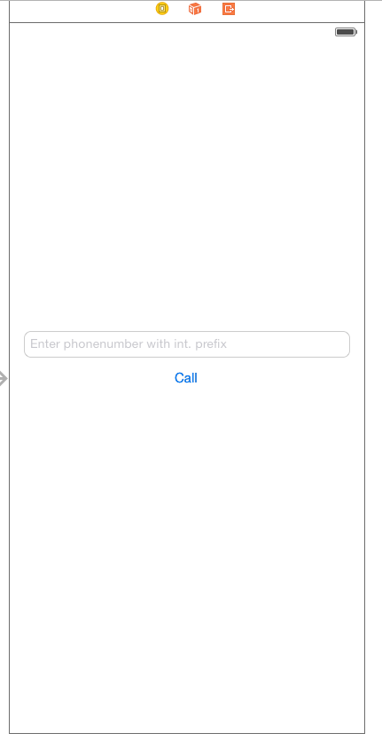

In this tutorial, you’ll learn how to use the Sinch SDK to make a voice call from an iOS app to a regular phone number. This will take about 20 minutes to build and will require:

>   - Xcode
>   - An understanding of Objective-C
>   - Another phone to call (any mobile with a standard phone number)

## Start

To begin, sign up for a Sinch account [here](https://portal.sinch.com/#/signup). Set up a new application using the dashboard and take note of your application key and secret.
Next:

>   - Launch Xcode and create a new project (File\>New\>Project)
>   - Select Single View Application and click Next
>   - Name the project “CallingApp” and save it

The easiest way to add the Sinch SDK is to use CocoaPods. Open a terminal window in your Xcode project directory and create a Podfile with the content below:

`pod init`

Open the Podfile and add the following:

    pod 'SinchRTC'

Save the file and in the terminal window type:

`pod install`


> **Note**
>
> If you are new to CocoaPods, go to* [cocoapods.org](http://cocoapods.org/) to learn how to install it.

Lastly, set the architectures on your project and the pod project to `armv7` and `armv7s`.

Setting up the client Open the **Main.storyboard** in Xcode and add a textfield and a button. Set the text of the button to “Call.”


Add outlets and actions in **ViewController.h** like this:

```objectivec
@property (weak, nonatomic) IBOutlet UITextField *phoneNumber;
@property (weak, nonatomic) IBOutlet UIButton *callButton;
- (IBAction)call:(id)sender;
```

Also add an import to the Sinch client in your ViewController.h:

`#import <Sinch/Sinch.h>`

Then, in ViewController.m, find `- (void)viewDidLoad` and add `[super viewDidLoad];` after. Here is what your code should look like:

```objectivec
- (void)viewDidLoad
{
    [super viewDidLoad];
    [self initSinchClient];
}
```

Add instance variables to ViewController.m:

```objectivec
@interface ViewController ()
{
    id<SINClient> _client;
    id<SINCall> _call;
}
@end
```

Next, synthesize the properties by adding `@synthesize phoneNumber,
callButton;`.

Create a method called `initSinchClient`, add your application key and secret, and choose a username. In this tutorial we are not going to have any login functionality because this is just a basic calling app skeleton.

```objectivec
-(void)initSinchClient
{
    _client = [Sinch clientWithApplicationKey:@"your_key"
                            applicationSecret:@"your_secret"
                              environmentHost:@"clientapi.sinch.com"
                                       userId:@"anything you want"];
    _client.callClient.delegate = self;
    [_client setSupportCalling:YES];
    [_client start];}
```

As you can see, you now have a warning. Let’s fix that by adding the `SINCallClientDelegate` to the `ViewController.h` file:

```objectivec
@interface ViewController : UIViewController <SINCallClientDelegate>
```

If you have followed the [iOS app-to-app calling tutorial](doc:build-an-ios-facebook-app-to-call-your-friends), you might notice that we are not listening to active connections with `[_client startListeningOnActiveConnection]`. That’s because it’s unnecessary when you only want to make PSTN and outgoing calls.

Also, not starting an active connection will save you money.

This all the setup needed to make PSTN (app-to-phone) calls. Next, we will implement a “placing the call” functionality.

## Making a call

Change the `call:` action to look like this:

```objectivec
- (IBAction)call:(id)sender {
    if (_call == nil)
    {
        _call = [[_client callClient] callPhoneNumber:phoneNumber.text];
        [callButton setTitle:@"Hangup" forState:UIControlStateNormal];
    }
    else
    {
        [_call hangup];
        [callButton setTitle:@"Call" forState:UIControlStateNormal];
    }

}
```

This changes the functionality either to call or hang up.

And there you have it. For a production app, your next steps will be to implement the `SINCallDelegate` protocol so you can make UI changes on `callDidEnd` or `callDidEstablish`, for example.

Happy coding\!

If you enjoyed this tutorial, read our other iOS and [app-calling tutorials](doc:tutorials-introduction).

<a class="gitbutton pill" target="_blank" href="https://github.com/sinch/docs/blob/master/docs/tutorials/ios/ios-app-to-phone-tutorial.md"><span class="fab fa-github"></span>Edit on GitHub!</a>