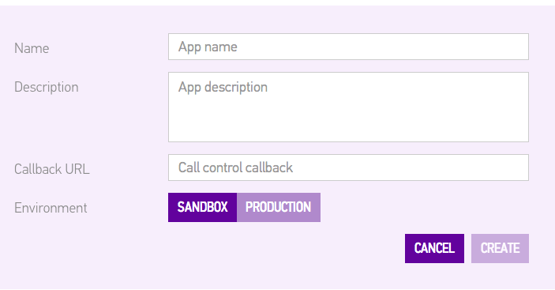

You can find the finished project [here](http://www.github.com/sinch/java-sms-tutorial).

## Setup

If you don’t yet have a Sinch developer account, create one at [sinch.com/signup](https://portal.sinch.com/#/signup). Us take note of the app key and secret.


## Library for Base64 encoding

You will need to download and add the commons codec library to your
Eclipse project to encode your app key and secret.  the .jar file and click **build path –\> add to build path**

## Send an SMS

Start by creating a new class; I’ll name mine **Sms.java**. To keep
things simple, I put the code to send an  message, your app key, and your app secret.

```java
import java.io.BufferedReader;
import java.io.IOException;
import java.io.InputStreamReader;
import java.io.OutputStream;
import java.net.HttpURLConnection;
import java.net.URL;
import org.apache.commons.codec.binary.Base64;

public class Sms {

    public static void main(String[] args) {

        try {
            String phoneNumber = "phone-number";
            String appKey = "your-app-key";
            String appSecret = "your-app-secret";
            String message = "Hello, world!";

            URL url = new URL("https://messagingapi.sinch.com/v1/sms/" + phoneNumber);
            HttpURLConnection connection = (HttpURLConnection) url.openConnection();
            connection.setDoOutput(true);
            connection.setRequestMethod("POST");
            connection.setRequestProperty("Content-Type", "application/json");

            String userCredentials = "application\\" + appKey + ":" + appSecret;
            byte[] encoded = Base64.encodeBase64(userCredentials.getBytes());
            String basicAuth = "Basic " + new String(encoded);
            connection.setRequestProperty("Authorization", basicAuth);

            String postData = "{\"Message\":\"" + message + "\"}";
            OutputStream os = connection.getOutputStream();
            os.write(postData.getBytes());

            StringBuilder response = new StringBuilder();
            BufferedReader br = new BufferedReader(new InputStreamReader(connection.getInputStream()));

            String line;
            while ( (line = br.readLine()) != null)
                response.append(line);

            br.close();
            os.close();

            System.out.println(response.toString());

        } catch (IOException e) {
            e.printStackTrace();
        }

    }

}
```

Now run the project and you will see “Hello, world\!” appear as an SMS
to the phone number you enter with Sinch.

**Note about sending quotes in your message**: If you want to send a
message like **Jordan says “hi backslashes before the quotes that you want to show up in the message.

In addition, you can find SMS prices by country
 /products/messaging/sms/).
