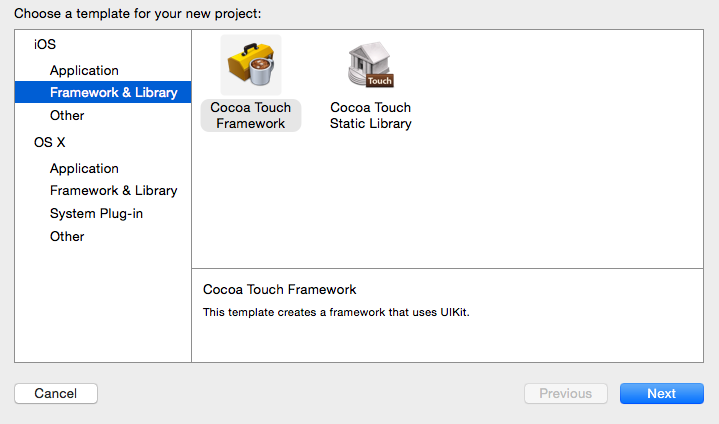
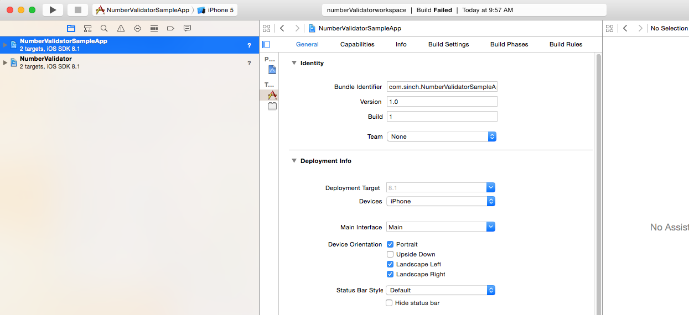
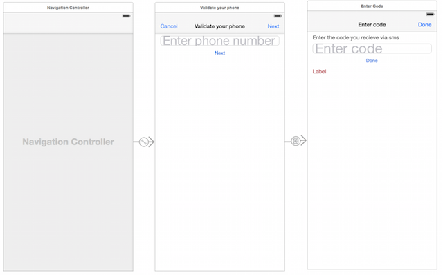
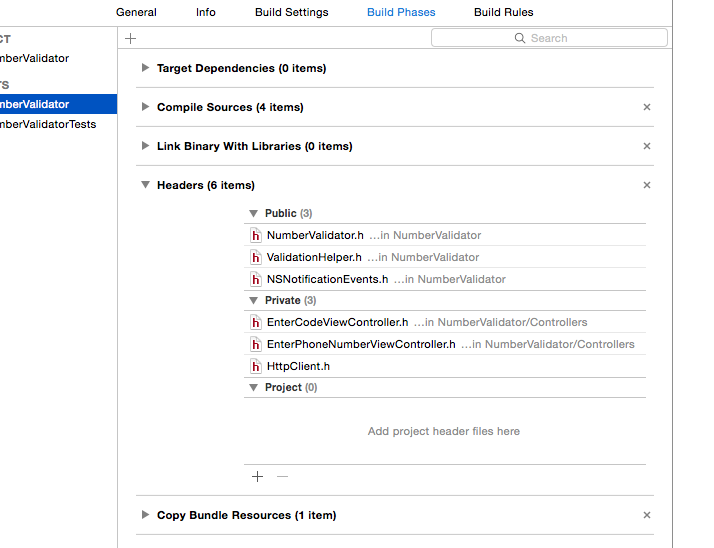
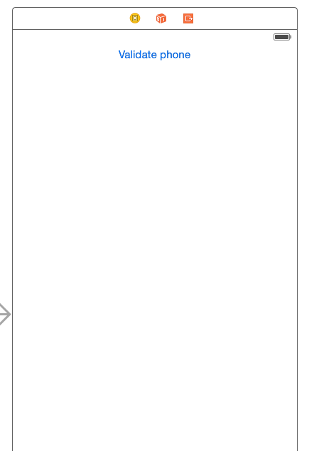

> **Update**
> 
> To verify numbers even easier, check out our [Verification SDK](https://www.sinch.com/products/verification/sms/)

In [Part 1 of this tutorial](doc:building-a-c-authentication-system-with-net-part-1), we created some server-side code to generate codes that are sent by [our SMS API](https://www.sinch.com/products/messaging/sms/) to a phone number. In Part 2, we will implement the number verification system for a mobile device. Then, in [Part 3](doc:number-verification-aspnet-identity-and-two-factor-authentication-part-3), we will add the two-factor authentication system to the iOS client and a website. This tutorial will take about 30 minutes to complete.

## Prerequisites

> 1.  Complete [Part 1](doc:building-a-c-authentication-system-with-net-part-1) of this tutorial, or [download the repo](https://github.com/sinch/net-two-factor-auth)
> 2.  Versed in iOS development
> 3.  Xcode 6

## iOS Cocoa Touch frameworks

An ideal framework is easy to implement with a few lines of code and reusable in many apps. You want to be able to drop the framework into a project and just call a method to start validating your number. In this tutorial, we will use the new template in Xcode 6 to create Cocoa Touch frameworks.

Using this framework, you should be able to drop it in an app, call a method and get started. The framework will display a View asking for the phone number and, when you click Next, show a view to enter the code. Then, it will validate the code and dismiss the view.

## Setup

> 1.  Create a workspace name it **NumberValidator**
> 2.  Create a new Cocoa Touch Framework


> 3. Add it to the workspace


Repeat steps 1 through 3 but add a Single Page application and call it **NumberValidatorSampleApp**.

When you are finished, your workspace should look like this:


## Setting the scene

Create a storyboard in NumberValidator and name it **NumberValidatorStoryBoard**. Add one **NavigationController** and two view controllers so it looks like this:


It doesn’t show very well on the image, but add a label just below the **Next** and **Done** buttons. Also add a **UIActivity** and center it in the views.

## Collecting user number

Create a controller called **EnterPhoneNumberViewController**. Set it as the class for the **EnterPhoneNumber** view.

Then, connect outlets for the **Enter Phonenumber** text field, the **label** and **Activityindicator**.

```objectivec
@property (weak, nonatomic) IBOutlet UITextField *phoneNumber;
@property (weak, nonatomic) IBOutlet UILabel *errorLabel;
@property (weak, nonatomic) IBOutlet UIActivityIndicatorView *spinner;
```

Next, add actions for the **Cancel** and **Next** buttons.

```objectivec
- (IBAction)next:(id)sender {
}

- (IBAction)cancel:(id)sender {
}
```

Now that this is set up, we are ready to implement some code. Let’s start with the cancel action first. When the user presses Cancel, we want to dismiss the view.

```objectivec
- (IBAction)cancel:(id)sender {
    [[self parentViewController] dismissViewControllerAnimated:YES completion:^{
    /// notify that user canceled
    }];
}
```

## Requesting the OTP

In the next action, we want to request a one-time password (OTP) code from the server and continue to the enter code scene.

```objectivec
- (IBAction)next:(id)sender {
    NSURLSession* sessionManager = [NSURLSession sharedSession];
    [self.spinner startAnimating]; //Show progress
    errorLabel.text = @"";
    NSString* url = [@"http://server/api/otp?phoneNumber=" stringByAppendingString:phoneNumber.text];
    [[sessionManager downloadTaskWithURL:[NSURL URLWithString:url] completionHandler:^(NSURL *location, NSURLResponse *response, NSError *error) {
          [self.spinner stopAnimating];
            [phoneNumber resignFirstResponder];
            if (error == nil)
            {
                [self performSegueWithIdentifier:@"enterCode" sender:nil];
            }
            else
            {
                errorLabel.text = @"Something went wrong";
                //show some error message
            }
    }] resume];
}
```

Before we go to the next scene, we have to pass the phone number to the **ViewController** of the **EnterCode** scene.

> 1.  Add a **ViewController** to your project and name it **EnterCode**. Set it to be the **viewController** of the **EnterCode** scene.
> 2.  Create a string property phoneNumber in **EnterCodeViewController.h** `@property NSString* phoneNumber;`
> 3.  Change the **prepareForSegue** to look like below

```objectivec
if ([segue.identifier isEqualToString:@"enterCode"])
   {
       EnterCodeViewController* vc = [segue destinationViewController];
       vc.phoneNumber = self.phoneNumber.text; 
   }
```

## Verifying the code

Open up the storyboard and connect the text field, label and spinner to outlets.

```objectivec
@property (weak, nonatomic) IBOutlet UIActivityIndicatorView *spinner;
@property (weak, nonatomic) IBOutlet UILabel *errorLabel;
@property (weak, nonatomic) IBOutlet UITextField *code;
```

Create an action for the Done buttons. Here we are calling our server and if there is no error, all is good.

```objectivec
- (IBAction)done:(id)sender {
    [spinner startAnimating]
    errorLabel.text = @"";
    NSURLSession* sessionManager = [NSURLSession sharedSession];
    NSString* url = [NSString stringWithFormat:@"http://server/api/otp?phoneNumber=%@&code=%@", phoneNumber, code.text];
    [[sessionManager downloadTaskWithURL:[NSURL URLWithString:url] completionHandler:^(NSURL *location, NSURLResponse *response, NSError *error) {
        [spinner stopAnimating]
        if (!error)
            [self dismissViewControllerAnimated:YES completion:nil];
        else
            errorLabel.text = @"Invalid code";
    }] resume];
}
```

This is all the UI for this part. Next, we need create a mechanism so it’s easy to use the framework and communicate back to the consuming app that the code was validated. Create a class and call it **ValidationHelper**.

## Validation helper

This helper class is going to help us start a new number validation and notify the consumer when we have a canceled or successful notification. For this helper, I am going to use the static design pattern.

In **ValidationHelper.m**, add the following code:

```objectivec
__strong static ValidationHelper* currentValidationHelperInstance = nil;
+(ValidationHelper *)sharedValidationHelper
{

    static dispatch_once_t onceToken;
    dispatch_once(&onceToken, ^{
        currentValidationHelperInstance = [[self alloc] init];
        currentValidationHelperInstance.sessionManager = [NSURLSession sharedSession];

    });
    return currentValidationHelperInstance;
}
```

And in **ValidationHelper.h**, add the method to the interface; also add a **startValidation** method:

```objectivec
+(ValidationHelper *)sharedValidationHelper;
-(void)startValidation
```

Now we have a way to access one and only one instance of the validation helper. Next, let’s add a method that will start the validation process.

```objectivec
-(void)startValidation
{
    //Get a reference to the current window
    UIWindow* window  = [[[UIApplication sharedApplication] delegate] window];
    //You need to fetch the bundle for the framework, if you leave this as null it will load the apps bundle instead. 
    NSBundle* bundle = [NSBundle bundleWithIdentifier:@"com.sinch.NumberValidator"];
    UIStoryboard *storyboard = [UIStoryboard storyboardWithName:@"ValidationStoryBoard" bundle:bundle];
    UINavigationController *vc = (UINavigationController *)[storyboard instantiateViewControllerWithIdentifier:@"start"];

    [[window rootViewController] presentViewController:vc animated:true completion:^{
    }];
}
```

## Broadcasting success or cancel of verification

We need a way to tell the consumer that the validation has been successful. There are a couple of different paths to accomplish this in iOS. One is with blocks, and another is with a delegate or NSNotification center events.

Because this process takes some time and involves UI, a **NSNotification** center approach may be most suitable. (You can [read more about NSNotificationCenter here](https://developer.apple.com/library/ios/documentation/Cocoa/Reference/Foundation/Classes/NSNotificationCenter_Class/).) Let’s define two strings with events name in a file called **NSNotificationEvents.h**.

```objectivec
UIKIT_EXTERN NSString* const VALIDATION_COMPLETE;
UIKIT_EXTERN NSString* const VALIDATION_CANCELED;
UIKIT_EXTERN NSString* const PhoneNumberKey;
```

In **NumberValidation.m** above the implementation line, add:

```objectivec
NSString* const NumberValidationDidCompleteNotification = @"NumberValidationDidCompleteNotification";
NSString* const NumberValidationDidCancelNotification= @"NumberValidationDidCancelNotification";
NSString* const PhoneNumberKey= @"PhoneNumberKey";
```

Open up **EnterCodeViewController.m** and add an import to **NSNotificationEvents.h**. Find `done:` method and modify it so it sends a notification on completion.

```objectivec
- (IBAction)done:(id)sender {
    [spinner startAnimating]
    errorLabel.text = @"";
    NSURLSession* sessionManager = [NSURLSession sharedSession];
    NSString* url = [NSString stringWithFormat:@"http://server/api/otp?phoneNumber=%@&code=%@", phoneNumber, code.text];
    [[sessionManager downloadTaskWithURL:[NSURL URLWithString:url] completionHandler:^(NSURL *location, NSURLResponse *response, NSError *error) {
        [spinner stopAnimating]
        if (!error)
        {
            [[NSNotificationCenter defaultCenter] 
                postNotificationName:NumberValidationDidCompleteNotification 
                object:self 
                userInfo:@{PhoneNumberKey: self.phoneNumber}]; 
            [self dismissViewControllerAnimated:YES completion:nil];
        }
        else
        {
            errorLabel.text = @"Invalid code";
        }

    }] resume];
}
```

Add the cancel event to the **EnterPhoneNumber.m**. Find the cancel action and change it to:

```objectivec
- (IBAction)cancel:(id)sender {
    [[NSNotificationCenter defaultCenter] 
        postNotificationName:NumberValidationDidCancelNotification 
        object:nil];
    [[self parentViewController] 
    dismissViewControllerAnimated:YES completion:^{
    }];
}
```

## Finishing up the framework

In a framework app, you need to decide which headers should be visible, so select your **NumberValidator** project and go into *build phases*. Drag the header files so they look like this:



You also want to open up the **NumberValidator.h** and add the following imports to make them visible with only one import in the consumer.

```objectivec
#import "ValidationHelper.h"
#import "NSNotificationEvents.h"
```

##Creating a test client 
Select the **NumberValidatorSampleApp** and go to *build phases*. Drag the **NumberValidator.framework** to Link Binary With Libraries. Open the story **Main.Storyboard** and add a button. Connect it with an action called validate.


In **ViewController.m**, add an import to our NumberValidator framework.

```objectivec
#import <NumberValidator/NumberValidator.h>
```

In the action validate, add a call to start the validation.

```objectivec
- (IBAction)validate:(id)sender {
    [[ValidationHelper sharedValidationHelper] startValidation];
}
```

Now we’ve validated the phone, but we also want to listen in on completed and canceled events. In **ViewDidLoad**, add the following lines of code to set up a notification on our events.

```objectivec
- (void)viewDidLoad {
    [super viewDidLoad];
    [[NSNotificationCenter defaultCenter] 
        addObserver:self 
        selector:@selector(verificationComplete:)
        name:NumberValidationDidCompleteNotification 
        object:nil];
}
```

Notice that we have a warning now. Add the method to **verificationComplete** like this:

```objectivec
-(void)verificationComplete:(NSNotification*)notification
{
    NSLog(@"number validated %@",[[notification userInfo]
                                  objectForKey:PhoneNumberKey]);
}
```

Lastly, in **dealoc**, unregister for the notifications:

```objectivec
-(void)dealloc
{
    [[NSNotificationCenter defaultCenter] 
        removeObserver:self 
        name:NumberValidationDidCompleteNotification 
        object:nil];
}
```

## Conclusion

In this tutorial, we learned how to build a Cocoa frameworks reusable library and how to make your stuff modularized in iOS. We also learned how to consume our service we created in [Part 1 of this series](doc:building-a-c-authentication-system-with-net-part-1). Next up in [Part 3](doc:number-verification-aspnet-identity-and-two-factor-authentication-part-3), we will build a small website and add two-factor authentication.

<a class="gitbutton pill" target="_blank" href="https://github.com/sinch/docs/blob/master/docs/tutorials/net/building-an-ios-client-for-number-verification-part-2.md"><span class="fab fa-github"></span>Edit on GitHub</a>