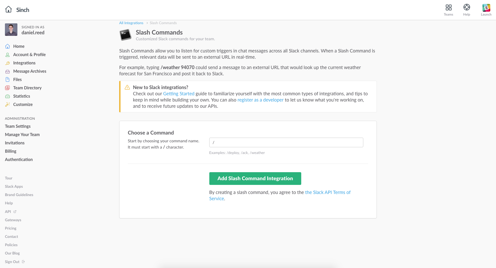
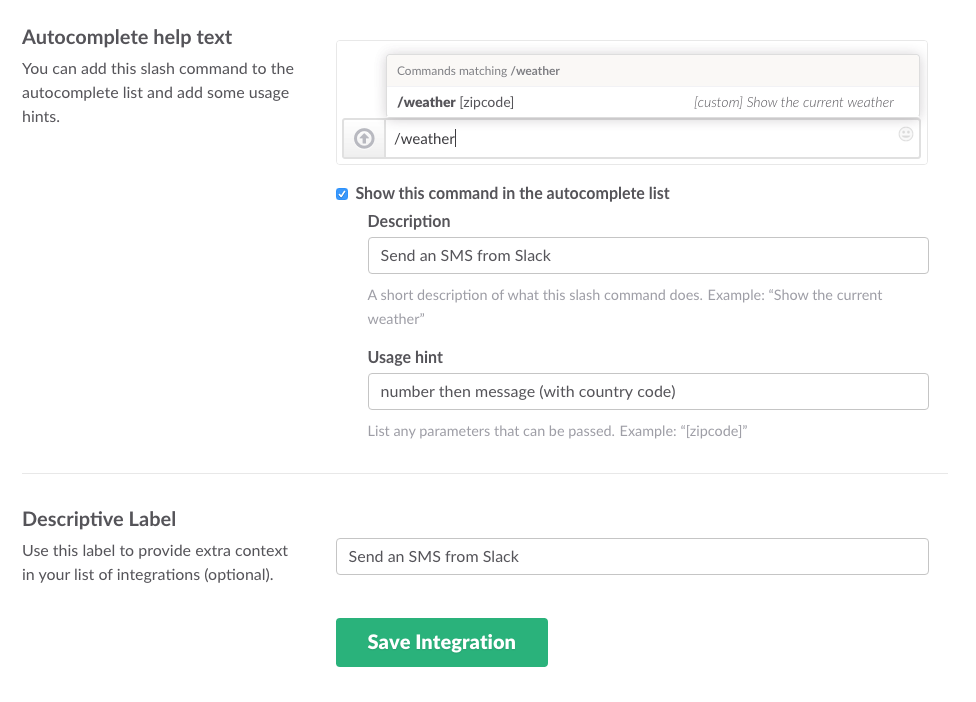

I’ve been wanting to make this integration for months, and at our latest innovation day here at Sinch, I finally got the chance to re-live my PHP days and build a Slack SMS slash command. This slash command will take the following structure `/sms +12784210884 Your Message`, letting users send a text message to anyone such as teammates or friends and family.

You will need:
  - Some PHP knowledge
  - Somewhere to host the PHP script
  - A Sinch account with credit

You can get started quickly by downloading [the code on GitHub](https://github.com/sinch/sinch-slack-sms/blob/master/sinchSMS.php).

## Set Up Slack

First, let’s set up the Slash command for users to use.

>   - Open up the admin section of Slack
>   - Create a [new Slash Command](https://sinch.slack.com/services/new)
>   - Set the method to `POST` and fill in the autocomplete help text and descriptive label. This is just to help your end users
>   - In this project we are not using the token for authentication, but if you are scaling this out, you might want to look into this for authentication


## PHP Script

First we want to receive the data a user is sending from Slack. We can do that with the following lines:

```php
//Slack Details
$command = $_POST['command'];
$text = $_POST['text'];
```

But this will receive the whole output. In the slash command admin section, you can view the outgoing payload, and see what is being sent to the server. In this case, we are using the text variable which is just one long line, like `text=94070`.

But since we want to get the number and the message, we will need to split the message and phone number. To do this, we will need to use the [explode](http://php.net/manual/en/function.explode.php) function in PHP which takes care of all of that.

Since our structure is **number** then **message**, we need to get the number first.

```php
//Parse
$pieces = explode(" ", $text, 2);
```

We can then assume that the rest of the Slack input is the message body, so we are using the limit of 2 to get the rest of the array.

That’s it. Now we can imagine our data from Slack being dealt with as

```php
$pieces[0] = +12784210884
$pieces[1] = Your Message
```

Now we can use this data and send it to the [Sinch SMS API](https://www.sinch.com/products/messaging/sms/).

Host this file on your server, and take a note of the direct URL to the script. i.e. `https://yourserver.com/sinchSMS.php`

## Setting up the API

We will be using the [sending SMS with PHP](doc:send-sms-in-php) script from an earlier tutorial. Set your app key and secret, and then set the receiving phone number with the `$phone_number = $pieces[0];` part of the array. This will set the number that we will be sending the message to.

Then set the message body with the rest of the array with `$message = array("message"=> $pieces[1]);`.

## User feedback

Finally, we will send a success message to the user in Slack using `echo "\n Your message was sent.";`.


In the end, we get this:

```php
//Slack Details
$command = $_POST['command'];
$text = $_POST['text'];

//Parse
$pieces = explode(" ", $text, 2);

//Sinch API Details
$key = "your_sinch_key";
$secret = "your_sinch_secret";

//Query
$phone_number = $pieces[0];
$user = "application\\" . $key . ":" . $secret;
$message = array("message"=> $pieces[1]);
$data = json_encode($message);
$ch = curl_init('https://api.sinch.com/messaging/v1/sms/' . $phone_number);
curl_setopt($ch, CURLOPT_POST, true);
curl_setopt($ch, CURLOPT_USERPWD,$user);
curl_setopt($ch, CURLOPT_POSTFIELDS, $data);
curl_setopt($ch, CURLOPT_RETURNTRANSFER, true);
curl_setopt($ch, CURLOPT_SSL_VERIFYPEER, false);
curl_setopt($ch, CURLOPT_HTTPHEADER, array('Content-Type: application/json'));

//Results
$result = curl_exec($ch);
if(curl_errno($ch)) {
    echo 'Curl error: ' . curl_error($ch);
} else {
    echo $result;
}
curl_close($ch);

//Final Output
echo "\n Your message was sent.";
```

There is also another message sent to the user on line 30 in the code which will send a Sinch message ID back to the user, or an error message. You can remove this if you want to deal with it yourself.


## Testing

Run a few tests in Slack to check the system works. You must enter a phone number with the international dialling code at the beginning, either as **+12784210884** or **0012784210884**. If you enter a number like 12784210884, you will get an error as the Sinch API needs the international dialling code to send.

## Finishing Up

That’s it. This will now be available for all your Slack users to use.

One thing I would like to do next is set the sending number by using a number given in a user’s Slack profile. You can do all of this and more with the Slack API but I ran out of time.

I’d also like to improve the error handling to give more user friendly error messages for non-technical users, using something like:

```php
//Error Logs
if (strpos($ch,'errorCode') !== false) {
    echo "It looks like something has gone wrong. Please try again or speak with your administrator.";
}
```

Finally, this integration needs a better way of dealing with phone number formatting. Using an *unclean* number like 070-240 72 12 confuses the app and it won’t send.

I hope that helps and please let us know in the comments section if you have any questions or issues.
