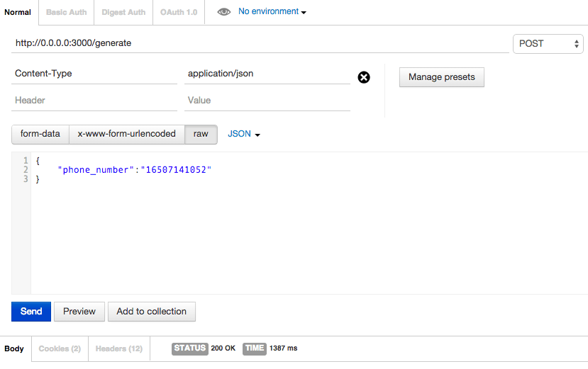
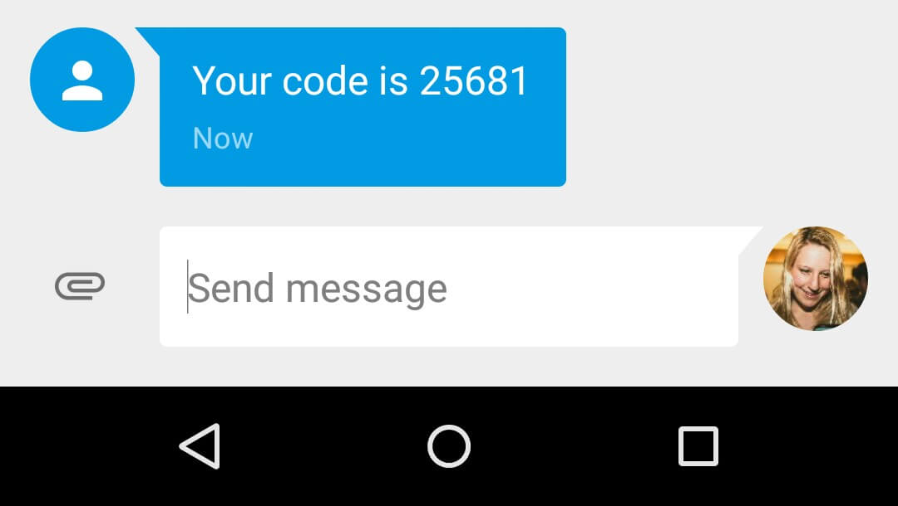

> **Update**
> 
> To verify numbers even easier, check out our [Verification SDK](https://www.sinch.com/products/verification/sms/)

More and more websites and apps rely on knowing your phone number and, in many cases, using that number for two-factor authentication (2FA). (More info about [2FA here](https://www.sinch.com/opinion/what-is-two-factor-authentication/)).

In this tutorial, you will learn how to build your own Ruby on Rails two-factor authentication system in about 30 minutes. In [part 2](doc:number-verification-and-two-factor-authentication-in-an-android-app-part-2), you will implement it in an Android app, and it [part 3](doc:web-two-factor-authentication-using-rails-devise-and-sinch-part-3), you will implement it as part of the login process in a Rails app.

The full sample code can be downloaded [here](https://github.com/sinch/ruby-two-factor-auth).

## Prerequisites

> 1.  Good understanding of Ruby on Rails and REST APIs
> 2.  A [Sinch account](https://portal.sinch.com/#/signup)

## Create a project

Create a new Rails project and a verification controller:

```shell
$ rails new YourProjectName --database=postgresql 
$ cd YourProjectName    
$ rails generate controller Verifications
```

I chose to use a postgres database for my app to make hosting on Heroku easy, since it does not support the default sql database.

## Set up routes

Add to **routes.rb**:

```ruby
post '/generate' => 'verifications#generate_code'
post '/verify' => 'verifications#verify_code'
```

## Set up database

Create a table to store pairs of phone numbers and OTP codes:

```shell
$ rails generate migration CreateVerifications phone_number:string code:string
$ rake db:create
$ rake db:migrate
```

Then, create the file **app/models/verification.rb** with the following:

```ruby
class Verification < ActiveRecord::Base
    validates_presence_of :phone_number, :code
end
```

## Add sinch\_sms gem

You’ll want to use Sinch to send SMS with the one-time password (OTP) codes. Add `gem 'sinch_sms'` to your gem file and then bundle install.

## Generating and verifying OTP codes

In **app/controllers/verifications\_controller.rb** `generate_code`, you
will:

> 1.  Generate a random code
> 2.  Create a new object with phone number
> 3.  Send an SMS with the code

In `verify_code`, you will:

> 1.  See if there is a verification entry that matches the phone number and code
> 2.  If yes, destroy the entry and return {“verified”:true}
> 3.  If no, return {“verified”:false}

```ruby
class VerificationsController < ApplicationController
    skip_before_filter :verify_authenticity_token

    def generate_code
        phone_number = params["phone_number"]
        code = Random.rand(10000..99999).to_s

        Verification.create(phone_number: phone_number, code: code)
        SinchSms.send('YOUR_APP_KEY', 'YOUR_APP_SECRET', "Your code is #{code}", phone_number)

        render status: 200, nothing: true
    end

    def verify_code
        phone_number = params["phone_number"]
        code = params["code"]
        verification = Verification.where(phone_number: phone_number, code: code).first

        if verification
           verification.destroy
            render status: 200, json: {verified: true}.to_json
        else
            render status: 200, json: {verified: false}.to_json
        end
    end
end
```

In a production application, you would most likely use Sinch to verify the format of a number before sending.

Also, one thing you might want to add in a production app is the functionality to wait to return until Sinch knows the message has been delivered to the operator by using:

```ruby
SinchSms.status(key, secret, message_id);
```

## Testing with Postman

I like to use Postman to test out my REST APIs. You can get it [here](https://www.getpostman.com/downloads/).

Use `$ rails s` to start a local Rails server and take note of the port. In my case it was 3000.

In Postman, generate a code:


See the code arrive in an SMS:


Then verify the code:


## Hosting

If you’re going to follow part 2 of this tutorial, you will need to host this backend somewhere. I chose [Heroku](http://www.heroku.com), since it’s easy to host a Rails app there and it has a huge free tier. After you’ve created an account, [follow the steps on the site to deploy your app](https://devcenter.heroku.com/articles/getting-started-with-rails4#deploy-your-application-to-heroku). Make sure to follow through the section on migrating your database.

