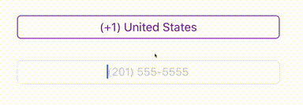

For better verification performance, it should be straightforward and easy for users to enter their phone numbers. To simplify this step and build a UI that accurately captures the correct input from the users, the Sinch SDK provides some utility APIs.

## As-You-Type-Formatting

The class `SINUITextFieldPhoneNumberFormatter` provides *"As-You-Type-Formatting"* on a UITextField. Example usage:
```objectivec
UITextField* textField = ... // your text field
NSString* defaultRegion = [SINDeviceregion currentCountryCode];

SINUITextFieldPhoneNumberFormatter* formatter;
formatter = [[SINUITextFieldPhoneNumberFormatter alloc] initWithCountryCode:defaultRegion];
formatter.textField = textField;
textField.placeholder = [formatter exampleNumberWithFormat:SINPhoneNumberFormatNational];
formatter.onTextFieldTextDidChange = ^(UITextField *textField) {
  BOOL isViablePhoneNumber = [SINPhoneNumberUtil() isPossibleNumber:textField.text fromRegion:defaultRegion error:nil]
    // Update UI based, e.g. color text field based on result
};
```


Example how *As-You-Type-Formatting* can look for the user:


## Listing regions and country dialing codes

Example of populating a *UITableView* with a list of countries and their country calling code (in *Swift*):
```swift
var regions: Array<SINRegionInfo> = [];

let regionList = PhoneNumberUtil().regionList(forLocale: NSLocale.currentLocale());

regions = regionList.entries.sort({ (a: SINRegionInfo, b: SINRegionInfo) -> Bool in
            return a.countryDisplayName < b.countryDisplayName;
          })
```


Then as for the *UITableViewDataSource*:
```swift
override func tableView(tableView: UITableView, cellForRowAtIndexPath indexPath: NSIndexPath) -> UITableViewCell {
        let cell = tableView.dequeueReusableCellWithIdentifier(...)

        let region = regions[indexPath.row];

        cell.textLabel?.text  = entry.countryDisplayName;
        cell.detailTextLabel?.text = String(format:"(+%@)", entry.countryCallingCode);

        return cell;
}
```
