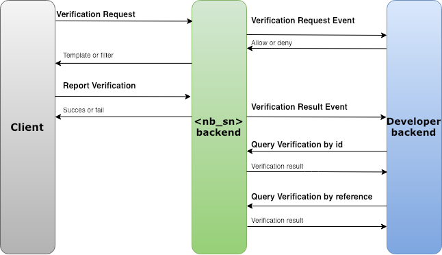

## Overview

Sinch offers a platform for phone number verification. It consists of different software development kits – the Sinch SDKs – that you integrate with your smartphone or web application and cloud based back-end services. Together, they enable SMS and Flash Call verification in your application.

## What are the supported platforms?

When using Sinch for Verification, the Sinch dashboard can provide both SMS and Flash Call verification (on Android mobile devices only).

The Sinch Verification service takes care of all the different steps in a verification process and let developers focus on building great application while easily reinforcing their sign up and login processes.

## What are the different verification services?

The Sinch SDK is currently available for [iOS](doc:verification-for-ios), [Android](doc:verification-for-android) and [JavaScript](doc:verification-for-javascript) platforms.

Back-end services such as authorization or data consolidation are also exposed over REST APIs, primarily for back-end to back-end integration.

## How do I get started?

Getting started with the Sinch Verification API and SDK is simple thanks to the extensive documentation for each platform and the different tutorials and sample application available together with the SDKs.

In most cases, Sinch can be used without needing a back-end or any configuration just follow these steps.

1.  [create an account](https://portal.sinch.com/#/signup),
2.  [download the SDK](https://sinch.readme.io/page/downloads)
3.  get started in minutes following one of the user guide below.

  

    

      <a href="./verification-for-ios" class="col-md-3 ug-link">
        

          iOS
        

      </a>
      <a href="./verification-for-android" class="col-md-3 ug-link">
        

          Android
        

      </a>
      <a href="./verification-for-javascript" class="col-md-3 ug-link">
        

          JavaScript
        

      </a>
      <a href="./verification-rest-api" class="col-md-3 ug-link">
        

          REST
        

      </a>
    

  

## How should the SDK and REST API be combined?

The SDK and REST API work together to ensure you the highest possible security and a full control over the verification solution. We recommend the following approach to integrate any of the Verification SDK in your apps:

 1.  Use the SDK to initiate verification requests
 2.  Use the Verification Request Event callback to:
  *   authorize a given verification request to be started
  *   control the amount of retries a single user can attempt
  *   control if a given phone number can be associated to multiple accounts
 3.  Let the SDK automatically intercept (Android only) and report flash calls/SMS to the Sinch backend
 4.  Consolidate the final verification status in your backend using the Verification Result Event callback

## Verification results and success rates

Keep track of verification success rates and results in real time through the Sinch Dashboard. For each verification method, get accurate metrics on how your app is performing:

  - Delivery rate: percentage of numbers who could successfully be reached (phone ringing or SMS delivered)
  - Conversion rate: percentage of unique numbers who could successfully be verified

## How does pricing work?

Verification pricing is calculated on a per request basis. A fixed price is charged for each flash call attempted and a SMS price (depending on country and operator) is charged for each SMS verification attempt.

## Need help?

If you have any questions, feel free to check out our help section or contact us.

<a class="gitbutton pill" target="_blank" href="https://github.com/sinch/docs/blob/master/docs/verification/verification-introduction.md">
                        
                            <svg xmlns="http://www.w3.org/2000/svg" role="img" viewBox="0 0 24 24"><title>GitHub icon</title><path d="M 12 0.297 c -6.63 0 -12 5.373 -12 12 c 0 5.303 3.438 9.8 8.205 11.385 c 0.6 0.113 0.82 -0.258 0.82 -0.577 c 0 -0.285 -0.01 -1.04 -0.015 -2.04 c -3.338 0.724 -4.042 -1.61 -4.042 -1.61 C 4.422 18.07 3.633 17.7 3.633 17.7 c -1.087 -0.744 0.084 -0.729 0.084 -0.729 c 1.205 0.084 1.838 1.236 1.838 1.236 c 1.07 1.835 2.809 1.305 3.495 0.998 c 0.108 -0.776 0.417 -1.305 0.76 -1.605 c -2.665 -0.3 -5.466 -1.332 -5.466 -5.93 c 0 -1.31 0.465 -2.38 1.235 -3.22 c -0.135 -0.303 -0.54 -1.523 0.105 -3.176 c 0 0 1.005 -0.322 3.3 1.23 c 0.96 -0.267 1.98 -0.399 3 -0.405 c 1.02 0.006 2.04 0.138 3 0.405 c 2.28 -1.552 3.285 -1.23 3.285 -1.23 c 0.645 1.653 0.24 2.873 0.12 3.176 c 0.765 0.84 1.23 1.91 1.23 3.22 c 0 4.61 -2.805 5.625 -5.475 5.92 c 0.42 0.36 0.81 1.096 0.81 2.22 c 0 1.606 -0.015 2.896 -0.015 3.286 c 0 0.315 0.21 0.69 0.825 0.57 C 20.565 22.092 24 17.592 24 12.297 c 0 -6.627 -5.373 -12 -12 -12" /></svg>
                        
                        Edit on GitHub!</a>