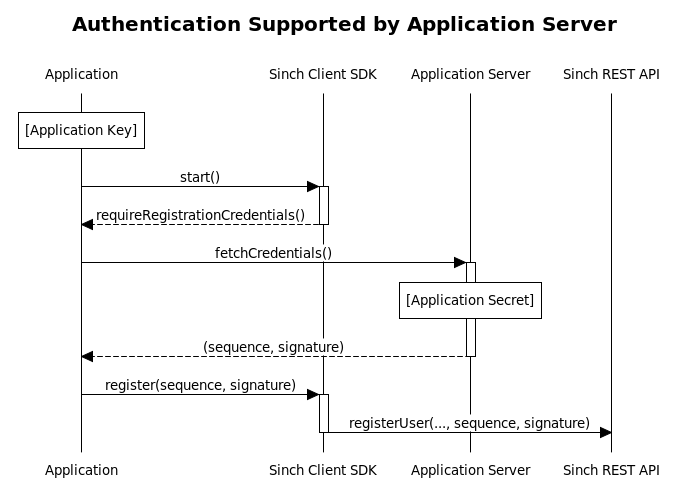

A user identity must be provided when initiating a Sinch client. The first time the application instance and the Sinch client are running on behalf of a particular user, they are required to register against the Sinch service. This is mostly handled transparently by the Sinch SDK, but it works slightly differently depending on which authentication scheme you choose to use.

The step of registering a user identity against the Sinch service requires the application instance to be authenticated and authorized to perform the user registration. Once the application instance has successfully registered the user identity, it will also have obtained the necessary credentials to perform further authorized requests for that specific user, for example, calling.

Two different authentication schemes are available: authentication by client access to application secret and authentication supported by application server.

## Authentication by client access to Application Secret

This application authentication scheme is based on giving the application direct access to the Application Secret, which enables the Sinch Client SDK in the application to self-sign an authorized request to perform user registration. Choosing this authentication scheme corresponds to initiating the Sinch client by using the factory method that takes both an Application Key and an Application Secret.

Using this authentication scheme is the quickest way to get started as the client application instances can directly perform authorized requests against the Sinch service.

> **WARNING: Caution**    
>
> It is not recommended to have the application secret in plain text in the source code in the release version of the application.

## Authentication supported by application server

This application authentication scheme is based on the client application instance not having direct access to the Application Secret. Instead, when the Sinch client needs to perform an authorized request to register a user identity against the Sinch service, it needs to be provided with an authentication signature and a registration sequence to perform the registration. This should be provided by the application’s backend service, for example, by using a HTTP request over an SSL connection.

This scheme has the benefit of the application secret never being directly accessible by the client applications and provides a better level of security as well as flexibility.

> **Note**    
>
> The need for the Sinch client to request an authentication signature and registration sequence is only required once per user and device–not on every application launch.




### Generating the signature

The *Application Server* is responsible for generating a valid signature for each registration request that it accepts as a valid user registration. The *sequence* is a [cryptographic nonce](http://en.wikipedia.org/wiki/Cryptographic_nonce), and must be a monotonically increasing value. The signature is then generated as as follows (pseudogrammar):
```objectivec
string userId;
string applicationKey; // E.g. "196087a1-e815-4bc4-8984-60d8d8a43f1d"
string applicationSecret; // E.g. "oYdgGRXoxEuJhGDY2KQ/HQ=="
uint64 sequence = previous_sequence + 1; // E.g. previous_sequence = 0

string stringToSign = userId + applicationKey + sequence + applicationSecret;

// Use a Base64-encoder that don't introduce line-breaks, 
// or trim the output signature afterwards.
string signature = Base64.encode(SHA1.digest(stringToSign));
```


For example, in Java:
```java
// Generating the Signature - Java
// import java.security.MessageDigest;
// import org.apache.commons.codec.binary.Base64;

String userId; 
String applicationKey; // E.g. "196087a1-e815-4bc4-8984-60d8d8a43f1d";
String applicationSecret; // E.g. "oYdgGRXoxEuJhGDY2KQ/HQ==";
long sequence; // fetch and increment last used sequence

String toSign = userId + applicationKey + sequence + applicationSecret;

MessageDigest messageDigest = MessageDigest.getInstance("SHA-1");
byte[] hash = messageDigest.digest(toSign.getBytes("UTF-8"));

String signature = Base64.encodeBase64String(hash).trim();
```


## Set up the Sinch client and provide authorization credentials for user registration
```java
// Instantiate a SinchClient using the SinchClientBuilder,
// and don't specify the application secret, only the application key.
android.content.Context context = this.getApplicationContext();
SinchClient sinchClient = Sinch.getSinchClientBuilder().context(context)
                                                  .applicationKey("<application key>")
                                                  .environmentHost("sandbox.sinch.com")
                                                  .userId("<user id>")
                                                  .build();

sinchClient.addSinchClientListener(...);

// SinchClientListener implementation
public void onRegistrationCredentialsRequired(SinchClient client, 
                                              ClientRegistration registrationCallback) {
    // This will on the first run for this user call onRegistrationCredentialsRequired on the client listener.
    // Perform API request to server which keeps the Application Secret.
    myApiService.getAuthorizedSignatureForUser("<user id>", new OnCompletedCallback() {
        public void onCompleted(String signature, long sequence) {
            // pass the signature and sequence back to the Sinch SDK
            // via the ClientRegistration interface.
            registrationCallback.register(signature, sequence);
        }
    });
}
```

<a class="gitbutton pill" target="_blank" href="https://github.com/sinch/docs/blob/master/docs/video/video-for-android/video-android-application-authentication.md">
                        <span class="icon medium">
                            <svg xmlns="http://www.w3.org/2000/svg" role="img" viewBox="0 0 24 24"><title>GitHub icon</title><path d="M 12 0.297 c -6.63 0 -12 5.373 -12 12 c 0 5.303 3.438 9.8 8.205 11.385 c 0.6 0.113 0.82 -0.258 0.82 -0.577 c 0 -0.285 -0.01 -1.04 -0.015 -2.04 c -3.338 0.724 -4.042 -1.61 -4.042 -1.61 C 4.422 18.07 3.633 17.7 3.633 17.7 c -1.087 -0.744 0.084 -0.729 0.084 -0.729 c 1.205 0.084 1.838 1.236 1.838 1.236 c 1.07 1.835 2.809 1.305 3.495 0.998 c 0.108 -0.776 0.417 -1.305 0.76 -1.605 c -2.665 -0.3 -5.466 -1.332 -5.466 -5.93 c 0 -1.31 0.465 -2.38 1.235 -3.22 c -0.135 -0.303 -0.54 -1.523 0.105 -3.176 c 0 0 1.005 -0.322 3.3 1.23 c 0.96 -0.267 1.98 -0.399 3 -0.405 c 1.02 0.006 2.04 0.138 3 0.405 c 2.28 -1.552 3.285 -1.23 3.285 -1.23 c 0.645 1.653 0.24 2.873 0.12 3.176 c 0.765 0.84 1.23 1.91 1.23 3.22 c 0 4.61 -2.805 5.625 -5.475 5.92 c 0.42 0.36 0.81 1.096 0.81 2.22 c 0 1.606 -0.015 2.896 -0.015 3.286 c 0 0.315 0.21 0.69 0.825 0.57 C 20.565 22.092 24 17.592 24 12.297 c 0 -6.627 -5.373 -12 -12 -12" /></svg>
                        </span>
                        Edit on GitHub!</a>