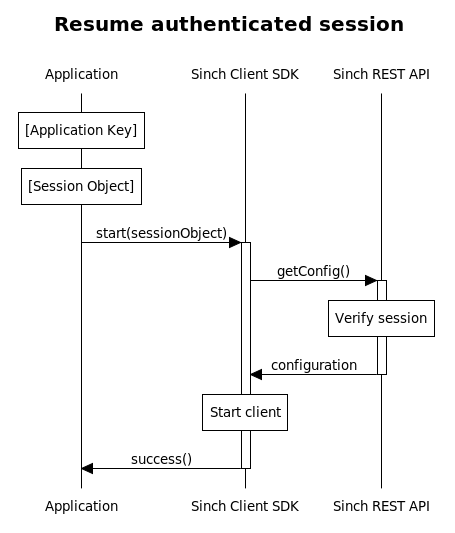

Between each page view, page reload or visit to the website, the current session is lost. Often there is an interest in re-using the same session and not forcing the end-user to re-authenticate. This can be solved by passing a session object into `sinchClient.start()`, and if the session is valid it will resume and you don’t have to prompt the user for any sign in. If it fails, you should fall back to whatever authentication method you’d like to use.

In order to be able to restore a session, it’s first required to save it on successful login.

## Saving a session

If you’d like to save the session after authentication, the code may look something like this:
```javascript
var sinchClient = new SinchClient({
        applicationKey: 'MY_APPLICATION_KEY',
        capabilities: {messaging: true},
    });

sinchClient.start({username: 'alice', password: 'somethingSecure'})
    then(function() {
        localStorage['sinchSession-' + sinchClient.applicationKey] = JSON.stringify(sinchClient.getSession());
    });
```


This code will start a sinchClient, authenticate using Sinch authentication and on success store the session in `localStorage`.

> **Note**    
>
> In the future, Sinch may handle this for you

## Resuming a session

Next time the same visitor come back to the website, it’s nice if we can resume the same session. If we assume we have a saved session object, similar to the example above, we can resume it by passing the sessionObject to `sinchClient.start()`.

Resume authenticated
session

In this case the code may look something like this:
```javascript
//Parse the saved session object
var sessionObj = JSON.parse(localStorage['sinchSession-' + sinchClient.applicationKey] || '{}');

//If there is a valid session object
if(sessionObj.userId) {
    sinchClient.start(sessionObj)
        .then(handleStartSuccess)
        .fail(showLoginUI); //On failure, the session was not valid => user must re-login
}
else {
    showLoginUI(); //There is no session => user must login
}
```


The session object can be stored in any secure way you see best fit, for example in the browser `localStorage` as shown above. The session object can be retrieved from sinchClient using the `sinchClient.getSession()` method after a successful call to `sinchClient.start()`.

See the Sample IM app for an example on working with sessions.

<a class="gitbutton pill" target="_blank" href="https://github.com/sinch/docs/blob/master/docs/video/video-for-javascript/video-javascript-session-management.md">
                        <span class="icon medium">
                            <svg xmlns="http://www.w3.org/2000/svg" role="img" viewBox="0 0 24 24"><title>GitHub icon</title><path d="M 12 0.297 c -6.63 0 -12 5.373 -12 12 c 0 5.303 3.438 9.8 8.205 11.385 c 0.6 0.113 0.82 -0.258 0.82 -0.577 c 0 -0.285 -0.01 -1.04 -0.015 -2.04 c -3.338 0.724 -4.042 -1.61 -4.042 -1.61 C 4.422 18.07 3.633 17.7 3.633 17.7 c -1.087 -0.744 0.084 -0.729 0.084 -0.729 c 1.205 0.084 1.838 1.236 1.838 1.236 c 1.07 1.835 2.809 1.305 3.495 0.998 c 0.108 -0.776 0.417 -1.305 0.76 -1.605 c -2.665 -0.3 -5.466 -1.332 -5.466 -5.93 c 0 -1.31 0.465 -2.38 1.235 -3.22 c -0.135 -0.303 -0.54 -1.523 0.105 -3.176 c 0 0 1.005 -0.322 3.3 1.23 c 0.96 -0.267 1.98 -0.399 3 -0.405 c 1.02 0.006 2.04 0.138 3 0.405 c 2.28 -1.552 3.285 -1.23 3.285 -1.23 c 0.645 1.653 0.24 2.873 0.12 3.176 c 0.765 0.84 1.23 1.91 1.23 3.22 c 0 4.61 -2.805 5.625 -5.475 5.92 c 0.42 0.36 0.81 1.096 0.81 2.22 c 0 1.606 -0.015 2.896 -0.015 3.286 c 0 0.315 0.21 0.69 0.825 0.57 C 20.565 22.092 24 17.592 24 12.297 c 0 -6.627 -5.373 -12 -12 -12" /></svg>
                        </span>
                        Edit on GitHub!</a>